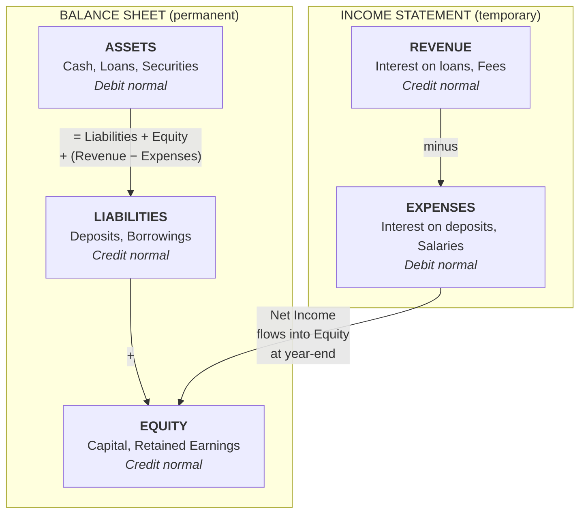

# A Core Banking System

A simplified but functionally complete Go library modeling the core accounting engine of a bank. Intended as a reference implementation for learning and prototyping — not for production use.

State lives behind a store interface with one implementation: `store/sqlite`, which persists everything to SQLite — real SQLite transpiled to Go, so it needs no server, no Docker and no C toolchain. It needs no setup, which is new: the relational backend used to be Postgres and used to be opt-in, and an in-memory `store/mem` was the default beside it. It exists mostly as *curriculum*: it is where a double-entry ledger meets relational tables, and where a single process-wide mutex stops doing your concurrency control for you. See [Persistence](#persistence) for what that turns out to involve.

## Four-Layer Architecture

The system is split into four layers, each in its own package, all of them resting on the first:

1. **`ledger` — the general ledger.** The pure, double-entry accounting core: ledgers, subledgers, accounts, multi-legged transactions, postings, on-demand book balances, and an immutable audit log. Its top-level type is `ledger.Book`. It knows nothing about customers' account status, holds, available balance, or snapshots.

2. **`deposit` — the demand-deposit (DDA) layer.** Layered on top of a `ledger.Book`, this is the customer-facing checking/current-account layer. Its top-level type is `deposit.Register`. It adds account **status and lifecycle**, **overdraft limits** and the credit terms priced on them, authorization **holds** and the **available balance** they reduce, and end-of-day **snapshots**. Each deposit account wraps a backing Liability GL account; the deposit layer never stores money itself — every movement of value is a real posting in the underlying `ledger.Book`.

3. **`lending` — the credit layer.** Layered on the same `ledger.Book` and deliberately **not** on `deposit`: a term loan does not need a current account behind it. Its top-level type is `lending.Portfolio`, and it owns credit **facilities** (term loans and revolving lines), their **amortization schedules**, daily **accrual**, **capitalization** and **arrears**. The third credit product — the arranged overdraft — lives in `deposit` instead, for reasons the [Lending](#lending) section is mostly about.

4. **`payment` — the interbank payment network.** Each participant bank gets its own `ledger.Book` plus a `deposit.Register` and a `lending.Portfolio` over it; funds and status checks for a payment run through that deposit layer, while the multi-leg GL postings (debtor leg, creditor leg, reserve movements) live in the payment layer. Its top-level type is `payment.Network`.

There is a fifth package, `interest`, and it is deliberately **not** a layer: pure day-count, accrual and rounding arithmetic with no store, no `ledger.Book` and no notion of an account. Both credit-bearing layers use it, which is what keeps either from reimplementing a convention or a rounding rule.

The sections below are organized around these layers: general-ledger concepts first, then the deposit-layer concepts (holds, available balance, account lifecycle, snapshots, overdraft), then lending (facilities, amortization, accrual, arrears), then settlement and the payment network.

## Table of Contents

- [Core Banking Concepts](#core-banking-concepts)
- [Accounting Foundations](#accounting-foundations)
  - [Assets: What an Account Is Denominated In](#assets-what-an-account-is-denominated-in)
  - [Double-Entry Bookkeeping](#double-entry-bookkeeping)
    - [The Invariant Is Per Asset](#the-invariant-is-per-asset)
    - [Foreign Exchange, and Why the Ledger Needs No Rates](#foreign-exchange-and-why-the-ledger-needs-no-rates)
  - [Chart of Accounts](#chart-of-accounts)
    - [Asset](#asset--things-the-bank-owns-or-is-owed)
    - [Liability](#liability--things-the-bank-owes-to-others)
    - [Equity](#equity--the-owners-residual-interest)
    - [Revenue](#revenue--income-the-bank-earns)
    - [Expense](#expense--costs-the-bank-incurs)
    - [Accounts Are Per Asset](#accounts-are-per-asset)
  - [Ledger and Subledger Hierarchy](#ledger-and-subledger-hierarchy)
    - [A Control Account, and Still an Aggregation](#a-control-account-and-still-an-aggregation)
  - [Amounts and Precision](#amounts-and-precision)
    - [Why Scale Is Capped at Nine](#why-scale-is-capped-at-nine)
- [Transactions](#transactions)
  - [Entries, Legs, and Postings](#entries-legs-and-postings)
  - [Booking Date vs. Value Date](#booking-date-vs-value-date)
  - [Balance Types](#balance-types)
  - [Backdated Postings Correct Themselves](#backdated-postings-correct-themselves)
    - [Recording the Refund and Paying It Are Two Operations](#recording-the-refund-and-paying-it-are-two-operations)
  - [Multi-Legged Transactions](#multi-legged-transactions)
  - [Holds (Authorization / Pending Transactions)](#holds-authorization--pending-transactions)
  - [Idempotency](#idempotency)
  - [Transaction Reversal](#transaction-reversal)
- [Account Lifecycle](#account-lifecycle)
  - [Account States](#account-states)
    - [What This Implementation Actually Enforces](#what-this-implementation-actually-enforces)
  - [State Transitions](#state-transitions)
  - [Overdraft](#overdraft)
- [Lending](#lending)
  - [Three Products, and Why the Third Is Not a Facility](#three-products-and-why-the-third-is-not-a-facility)
  - [Two GL Accounts Per Facility](#two-gl-accounts-per-facility)
  - [Daily Accrual and the Precision Split](#daily-accrual-and-the-precision-split)
    - [The Recompute Window Opens at Inception](#the-recompute-window-opens-at-inception)
  - [Two Amortization Methods](#two-amortization-methods)
  - [Repayment: Against What Accrued, Not the Schedule](#repayment-against-what-accrued-not-the-schedule)
  - [Arrears and Non-Performing](#arrears-and-non-performing)
- [Settlement Cycles](#settlement-cycles)
  - [What Is Settlement](#what-is-settlement)
  - [Common Settlement Cycles](#common-settlement-cycles)
  - [Settlement and the Ledger](#settlement-and-the-ledger)
- [Payments, Clearing, and Settlement (the `payment` package)](#payments-clearing-and-settlement-the-payment-package)
  - [Why a Separate Package](#why-a-separate-package)
  - [The Multi-Bank Model](#the-multi-bank-model)
    - [Addressing](#addressing)
  - [Provisioning: A Bank Is Three Rows at Three Institutions](#provisioning-a-bank-is-three-rows-at-three-institutions)
    - [What Admission Is Not](#what-admission-is-not)
  - [Payment Schemes](#payment-schemes)
    - [The Book Transfer](#the-book-transfer)
    - [A Scheme Declares Its Asset](#a-scheme-declares-its-asset)
    - [Cross-Currency Payments Are Two Operations](#cross-currency-payments-are-two-operations)
  - [The Payment Lifecycle](#the-payment-lifecycle)
  - [Posting Choreography: SEPA Credit Transfer](#posting-choreography-sepa-credit-transfer)
  - [Settlement Is Final at the Central Bank, and the Banks Catch Up](#settlement-is-final-at-the-central-bank-and-the-banks-catch-up)
    - [Each Institution Knows Only What Its Own Job Needs](#each-institution-knows-only-what-its-own-job-needs)
    - [A Bank Reconciles Two Advices from Two Institutions Against One Balance](#a-bank-reconciles-two-advices-from-two-institutions-against-one-balance)
    - [What a Bank Can Catch on Its Own](#what-a-bank-can-catch-on-its-own)
    - [Unclaimed Balances](#unclaimed-balances)
  - [Netting: A Worked Example](#netting-a-worked-example)
  - [SEPA Direct Debit and Returns](#sepa-direct-debit-and-returns)
    - [Posting Choreography: A Return](#posting-choreography-a-return)
    - [Returns Receivable](#returns-receivable)
  - [Deliberate Simplifications](#deliberate-simplifications)
  - [Next Work](#next-work)
- [Reporting and Compliance](#reporting-and-compliance)
  - [End-of-Day Snapshots](#end-of-day-snapshots)
  - [Audit Trail](#audit-trail)
    - [There Is No Combined Log, and No Order Between Two of Them](#there-is-no-combined-log-and-no-order-between-two-of-them)
- [Statements](#statements)
  - [Derived from the Ledger, Not a Separate Account Ledger](#derived-from-the-ledger-not-a-separate-account-ledger)
  - [What Appears on a Statement](#what-appears-on-a-statement)
  - [Why Transactions and Balances May Not Reconcile](#why-transactions-and-balances-may-not-reconcile)
- [Persistence](#persistence)
  - [One Implementation, and the Suite That Used to Compare Two](#one-implementation-and-the-suite-that-used-to-compare-two)
  - [The Ledger as Relational Tables](#the-ledger-as-relational-tables)
  - [The Asset Dimension in the Schema](#the-asset-dimension-in-the-schema)
    - [The Constraint That Is Missing on Purpose](#the-constraint-that-is-missing-on-purpose)
  - [A Balance Is an Aggregate, Not a Column](#a-balance-is-an-aggregate-not-a-column)
  - [The Unit of Work](#the-unit-of-work)
  - [Three Races a Single Mutex Was Hiding](#three-races-a-single-mutex-was-hiding)
  - [Migrations](#migrations)
  - [Keeping State Across a Restart](#keeping-state-across-a-restart)
- [Usage Example](#usage-example)

## Core Banking Concepts

A core banking system is the backbone of a financial institution. It is the "system of record" for all financial activity — every deposit, withdrawal, transfer, loan disbursement, and fee charge flows through it. The concepts below explain how this system models real-world banking.

## Accounting Foundations

### Assets: What an Account Is Denominated In

An **asset**, in the sense used throughout the rest of this document, is a unit of value that accounts are denominated in: euro, dollars, bitcoin. It is a `ledger.AssetDef`:

```go
type AssetDef struct {
    Code  AssetCode  // "EUR", "USD", "BTC" — the natural key
    Name  string     // "Euro"
    Scale uint8      // decimal places: 2 for EUR, 8 for BTC
    Class AssetClass // Fiat | Crypto
}
```

> **A note on the name.** `AssetDef`, not `Asset`, because `Asset` is already taken: it is the `AccountType` constant for the asset side of the balance sheet ([below](#asset--things-the-bank-owns-or-is-owed)). That constant keeps the name — it is the accounting term, and it appears in every chart of accounts ever written. The two senses are genuinely different things: an account's *type* says whether it is something the bank owns or owes, and its *asset* says what kind of money it is counted in. A euro deposit and a bitcoin deposit are both Liability accounts.
>
> `AssetClass` (`Fiat` or `Crypto`) carries no behaviour at all today. It exists so a chart of accounts or a UI can tell a currency from a token without pattern-matching on the code.

Three properties do most of the work.

**Assets are defined in code, not stored.** The known assets are a package-level list in `ledger` (`ledger.LookupAsset`, `ledger.Assets`), not rows in a table. An asset *definition* is a fact about the world rather than per-bank state: "BTC has 8 decimal places" is true in every book that ever mentions BTC, and two books disagreeing about it would be a bug, not a feature — storing it once per book is what makes that disagreement representable in the first place.

The system already draws this line elsewhere. A [payment scheme](#a-scheme-declares-its-asset) is a Go type with an `Asset()` method, registered in code; its *settlements* are rows. Assets work the same way: the definition is code, and everything denominated in one — accounts, deposit accounts, a bank's [per-asset plumbing accounts](#accounts-are-per-asset) — is a row that names it.

An earlier design here had a writable per-book registry, and it is worth saying why it was removed rather than quietly dropped. It promised something the rest of the system could not deliver. A bank's per-asset plumbing is provisioned once and never extended: suspense, reserve, unclaimed balances and returns receivable are created in the bank's own book when it is [founded](#provisioning-a-bank-is-three-rows-at-three-institutions), and the settlement account is the central bank's, opened when the scheme answers the bank's application. Neither moment comes round again, so an asset registered afterwards produced a real customer account that could never settle, and the failure surfaced as a `404` on funding. Adding an asset is a code change, which is the honest shape of it: the reserve plumbing, the schemes that quote it and the chart of accounts all have to move together.

What *is* per bank is which assets it operates in — that is `bank_assets`, decided when the bank is founded.

**An account is denominated in exactly one asset, fixed at creation.** It is chosen when the account is created and never changes afterwards. This is how real core banking systems work — an account number and its currency are inseparable, which is why IBANs are per-currency and why "my euro account" and "my dollar account" are two accounts and not two views of one.

**That is what keeps a balance a scalar.** If a single account could hold several assets, its balance would be a *map*, and every balance query, every statement line, every end-of-day snapshot and every available-balance calculation would have to carry an asset alongside the number, forever. Fixing the asset to the account pushes that dimension into the chart of accounts, where it costs one more account instead of one more type parameter on everything.

The `deposit` layer follows the GL: a `deposit.Account` records its asset too. That is not a copy of anything — a customer account is not a chart-of-accounts row — it is the account's own defining fact, and it is what decides which control line the money pools in. It is fixed for life for the same reason a GL account's is: an account whose asset changed would have its history under one line and its balance under another. See [The Asset Dimension in the Schema](#the-asset-dimension-in-the-schema).

There is no default anywhere: every account names its asset, and one naming a code the system does not know fails with `ErrAssetNotFound`. Every entry in the list is held to `ledger.MaxAssetScale` — see [Why Scale Is Capped at Nine](#why-scale-is-capped-at-nine). That the check is a *domain* rule enforced by `ledger.Book`, rather than a constraint in the database, turns out to have consequences for the schema — see [The Asset Dimension in the Schema](#the-asset-dimension-in-the-schema).

### Double-Entry Bookkeeping

The most fundamental principle in banking is double-entry bookkeeping, codified in 15th-century Italy (by Luca Pacioli in 1494, though Italian merchants had practised it since the 13th–14th centuries) and still the foundation of all modern accounting. The rule is simple:

> Every transaction must have equal debits and credits.

This means money never appears or disappears — it always moves from one account to another. When a customer deposits €100 cash:

- **Debit:** Bank's Cash account (asset increases — the bank has more cash)
- **Credit:** Customer's Deposit account (liability increases — the bank owes the customer more)

When a customer transfers €50 to another customer:

- **Debit:** Sender's Deposit account (liability decreases)
- **Credit:** Receiver's Deposit account (liability increases)

The balanced nature of double-entry provides a built-in error-detection mechanism: if debits don't equal credits, something is wrong.

#### The Invariant Is Per Asset

The rule as Pacioli stated it assumes something he never had to say out loud: that everything in the book is counted in the same money. Once a book holds more than one [asset](#assets-what-an-account-is-denominated-in), the invariant needs one more clause:

> Every transaction must have equal debits and credits **within each asset**.

The global version is not a weaker check — it is a *broken* one, and seeing exactly why means being precise about what it compares. An `Amount` is an integer in its asset's [minor units](#amounts-and-precision) and carries nothing else; a global check sums those integers with no idea which asset each belongs to. So it is satisfied by any two legs whose **integers** match, whatever those integers are worth.

Ten billion is ten billion:

```
Debit  Cash EUR (Asset)         10_000_000_000    // €100,000,000.00
Credit Customer BTC (Liability) 10_000_000_000    // ₿100.00000000
                                ──────────────
Total debits − total credits:                0    ✓ by the old rule
```

It passes. The bank has booked one hundred million euro of cash against an obligation of one hundred bitcoin — worth roughly €6.5 million at the rate the [FX example below](#foreign-exchange-and-why-the-ledger-needs-no-rates) implies. Some **€93 million has appeared out of nothing**, and the engine that waved it through had no idea it was pricing anything, because it was not pricing anything: it was comparing two integers.

Notice what actually did the damage. It is *not* that the two legs were unequal in value — the check never looks at value, and could not, since it has no rate. It is that the integers were equal while the assets were not, and EUR and BTC differ in scale by a factor of a million (2 places against 8). Change either asset's scale and the very same posting becomes a different fiction. The rate this transaction implies is not merely wrong; it is an artefact of two unrelated unit conventions that no one chose and nothing records.

Per asset, there is no rate to get wrong. The check sums debits and credits *within* each asset and requires each sum to net to zero:

```go
// ledger.validateBalance, in essence
net := map[AssetCode]Amount{}
for _, e := range entries {
    asset := accounts[e.AccountID].Asset   // an entry's asset is its account's
    if e.Direction == Debit { net[asset] += e.Amount } else { net[asset] -= e.Amount }
}
// every asset must net to zero
```

A failure returns `ErrUnbalancedAsset` **wrapped together with** `ErrUnbalancedTransaction`, and names the offending asset. Both sentinels match under `errors.Is`, so a caller that only wants to know "did this balance?" checks the general one and a caller that wants to report which asset broke checks the specific one, without either having to know about the other.

This is the whole reason the ledger never needs to know what anything is worth. A single-asset check needs no prices because there is only one thing to price; a per-asset check needs no prices because the assets never meet inside one balancing sum. A *global* multi-asset check would need prices, and that is precisely the design that puts an exchange rate in the middle of an accounting engine.

#### Foreign Exchange, and Why the Ledger Needs No Rates

Foreign exchange is **not implemented** — there are no rates anywhere in this system and no trade operation. What follows is the shape the ledger was designed to accommodate, not something you can call today.

The per-asset invariant rules out the obvious posting. A customer selling 100 EUR for bitcoin cannot be recorded as one transaction with a euro leg and a bitcoin leg, because that is exactly the posting rejected above. Instead each asset balances through a **position account** of its own asset, and the trade is two ordinary, individually balanced postings:

```
EUR side — balances in EUR:
  Debit  Customer EUR deposit (Liability)   10000      // the customer's euros leave
  Credit EUR Position                       10000      // the bank takes them on

BTC side — balances in BTC:
  Debit  BTC Position                      153000      // the bank gives bitcoin up
  Credit Customer BTC deposit (Liability)  153000      // the customer receives it
```

Neither posting mentions the other, and neither mentions a rate. The rate is expressed *entirely* in the choice of the two amounts — `10000` cents against `153000` satoshi — and that choice is made above the ledger, by whatever quoted the price. The ledger records the consequence of a price; it never decides one. Which of the five [account types](#chart-of-accounts) a position account should be is a modelling decision that belongs to the FX work itself; what matters here is that there is one per asset and that it is the counterparty to every trade leg in that asset.

The balance of a position account is then a number worth having in its own right: it is the bank's **open position** in that asset — how much of it the bank is long or short as a result of the trades it has done. A bank that has bought and sold the same amount of bitcoin is *flat*, and its BTC position account reads zero. A bank that has been buying is long, and holds a real exposure to the price moving against it.

Note what is *not* in the ledger under this scheme: the profit or loss on trading. It appears only when the positions are revalued at a current rate, which needs a price and therefore lives above the ledger too — in the same layer that quoted the trade in the first place.

### Chart of Accounts

The chart of accounts organizes all accounts into five fundamental types, derived from the accounting equation:

```
Assets = Liabilities + Equity + (Revenue - Expenses)
```

The five types split into two groups: three permanent accounts on the **balance sheet** (a snapshot of the bank's financial position at a point in time) and two temporary accounts on the **income statement** (activity over a period). At year-end, net income flows into equity, connecting the two:



Each type has a "normal balance" — the direction that increases it:

| Type | Normal Balance | Description | Examples |
|------|---------------|-------------|----------|
| **Asset** | Debit | Things the bank owns or is owed | Cash, loans to customers, securities, real estate |
| **Liability** | Credit | Things the bank owes to others | Customer deposits, borrowings, bonds payable |
| **Equity** | Credit | Owner's residual interest | Paid-in capital, retained earnings |
| **Revenue** | Credit | Income earned | Interest income, fee income, trading gains |
| **Expense** | Debit | Costs incurred | Interest expense, salaries, rent, provisions |

#### Asset — Things the Bank Owns or Is Owed

An asset is anything of value that the bank controls. The most intuitive example is cash sitting in the vault — that is clearly something the bank owns. But assets also include money that other people owe *to* the bank. When a bank gives a customer a $200,000 mortgage, the bank doesn't lose $200,000 — it *converts* one asset (cash) into another asset (a loan receivable). The customer now owes the bank $200,000 plus interest, and that obligation is valuable.

Common asset accounts in a bank:
- **Cash / reserves** — physical currency and balances held at the central bank
- **Loans to customers** — mortgages, personal loans, credit card balances
- **Securities** — government bonds, corporate bonds, and other investments the bank holds
- **Interbank lending** — short-term loans to other banks (e.g., overnight lending)

Assets have a **debit normal balance**, meaning a debit increases an asset and a credit decreases it. When the bank receives a $500 cash deposit from a customer, its cash (asset) increases by a $500 debit — but as we'll see, the other side of that entry is a liability.

#### Liability — Things the Bank Owes to Others

A liability is an obligation the bank has to pay someone else. The most important liability for a bank is **customer deposits**. When a customer deposits $500 into their checking account, the bank now *owes* that customer $500 on demand. The customer's account balance is, from the bank's perspective, a debt.

This is often the most counterintuitive part: the money in your checking account is the bank's liability, not its asset. The bank has the cash (asset), but it owes that cash back to you (liability).

Common liability accounts in a bank:
- **Customer deposits** — checking accounts, savings accounts, certificates of deposit
- **Borrowings** — money the bank has borrowed from other banks or the central bank
- **Bonds payable** — debt securities the bank has issued to raise capital

Liabilities have a **credit normal balance**. A credit increases a liability and a debit decreases it. When a customer deposits $500, the bank credits the customer's deposit account (liability goes up) and debits its cash account (asset goes up). Both sides increase — the bank has more cash *and* owes more to the customer.

#### Equity — The Owner's Residual Interest

Equity is what's left over after you subtract liabilities from assets. It represents the shareholders' stake in the bank. If a bank has $100M in assets and $92M in liabilities, the equity is $8M.

Equity accounts don't change as frequently as the others. They mainly move when the bank issues new shares, buys back shares, or at year-end when net profit (revenue minus expenses) is rolled into retained earnings.

Common equity accounts:
- **Paid-in capital** — money shareholders invested when buying the bank's stock
- **Retained earnings** — accumulated profits the bank has kept rather than distributing as dividends

Equity has a **credit normal balance**. Profits increase equity (credit), losses decrease it (debit).

#### Revenue — Income the Bank Earns

Revenue accounts track money flowing into the business from its operations. For a bank, the primary source of revenue is interest charged on loans — the bank lends money at a higher rate than it pays on deposits, and the difference (the *net interest margin*) is how banks make most of their money.

Common revenue accounts:
- **Interest income** — interest earned on loans, mortgages, and securities
- **Fee income** — account maintenance fees, ATM fees, wire transfer fees, overdraft fees
- **Trading gains** — profits from buying and selling securities

Revenue has a **credit normal balance**. When a customer pays $50 in monthly interest on a loan, the bank credits interest income (revenue goes up) and debits the customer's loan account (the loan balance — an asset — decreases because the customer has repaid part of it) or debits cash (if the payment comes from outside the bank).

At year-end, revenue accounts are "closed" — their balances are zeroed out and the net profit is transferred into retained earnings (equity).

#### Expense — Costs the Bank Incurs

Expense accounts track the costs of running the bank. Just as revenue increases the owners' stake, expenses decrease it.

Common expense accounts:
- **Interest expense** — interest paid to depositors and bondholders (this is the bank's biggest cost)
- **Salaries and benefits** — compensation for employees
- **Provisions for loan losses** — money set aside in case borrowers default
- **Operating costs** — rent, technology, compliance, legal

Expenses have a **debit normal balance**. When the bank pays $10 in monthly interest to a savings account customer, it debits interest expense (expense goes up) and credits the customer's deposit account (liability goes up — the bank now owes the customer $10 more).

Like revenue, expense accounts are closed at year-end into retained earnings.

#### Accounts Are Per Asset

The five types say what an account *is*. The [asset](#assets-what-an-account-is-denominated-in) says what it is *counted in*, and the two dimensions are independent: a euro deposit and a bitcoin deposit are both Liability accounts, and a euro cash account and a bitcoin wallet are both Asset accounts.

Because an account is bound to exactly one asset, a bank that operates in three currencies does not have one Cash account holding three kinds of money. It has three Cash accounts:

```
Bank Assets (subledger)
├── 100.100.001  Cash EUR   (Asset,     EUR)
├── 100.100.002  Cash USD   (Asset,     USD)
└── 100.100.003  Cash BTC   (Asset,     BTC)

Customer Deposits (subledger)
├── 200.100.001  Customer Deposits EUR  (Liability, EUR)
└── 200.100.002  Customer Deposits BTC  (Liability, BTC)
```

So the chart of accounts of a multi-asset bank is, roughly, its single-asset chart multiplied by the assets it operates in. That sounds like duplication and is in fact the point: it is what makes "the bank's euro cash" a thing with a balance you can read, rather than one component of a vector that some caller has to know how to project. Alice, likewise, has two accounts rather than one account with two balances — which is why in practice a customer with a foreign-currency account has a second IBAN. Neither of hers is a line above: both are *positions* within the two lines that are, and the next section is about what that means.

### Ledger and Subledger Hierarchy

Accounts are organized into a two-level hierarchy:

```
General Ledger
├── Customer Deposits (subledger)
│   └── Customer Deposits (EUR)   (Liability, CONTROL)   ← 50,000 customers
├── Loans and Advances (subledger)
│   ├── Loan Principal (EUR)      (Asset, CONTROL)       ← every borrower
│   └── Accrued Interest (EUR)    (Asset, CONTROL)
├── Bank Assets (subledger)
│   └── Cash Vault (Asset)
└── Revenue (subledger)
    └── Fee Income (Revenue)
```

- **Ledger:** The top-level book. A bank typically has a General Ledger (GL) that contains all accounts. Large banks may also have separate ledgers for different business units or legal entities.

- **Subledger:** A subdivision of a ledger that groups related accounts. For example, under the General Ledger you might have subledgers for "Customer Deposits", "Loans and Advances", "Interbank", "Fee Income", etc.

The chart of accounts above holds one line for fifty thousand customers, and that is not an abbreviation for the reader: it is what the chart actually holds. A customer's deposit account is **not** a row in it. `Customer Deposits (EUR)` is a **control account** — one line standing for many — and every entry against it names *whose* money the leg is, so Alice's balance is that account's balance filtered to Alice and the bank's total customer deposits is the same sum with the filter dropped. The detail lives in the entries, under a dimension the next section is about.

Which line a flow posts to is **data**, not a name matched in code. A *slot* is the role — the line a customer's money pools in, the receivable an accrual debits, the revenue it credits — and a row keyed by `(product, slot, asset)` says which account fills it. The row is validated when it is written: a slot declares the account type it needs and whether that account must pool subsidiaries, so a Revenue line in a Liability slot is refused at the configuration change rather than at a posting weeks later. A *product* may point its own revenue line at a slot that carries no balance; it may not repoint one that holds any, because money already posted under a customer stays where it was posted and moving it is a reclassification journal this system does not have.

#### A Control Account, and Still an Aggregation

The line item above is where this system parts company with classic core banking, and the difference is worth stating because it is the general form of an argument that recurs — in the [overdraft](#overdraft), which has no facility record, and in [A Balance Is an Aggregate, Not a Column](#a-balance-is-an-aggregate-not-a-column).

In the classic design the general ledger and the deposit subledger are genuinely separate systems. The subledger holds the per-customer detail; the GL holds a single **control account** — "Customer Deposits" — whose **stored** balance is supposed to equal the sum of all that detail, and the subledger posts summarized entries up to it. Because the control figure is written down independently of the detail, the two can drift: a bug, a partial failure, a timing window. So the bank runs a **subledger-to-GL reconciliation** every day to prove that `Σ(detail) == control`, and a mismatch is a reconciliation break somebody has to investigate. That is real operational toil, and it exists precisely because the same number is recorded in two places.

Two properties travel together in that description, and they are independent. A control account is one line standing for many. A *stored* control figure is a second copy of a number. This system takes the first and refuses the second.

Here there is one ledger. A customer's deposit account is not a chart-of-accounts row at all: it is a **subsidiary** under `Customer Deposits (EUR)` — the holder named on every entry that moves their money. Their balance is that account's balance with their id in the `WHERE` clause; the bank's total customer deposits is the *same sum* with the id dropped. So `Σ(detail) == control` is not a nightly proof but one statement read two ways, and there is nothing to reconcile because there is no second number to reconcile against. What it costs is performance: every balance read still aggregates entries rather than reading a column.

What the control account buys is the chart of accounts itself. A bank with fifty thousand customers and ten thousand loans has a chart of a few dozen lines — one per asset per role, plus its own positions — which is what a chart of accounts is for. A trial balance is a page rather than a book, and every argument this system makes about resolving a well-known account by name is cheap for the same reason.

The same arrangement is what makes the **`Payables`** line honest. `Interest Refunds Payable (EUR)` is what the bank owes borrowers back after a backdated correction takes back interest they had already paid — see [Backdated Postings Correct Themselves](#backdated-postings-correct-themselves) — and pooled with no subsidiary it would hold a single number that cannot say who is owed what, so a payout against it would be unbounded: nothing would stop it paying one borrower out of another's, because the ledger's balance check guards Asset and Expense positions only and a Liability is never caught by it. The subsidiary on the entry answers both objections. It is one line like every other, and the balance check reads the *position* rather than the account, which is what keeps the discharge bounded.

### Amounts and Precision

All monetary amounts are integers in the smallest unit of their [asset](#assets-what-an-account-is-denominated-in) — cents for EUR and USD, satoshi for BTC. This is the approach Stripe, most banks and most payment processors use, generalized here to any asset rather than to a single currency.

It avoids floating-point precision entirely. `0.1 + 0.2` is `0.30000000000000004` in IEEE 754, and a system whose whole job is adding money cannot afford an error that accumulates. With integers there is no rounding at all.

How many decimal places an asset's minor unit has is its **scale**, and scale is a property of the *asset*, not of the system:

| Display | Internal | Asset | Scale |
|---------|----------|-------|-------|
| €100.50 | 10050 | EUR | 2 |
| €1,234.56 | 123456 | EUR | 2 |
| ₿1.00000000 | 100000000 | BTC | 8 |
| ₿0.00000001 | 1 | BTC | 8 |

The same integer therefore means quite different things in different assets: `100000000` is one bitcoin, and it is also a million euro. Nothing can be rendered, and nothing can be compared, without knowing which asset it belongs to — which is one more reason the asset lives on the account rather than being passed around beside the number.

The caller is responsible for converting to and from display format.

#### Why Scale Is Capped at Nine

`ledger.Amount` is an `int64`, and `ledger.MaxAssetScale` is **9**. No known asset may exceed it.

The cap is arithmetic, not preference. A signed 64-bit integer tops out at 9,223,372,036,854,775,807 — about 9.22 × 10¹⁸. Divide that by the scale to get the largest amount the type can hold:

| Scale | Asset | Largest representable amount |
|-------|-------|------------------------------|
| 2 | EUR | ~92 quadrillion € |
| 8 | BTC | ~92 billion ₿ (the entire 21M supply is 2.1 × 10¹⁵ satoshi) |
| 9 | the cap | ~9.2 billion whole units |
| 18 | ETH (wei) | **9.2 units** |

At 18 decimal places — the native precision of ether and of most ERC-20 tokens — an `int64` holds 9.2 ETH. Not 9.2 billion, not 9.2 million: nine. Native 18-decimal precision and an `int64` amount are mutually exclusive, and the only real decision is which of the two to give up.

This system keeps the `int64` and caps the scale, so an 18-decimal asset can be carried only at reduced precision — listed at 9 places, say, discarding the smallest nine. That is a real limitation and it is stated here rather than discovered later. The important part is that the bound is **checked, not assumed**: because the assets are a list in code rather than runtime input, the check is a test over that list (`TestKnownAssetsRespectMaxScale`) that fails the build the moment someone adds an entry that would silently overflow.

`Amount` is a defined type (`type Amount int64`) rather than an alias for exactly this reason. If the trade-off is ever revisited and amounts widen to 128 bits, the compiler points at every site that has to change instead of quietly accepting a bare `int64`.

## Transactions

### Entries, Legs, and Postings

A few words are used interchangeably throughout this document and the code, so it is worth pinning them down up front:

- **Entry:** A single debit or credit to one account. This is the `ledger.Entry` type — it carries an account, an amount, and a `Direction` (`Debit` or `Credit`). It is the smallest unit of bookkeeping.

- **Leg:** A synonym for *entry*. The word is used when emphasizing that a transaction has several sides — a "two-legged" transfer has one debit entry and one credit entry, while a "multi-legged" transaction has three or more. "Leg" and "entry" refer to exactly the same thing; there is no separate `Leg` type.

- **Posting:** The act of recording a transaction in the ledger (the verb, as in "to post a transaction" via `PostTransaction`). Loosely, "a posting" is also used to mean an entry that has been recorded. Posted transactions are immutable — they are never edited or deleted, only reversed (see [Transaction Reversal](#transaction-reversal)).

- **Transaction:** A balanced set of entries (legs) that are posted together as one atomic unit. Within any transaction, **total debits = total credits** (see [Multi-Legged Transactions](#multi-legged-transactions)).

In the `payment` layer two specific legs get their own names: the **debtor leg** is the entry that moves money out of the payer's account (posted by the payer's *own* bank — at submission for a push, on receipt of the collection for a [pull](#sepa-direct-debit-and-returns)), and the **creditor leg** is the entry that delivers money into the payee's account (posted by the payee's *own* bank, once the clearing house has told it the cycle settled). Both are ordinary ledger entries — the names just identify which side of a cross-bank payment they represent. See [The Payment Lifecycle](#the-payment-lifecycle).

> **Trial balance:** Referenced in a few places below, this is the list of every account's balance at a point in time. Because every transaction balances, the sum of all debit balances must equal the sum of all credit balances — a trial balance that does not sum to zero signals a bookkeeping error.

### Booking Date vs. Value Date

Every transaction carries two dates:

- **Booking Date:** The date/time when the transaction was recorded in the system. This is the "system date" or "processing date". It determines when the transaction appears in audit trails and system reports.

- **Value Date:** The date when the transaction takes economic effect. This determines when interest starts accruing, when funds become available, and which business day "owns" the transaction. The value date may be in the past (back-dated) or future (forward-dated) relative to the booking date.

#### When Value Date Differs from Booking Date

In many real-world scenarios the two dates can diverge by days or even weeks:

- **Weekend/holiday processing:** A wire transfer received Friday evening is booked immediately (Booking Date: Friday 7:00 PM) but funds are only available on the next business day (Value Date: Monday). Over a long holiday weekend this gap can stretch to 4–5 days.

- **Check deposits:** A customer deposits a check on Monday and the bank records it right away (Booking Date: Monday). However, the check must clear through the interbank settlement network, so the value date might be Wednesday or Thursday depending on the clearing cycle. Until then the funds don't accrue interest and may not be available for withdrawal.

- **Back-dated corrections:** An operations team discovers on March 5 that a corporate payment should have settled on February 28. The correction is booked today (Booking Date: March 5) but given a value date of February 28 so that interest calculations for the intervening days are correct. Without this, the customer would lose several days of interest.

- **Forward-dated standing orders:** A customer schedules a rent payment for the 1st of next month. The bank may book the instruction today (Booking Date: January 20) but assign a value date of February 1, when the money actually moves and interest implications begin.

- **Securities settlement:** A stock trade executed on Monday (trade date T) typically settles on the next business day (T+1). The cash leg is booked on Monday but value-dated to Tuesday when ownership and funds actually transfer.

Interest is calculated based on value dates, not booking dates. This distinction is critical for accurate financial calculations — using the wrong date can mean customers earn too much or too little interest, and regulatory balance reports would be incorrect.

#### Who Decides the Value Date

The value date is not set by a single actor — it depends on the transaction type:

- **Automated rules** handle the majority of cases. The bank's system assigns the value date based on predefined policies per product and payment channel (e.g., domestic wires get same-day value, checks get T+2, international transfers get T+1 to T+3 depending on the corridor).

- **Payment networks** can dictate it. SWIFT messages for international transfers include a value date field set by the sending bank that the receiving bank is expected to honor. Securities settlement follows market conventions like T+2 that both parties agree to.

- **The customer** influences it for scheduled payments and standing orders — they choose when the payment should take effect, which becomes the value date.

- **Operations staff** set it manually for corrections and adjustments, deciding the appropriate value date based on when the economic event actually occurred or should have occurred.

- **Regulation** constrains all of the above. Laws like the US Expedited Funds Availability Act (Reg CC) set maximum hold periods for check deposits, putting an upper bound on how far the value date can lag behind the booking date.

In practice, most core banking systems have a rules engine upstream of the ledger that determines the value date automatically before posting the transaction.

### Balance Types

A single account carries three distinct balances at any point in time:

- **Value-date balance** (also called the **interest-bearing balance**): The balance computed from entries whose value date has passed. This is what the bank uses to calculate interest. It is `ledger.Book.ValueDateBalance(ctx, accountID, asOf)` — the balance endpoint's one non-test caller — and it is also exactly what `Tx.ValueDatedSeries` opens on at the start of its window; both interest engines read the series rather than calling `ValueDateBalance` directly.

  A day boundary here is a UTC day, and a day's interest accrues on that day's **closing** balance: entries value-dated on the day itself count. A business date is a date, so an end-of-day run at 23:00 covers the same day as one at 09:00 — `ledger.DayStart` is where that rule lives, and it lives in Go rather than in the store, because which day an instant falls in is a domain answer and date arithmetic in a dialect is one DST-adjacent edge case away from disagreeing with it.

- **Book balance** (also called the **ledger balance**): The balance computed from all posted transactions based on their booking date, regardless of value date. It reflects everything that has been recorded in the system.

- **Available balance**: The book balance minus any active holds. This is what ATMs and point-of-sale terminals check to decide whether a transaction should be approved.

For example, a single account might show all three balances simultaneously:

| Balance | Amount | What drives it |
|---------|--------|----------------|
| Value-date balance | $9,500 | Only entries whose value date has passed |
| Book balance | $10,000 | All posted transactions |
| Available balance | $9,200 | Book balance minus $800 in active holds |

The value-date balance can be lower than the book balance if a forward-dated transaction has been booked but its value date has not yet arrived. It can be higher if a back-dated correction added economic value to a past date.

### Backdated Postings Correct Themselves

A posting can arrive value-dated to a day that has already been accrued for — a salary credit booked Friday and value-dated Wednesday. The interest charged for Wednesday and Thursday was computed on a balance that is now known to be wrong.

Accrual handles this without reversing anything. Every run recomputes the interest for its whole window — every day since inception — from the account's value-dated movement series, and posts the change in the rounded value against what it posted last time. A backdated entry moves a historical day's balance, the recomputed gross moves with it, and the next run's delta is the true-up. Nothing is rewound and no earlier accrual is reversed: each of those was a correct statement of what the ledger knew when it was made, and the correction is a new, linked event.

A negative true-up credits the accrued-interest receivable. If interest has already been capitalised out of it, the receivable cannot absorb the whole correction — that money has left it — so the remainder is refunded to the customer's account, or credited to principal on a loan. When the drawn principal cannot absorb the whole remainder either — including when it is already zero — whatever is left over is credited to **`Interest Refunds Payable (<asset>)`**, in the bank's **`Payables`** subledger, **under this facility**: the borrower is still owed that money, and the bank cannot simply keep it. The line is one per asset like every other and exists from the first facility opened in it; what is per borrower is the balance under them.

#### Recording the Refund and Paying It Are Two Operations

Only the first of them happens in the accrual. The correction runs inside an end-of-day batch, over every facility in the book, with no borrower account in hand and no business choosing one — so it records the obligation and stops. `Portfolio.RefundInterest` is the other half:

```
    Dr  Interest Refunds Payable (EUR), for Alice's home loan   4_932
      Cr Customer Deposits (EUR), for Alice's current account      4_932
```

It is the mirror of a repayment, and every difference between the two follows from the money running the other way.

- **It touches neither principal, nor the receivable, nor the schedule.** A repayment allocates across two accounts and then across instalments, because it settles a debt the schedule is a plan for. This settles a debt with no schedule and no components: the correction already decided what the borrower owes, crediting principal as far as principal could absorb, and only the overflow reached the payable. Putting any of this refund back onto the loan would undo that split and hand the borrower money the correction had already spent reducing what they owed. Arrears are untouched for the same reason — they are a pure function of a schedule this does not change.
- **A closed facility can still be refunded.** `Repay` refuses `ErrFacilityClosed`; this deliberately does not. Closed means the *borrower* owes nothing and no more will be lent — a statement about their obligations, not the bank's. A bank that discovers it overcharged interest on a loan settled last year still owes that money, and refusing to pay it because the contract is over would strand the obligation in a Liability account with nothing left that could ever discharge it: the facility accrues no more, is never billed again, and takes no more repayments.
- **The amount is bounded rather than clamped.** Over-refunding would post cleanly — the ledger's balance check guards Asset and Expense positions only — and leave this borrower's share of the payable *negative*, a balance asserting that the borrower owes the bank a refund, while the pooled line stayed comfortably positive on everybody else's money. Partial refunds are fine; paying out more than was ever owed is `ErrInvalidAmount`. It is bounded rather than silently clamped because nothing here runs inside an end-of-day batch, which is precisely why the correction upstream clamps and this does not: there is no batch to take down by refusing.

`Portfolio.ListRefundsPayable` is the worklist — every borrower the bank still owes, across the whole book, closed facilities included. Leaving those out would hide exactly the obligations nothing else surfaces.

The window starts at **inception** — account opening for a deposit overdraft, origination for a lending facility — rather than at the last repricing. That is what effective-dated product terms buy: because the limit and the rates are rows on a timeline rather than columns on the record, each day is re-derived at the terms that were actually in force *on it*, so reaching back across a repricing prices the earlier days at the earlier rate instead of at today's. A back-value landing before a repricing is therefore trued up over *every* day it takes effect on, rather than only over the days from the repricing forward — which is where a mutable-terms window stopped. See [The Recompute Window Opens at Inception](#the-recompute-window-opens-at-inception) for what that costs and what would remove the cost.

### Multi-Legged Transactions

While simple transfers involve two entries (one debit, one credit), real-world transactions often require more legs:

- **Fee split:** A $100 payment might be split into $97 to the merchant and $3 to the fee income account.

- **Loan disbursement:** Disbursing a $10,000 loan might involve crediting the customer's deposit account, debiting the loan receivable account, and debiting an origination fee from the deposit account with a corresponding credit to fee revenue.

- **Interest accrual:** Posting monthly interest on a savings account involves debiting the bank's interest expense account and crediting the customer's deposit account, possibly with a separate leg for tax withholding going to a liability account.

In all cases, the invariant holds: **total debits = total credits**.

### Holds (Authorization / Pending Transactions)

> Holds, the available balance, account status, and snapshots all live in the **`deposit`** package (`deposit.Register`), not in the general ledger. The pure `ledger.Book` only knows about posted transactions and book balances. This section describes deposit-layer behavior.

Holds model the "auth-capture" flow common in card payments and other scenarios where funds must be reserved before a final amount is known:

1. **Authorization:** When a customer swipes their debit card at a gas pump, the bank places a hold (e.g., $100) on the account. The book balance is unchanged, but the available balance drops by $100.

2. **Capture:** When the customer finishes pumping ($45 of gas), the hold is captured for the actual amount. The hold is removed and a real transaction is posted for $45.

3. **Release:** If the transaction is cancelled (e.g., the customer drives away without pumping), the hold is released and the available balance is restored.

The difference between book balance and available balance is significant. In the deposit layer a customer's money is the book balance of the bank's customer-deposit control account *under this customer*, and the available balance accounts for both active holds and any overdraft limit:

```
Book Balance      = book balance of the customer's position
Available Balance = Book Balance - Active Holds + Overdraft Limit
```

Holds typically have an expiration time. If not captured within that window, they automatically stop affecting the available balance.

#### Holds Are Off-Ledger

Unsettled holds do not exist as ledger entries. The general ledger only records posted transactions — actual debits and credits that have settled. A hold is an operational concept tracked by the `deposit` layer alone; it doesn't move money and doesn't appear in the general ledger or trial balance.

A hold only touches the ledger when it is **captured** — at that point `deposit.Register` posts a real transaction into the underlying `ledger.Book` with proper debits and credits (debiting the customer's Liability GL account, crediting the counterparty). If the hold is **released**, nothing ever hits the ledger; from an accounting perspective it's as if it never happened.

This is exactly why holds live one layer up from the ledger: the ledger stays a pure record of settled value, and the deposit layer owns the operational state. The ledger is only involved when a hold is captured and converted into a real transaction.

### Idempotency

In distributed systems, clients may retry requests due to timeouts or network failures. Without idempotency, a retry could cause the same transaction to be posted twice.

The idempotency key mechanism prevents this:

1. The client generates a unique key (e.g., a UUID) for each logical operation and includes it in the request.
2. If the system receives a request with a key it has already processed, it returns an error instead of creating a duplicate.
3. The client can then look up the original transaction by the key.

### Transaction Reversal

In banking, posted transactions are never deleted. The ledger is an immutable record. To correct an error, a new "reversal" transaction is posted that exactly offsets the original:

- Every debit in the original becomes a credit in the reversal.
- Every credit in the original becomes a debit in the reversal.
- The net effect on all accounts is zero.

The original transaction is marked as "Reversed" for reporting purposes, and the reversal transaction carries a reference to the original.

## Account Lifecycle

> Account status and its lifecycle are a **`deposit`**-package concern (`deposit.Account` and `deposit.Register`), not a general-ledger one. The `ledger.Book` does not track account status; a GL account simply exists. The `deposit.Register` adds the status machine (`Active`, `Dormant`, `Frozen`, `Closed`) and enforces the transitions below via `Freeze`, `Unfreeze`, `MarkDormant`, `Reactivate`, and `Close`.

In a real banking system, accounts are not simply created and then used forever. They go through a series of states that govern what operations are permitted.

### Account States

| State | Description | Allowed Operations |
|-------|-------------|-------------------|
| **Active** | Normal operating state. The account is open and fully functional. | All: debits, credits, holds, statements |
| **Dormant** | No customer-initiated activity for an extended period (typically 12–24 months, varies by jurisdiction). The bank may charge dormancy fees. | Credits only (incoming payments reactivate the account). Debits and new holds blocked until reactivated. |
| **Frozen** | Temporarily restricted, usually due to a court order, fraud investigation, or regulatory action. | View balance only. All debits, credits, and holds blocked. The freeze may be partial (e.g., allowing credits but blocking debits). |
| **Closed** | Permanently shut down. The account no longer accepts any transactions. | None. Balance must be zero before closing. Historical data retained for audit and regulatory purposes. |

#### What This Implementation Actually Enforces

The table above is the real-world model. This system implements one specific reading of it, and the two differ in one place worth naming:

| State | Money out (withdrawal, new hold) | Money in (credit) |
|---|---|---|
| **Active** | permitted | permitted |
| **Dormant** | `ErrAccountDormant` | permitted |
| **Frozen** | `ErrAccountFrozen` | **permitted** |
| **Closed** | `ErrAccountClosed` | `ErrAccountClosed` |

**The freeze here is a debit block, not a full freeze.** That is the partial freeze the table's `Frozen` row mentions, and it is the common retail case: a garnishment or a fraud investigation stops the customer taking money out while their salary keeps arriving. A **sanctions** freeze is the other kind — funds must not be accepted into the account at all — and one boolean status cannot express both. Separating them is a debit-block and credit-block pair, which real systems carry and this one does not.

**The two directions are asymmetric on purpose, and not symmetric functions.** `CheckWithdrawalTx` takes an amount and can fail for want of money; `CheckCreditTx` takes none and cannot. The only question a credit can answer is whether this account is still somewhere money may land, so `Closed` is the sole state that refuses one.

**`Closed` refusing credits is what keeps `Close`'s own invariant true.** Closing requires a zero balance. A credit landing afterwards leaves a Closed account holding money that no withdrawal can reach, that closing again cannot clear because `Closed` is terminal, and that contradicts the precondition `Close` had just enforced — stranded money, not a restriction.

The enforcement point is worth being precise about, because this layer has **no credit method of its own**. Money reaches a deposit account's position from the layers above: a bank funding a customer, a settlement's creditor leg, a lending counterparty. Each posts straight into the general ledger, which knows nothing about account status by design. So the guard is a *callable* check rather than something the register can impose — `Register.CheckCreditTx`, the mirror of `CheckWithdrawalTx` — and it binds only where a caller invokes it. Funding does. See [Next Work](#next-work) for the path that does not.

### State Transitions

```
                  ┌─────────────────────────────────┐
                  │                                 │
                  ▼                                 │
  ┌──────────┐  inactivity  ┌──────────┐  customer  │
  │  Active  │ ──────────▶  │ Dormant  │ ──request──┘
  │          │ ◀──────────  │          │
  └──────────┘  reactivate  └──────────┘
       │                         │
       │ freeze                  │ freeze
       ▼                         ▼
  ┌──────────┐              ┌──────────┐
  │  Frozen  │              │  Frozen  │
  └──────────┘              └──────────┘
       │                         │
       │ unfreeze                │ unfreeze
       ▼                         ▼
  ┌──────────┐              ┌──────────┐
  │  Active  │              │ Dormant  │
  └──────────┘              └──────────┘
       │
       │ close (balance = 0)
       ▼
  ┌──────────┐
  │  Closed  │  (terminal state)
  └──────────┘
```

Key rules:

- **Active → Dormant:** Triggered automatically after a configurable inactivity period. The bank must typically notify the customer before the transition.
- **Dormant → Active:** Any customer-initiated transaction or explicit reactivation request returns the account to Active.
- **Any → Frozen:** Can happen at any time due to legal or fraud reasons. The previous state is preserved so the account returns to it when unfrozen.
- **Active → Closed:** Only permitted when the balance is zero. Requires all pending holds to be resolved and all scheduled payments to be cancelled.
- **Closed is terminal:** A closed account cannot be reopened. If the customer wants to bank again, a new account must be created.

### Overdraft

An overdraft occurs when a transaction would cause an account's available balance to go below zero. Banks handle this in several ways:

- **Hard decline:** The transaction is rejected outright. This is the simplest model and is what this implementation uses for Asset and Expense accounts — the system returns `ErrInsufficientBalance` if a debit would push the available balance negative.

- **Arranged overdraft (credit facility):** The customer has a pre-agreed overdraft limit. Transactions are permitted as long as the negative balance does not exceed this limit. For example, an account with a $0 balance and a $500 overdraft limit can process debits up to $500. Interest is typically charged on the overdrawn amount at a higher rate than standard lending.

- **Unarranged overdraft:** The bank may choose to honor a transaction that exceeds the arranged limit (or where no arrangement exists) as a courtesy, but at significantly higher fees. Regulations in many jurisdictions cap these fees.

From a ledger perspective, overdraft is straightforward: the book balance of a liability account goes negative (from the bank's perspective, the customer now owes the bank rather than the bank owing the customer). The overdraft limit is a business rule enforced *before* posting to the ledger — the ledger itself is simply recording the economic reality.

```
Account balance:        $200   (bank owes customer $200)
Overdraft limit:        $500
Transaction:           -$600   (debit of $600)
New balance:           -$400   (customer owes bank $400)
Available for further: $100    (limit $500, used $400)
```

The available balance calculation with overdraft becomes:

```
Available Balance = Book Balance + Overdraft Limit - Active Holds
```

The limit, both rates and the day count are **effective-dated**. They are not columns on the account: they are rows on a small per-account timeline, one per repricing, each carrying the day it takes effect, and a repricing appends a row rather than editing what an earlier day already said. So the available-balance formula above resolves a limit *as of a day* rather than reading one off the account, and "what could this customer spend, and what were they charged, on 15 July?" is a question with a stable answer. See [Daily Accrual and the Precision Split](#daily-accrual-and-the-precision-split) for why that matters to more than an auditor.

#### Pinned and floating: which parameter comes from where

Those parameters do not all come from the same place, and the split is deliberate:

- The **rate** (and the day-count convention that goes with it) *floats* with the **product**. An account is opened *from* a named catalogue entry — "Basic Current Account" — whose price is its own effective-dated timeline of immutable published versions. Publishing one version reprices every account bound to that product, per day, with no write to any account at all.
- The **limit** is *pinned* to the account. It never comes from the catalogue.

The reason is that these are different kinds of decision. **A rate is a price the bank publishes; a limit is an underwriting decision about one customer's creditworthiness.** Repricing the overdraft book and raising one customer's limit are not the same operation, and a model in which they are the same four fields on the same row makes them look like one. Here the distinction is enforced by the types rather than by a rule someone has to remember: the catalogue's pricing record has no limit field, so "the limit does not float" is a fact the compiler checks.

There is a second dividend. Every withdrawal check needs the limit and nothing else, and the limit is on the account's own row — so that path still answers in one read, with no catalogue lookup. A floating limit would have put a product read on every withdrawal check in the system.

A customer can be given a **negotiated rate** instead of the product's: a *pricing overlay*, carried on the account's own terms timeline rather than in a table of its own, so that setting one and clearing one are ordinary rows ordered against limit changes and product migrations like any other. While an overlay is in force it outranks the product, so a reprice published underneath it does not reach that customer; clearing it puts the account back on the product at whatever the product costs *by then*. No overlay means *float*, and specifically not interest-free — an interest-free account is an overlay with a zero rate, which is a real product and a different, deliberate statement.

Moving an account **between products** is a forward-dated row like any other, which is the point: the days before it still resolve against the product that priced them. A migration is not a rewrite.

#### Forward-only publication, and what this system does not have

A catalogue version can only be published **effective today or later**. A version effective in the past would move interest already charged on every account bound to the product at once, and the audit log would be the only control on it. The real answer to that is a four-eyes maker-checker regime, and **this system does not have one** — so it refuses the operation instead. This is deliberately less capable than a real core banking system, and worth stating plainly rather than glossing.

Retroactivity therefore stays where its blast radius is one named customer: the per-account pricing overlay, which may be backdated exactly as any other terms row may be, and whose delta the accrual posts as ordinary correction interest. Correcting a mispublished product rate is a set of per-account overlays — which is laborious, and should be, because it is a set of individual decisions about money already taken from named people.

A published version is frozen, and a **content hash** over its identity and its pricing is stamped at publication and **verified every time a day is priced**. A hash that were merely stored would be theatre; verifying it on read is what makes it a control on the one hole a domain-layer refusal cannot cover — a direct `UPDATE` to a published row. A mismatch fails the accrual rather than pricing a day from a row nobody published.

Taking a product **off sale** (retiring it) does not unprice anything: the accounts already sold from it keep resolving against its versions for as long as they live. A bank that could not express that would have to keep dead products on sale.

An overdraft is not free once a rate is set on it. Interest accrues **daily** on the drawn (negative) balance — the arranged rate up to the limit, and the higher **unarranged rate** on any amount beyond it, so that exceeding the limit is never cheaper than staying inside it. The unarranged rate is a *surcharge*, and an account priced without one charges the arranged rate on the excess instead: its absence never means the money beyond the limit is free, which would invert the whole point of having a limit. It is **charged to the account monthly** — capitalized into the debit balance the same way a credit facility's interest is capitalized (see [Daily Accrual and the Precision Split](#daily-accrual-and-the-precision-split)) — which is what makes an overdraft **compound**: next month accrues on a balance that already includes this month's interest.

The load-bearing point is what does *not* happen. Once a customer is overdrawn, the bank's balance-sheet classification of that money flips: what was a liability (money the bank owes the customer) is now, from the bank's perspective, an asset (money the customer owes the bank). A real bank's general ledger reflects this with a posting — a nightly sweep or reclassification journal that moves the drawn amount onto an Asset-side receivable. **This system posts no such thing.** The overdrawn balance stays exactly where it always was, in the customer's position within `Customer Deposits (EUR)`, merely negative; and the Asset-side total — "how much is drawn on overdraft across the book" — is computed by aggregating `Σ max(0, −balance)` over every deposit account, the same on-demand aggregation that produces "total customer deposits". It is not stored, and no transaction ever posts the **drawn amount** to an Asset account (`deposit.TestTotals_OverdraftsAreDerivedAndNothingIsPosted` pins exactly this, over accounts with no rate set). The interest on that drawn amount is a different matter and does post: once a rate is set, each day's accrual debits an Asset account — the bank's accrued-interest receivable, under this customer — because interest earned and not yet collected genuinely is a receivable. What never happens is the *balance* being reclassified.

The reason is the same one that keeps a balance from being a stored column anywhere else in this system: the drawn amount **has no independent existence**. It is the negative balance of the customer's own position, read by sign — the same fact, viewed the other way — not a second fact that happens to agree with it. Storing it separately, even as a "derived" mirror kept in sync by a sweep, would be exactly the drift a unified ledger is built without: two numbers that are supposed to agree and that nothing but discipline keeps agreeing.

What has changed is that the journal is now **expressible**. Before customer accounts pooled, a reclassification would have had to name fifty thousand accounts on each side; with control accounts it is one line to one line, per asset, with each leg naming whose money moved. It is still not built, and the reason is the paragraph above rather than the shape of the ledger: posting it while `Totals` keeps deriving the same figure would put one number in two places, which is the whole thing this design refuses. It has its own roadmap entry. See [A Control Account, and Still an Aggregation](#a-control-account-and-still-an-aggregation) for the general pattern, and the [Lending](#lending) section below for why this is also the reason an overdraft has no facility record of its own.

## Lending

> Lending is a **`deposit`**-and-**`lending`**-package concern (`deposit.Register` for the overdraft's terms, `lending.Portfolio` for the other two products), built on top of the same `ledger.Book` — the pure day-count and accrual math lives in a third package, `interest`, that neither of them owns exclusively.

### Three Products, and Why the Third Is Not a Facility

This system extends credit to a customer three ways:

1. **Term loan** — a fixed principal, disbursed once, repaid on a schedule generated at disbursement.
2. **Revolving line** — a reusable commitment the customer draws down and repays repeatedly, billed in cycles rather than against a fixed schedule.
3. **Arranged overdraft** — a limit that lets a current account's balance go negative, covered above.

The first two are `lending.Facility` records: each wraps two Asset GL accounts of its own (below), and its drawn principal is the book balance of one of them — a fact of its own, existing whether or not the customer holds any other account, because a €10,000 five-year loan is €10,000 owed independently of anything else. (A facility does not *store* that principal any more than anything else here stores a balance; what it stores is the contract — see below.)

The overdraft is deliberately **not** a third facility. Its "drawn principal" is the current account's own negative balance, read by sign; giving it a facility record would store a number that already exists elsewhere, which is precisely the duplication this system's unified ledger design exists to avoid. That is also why an overdraft has no amortization schedule and no commitment record: `Commitment` and a schedule are contract artifacts a term loan and a revolving line need and an on-demand, repayable-any-time overdraft does not.

### Two GL Accounts Per Facility

Every `lending.Facility` carries exactly two Asset accounts:

- **Principal** — what is owed on drawn money.
- **Accrued interest receivable** — interest earned and not yet collected.

They are separate because a repayment allocates **interest before principal**, and one account cannot express a split between two things it does not distinguish. Disbursing a term loan or drawing a revolving line debits Principal (and credits the customer's account, or wherever the money goes); a day's accrual debits the receivable and credits an Interest Income (Revenue) account; a repayment credits the receivable first, then whatever remains credits Principal.

`Drawn` is never a stored field: it is the principal account's book balance, the same discipline every other derived balance in this system follows. `AccruedInterest` (in whole minor units) is `Minor()` of the facility's own exact accrued-interest record — which the receivable account's balance always equals, by the invariant the next section is about, so the two figures agree to the cent while the record is the one being read. `Commitment` (a term loan's original principal, or a revolving line's limit) is stored outright, because it is a fact about the contract rather than a fact about postings so far.

### Daily Accrual and the Precision Split

Interest accrues once per business day, on the **drawn** principal (an undrawn commitment costs nothing), under a day-count convention — `ACT/365`, `ACT/360`, or `30/360` — that is a real term of the contract, not an implementation detail: the same balance at the same rate accrues a different amount under each.

A day's interest on a real balance is mostly fraction, and rounding it away daily is a measurable annual error. So a facility (and an overdraft) holds its accrued interest twice, at two precisions, and the split is the point:

- The **record** holds it in **micro-minor-units** (`interest.Accrued`, minor units × 1,000,000) — exact, never rounded.
- The **ledger** holds `Accrued.Minor()` — the record rounded to a whole minor unit, half away from zero — because a posting cannot be a fraction of a cent.

Every day's posting is the **change** in the rounded value, not the day's raw interest, so the ledger and the record can never drift apart. A €10,000 five-year loan at 6% (`ACT/365`) accrues 164.383561 cents a day, exactly:

| Day | Cumulative accrued (micro-minor-units) | `Minor()` (cents) | Posted that day |
| --- | --- | --- | --- |
| 1 | 164,383,561 | 164 | 164 |
| 2 | 328,767,122 | 329 | 165 |
| 15 | 2,465,753,415 | 2,466 | 165 (up from day 14's 2,301) |

Most days post 164; some post 165 as the rounding ticks over — the record is exact throughout, and the ledger only ever holds its rounding. A revolving line's interest is not just held this way but **capitalized**: `ChargeInterest` charges the rounded receivable into principal at the end of a billing cycle, clearing it back toward zero and folding this cycle's interest into what next cycle accrues on — which is what makes a revolving balance **compound**. Charging the rounded figure rather than the exact one leaves the record with a residue of up to half a minor unit either way; a €1,000 draw at 18% accrues 1,479.452040 cents over 30 days, of which only 1,479 is capitalized (rounding down), leaving the record at **+452,040** micro-minor-units. `Minor()` of a residue that size is 0, so the ledger never sees it and the next cycle's accrual absorbs it — but that is not true of *every* residue: at an EXACT half of a minor unit, `Minor()` rounds away from zero to ±1 even though the receivable is already back to zero. That is why `Close`/`CloseTx`, on both `deposit` and `lending`, test the receivable's own ledger balance rather than the record — the record may legitimately disagree with the ledger by a sub-minor-unit amount, which is the entire reason it is kept at higher precision.

#### The Recompute Window Opens at Inception

Accrual is a **recomputation**, not an increment: every run re-derives the account's or facility's whole history from its value-dated balance and posts the change in the rounded value. That is what makes a backdated posting correct itself — the days it takes effect over are re-derived with it in place, the gross moves, and the difference is posted as a true-up.

How far back "whole history" reaches is decided by the product terms. While terms were mutable columns, the window had to start at the last repricing: reaching further would have re-derived old days at *today's* rate. That bound was an accident of the storage, and it had a cost the customer could not see. A repricing closed the old window out and opened a new one at itself, so a back-value landing behind it was trued up only **from the repricing forward** — the window's opening balance is value-dated, so the posting did move it — while the days between where it took effect and the repricing kept the interest computed without it, permanently. **The repricing was a line the correction stopped at.**

Because terms are now a timeline, every day can be re-derived at the terms that were actually in force on it, and the window opens at account opening (or, for a facility, at origination). The days before the first advance accrue nothing on their own, because the drawn balance across them is zero.

The cost of that is real and is accepted deliberately: every nightly run re-derives every day the account has ever had, so a ten-year-old account is roughly 3,650 day-iterations a night. The cost is arithmetic rather than I/O — the balance series is still one query over the window — and at this scale it is nothing. **Checkpointing** is what removes it, and the end-of-day snapshots this system already writes and never reads are the raw material; see [End-of-Day Snapshots](#end-of-day-snapshots) and *Next Work*.

### Two Amortization Methods

A term loan's schedule is generated once, at disbursement, as a plan — one row per instalment with its own principal and interest due — chosen at opening between two methods:

- **Annuity** — every instalment has the same total payment; the interest share falls and the principal share rises as the balance amortizes.
- **Equal principal** — every instalment repays the same principal; the total payment falls as interest on a shrinking balance falls with it.

Under either method the **last instalment** is not computed the same way as the rest: it repays whatever principal is actually left, so that the scheduled principal across every row sums to the disbursed principal exactly, however rounding fell along the way, rather than leaving a stray cent unaccounted for.

A revolving line has no upfront schedule — there is nothing to generate one from until the customer draws. Its instalments are appended one per billing cycle, each one that cycle's interest charged plus a minimum-payment share of the drawn balance.

### Repayment: Against What Accrued, Not the Schedule

A repayment settles interest before principal — but the *interest* it settles is what actually **accrued**, not what the schedule projected for that instalment. On the €10,000 loan above, the schedule's first-month interest is a flat twelfth of 6%: €50.00. Thirty days of `ACT/365` accrual come to **€49.32**, not €50.00 — the calendar month is 30 or 31 actual days, never exactly a twelfth of a 365-day year. Paying the scheduled €193.33 instalment credits €49.32 to the receivable (what was actually earned) and the remaining €144.01 to principal — 68 cents more principal than the schedule's own €143.33 assumed, because the plan overstated the interest by exactly that much.

This is exactly why the **30/360** day-count convention exists: under it, every calendar month is defined to be precisely a twelfth of a year, so the scheduled interest and the accrued interest always agree to the cent and a repayment never has to reconcile the two. Under `ACT/365` or `ACT/360` they generally do not, and the difference — small, and different every month — is absorbed silently by the principal portion of each payment. The schedule stays a **plan the facility is checked against**, never a statement of what is actually owed; that fact is always read from the accrued-interest record.

### Arrears and Non-Performing

A facility's delinquency is **computed from its schedule**, not stored as a stream of events: days-past-due is the calendar-day age of the *oldest* instalment that is still due and unpaid, and paying that instalment is what moves the clock forward — a borrower who is permanently one payment behind stays visibly one payment behind rather than looking current between due dates. Those days sort into five bands: `Current`, `1-29`, `30-59`, `60-89`, and `90+`.

**Non-performing** is set once days-past-due reaches 90, and it **marks only**: nothing about how interest accrues, how it posts, or what the schedule says changes because of it. Non-accrual accounting (where a non-performing loan stops recognizing interest into income) and expected-credit-loss provisioning are both real next steps for a production system and both deliberately out of scope here — see `docs/expansion-roadmap.md`.

## Settlement Cycles

### What Is Settlement

Settlement is the process by which a transaction becomes final and irrevocable — when ownership of funds actually transfers between parties. The distinction between *executing* a transaction and *settling* it is fundamental to banking.

When Alice sends Bob $100 via bank transfer, several things happen in sequence:

1. **Initiation:** Alice's bank debits her account and sends a payment instruction.
2. **Clearing:** The payment networks validate, match, and route the instruction. Net positions between banks are calculated.
3. **Settlement:** The actual movement of funds between banks occurs, typically through central bank accounts. The transaction is now final.

The time between initiation and settlement is the **settlement cycle**.

### Common Settlement Cycles

| Payment Type | Typical Cycle | Details |
|-------------|--------------|---------|
| **Card payments** | T+1 to T+2 | The merchant's bank receives funds 1–2 business days after the transaction. The cardholder sees an immediate hold, then a posted transaction after settlement. |
| **ACH / Direct Debit** | T+1 to T+2 | Batched and settled through the Automated Clearing House. Same-day ACH is available but not universal. |
| **Wire transfers (domestic)** | T+0 (same day) | Settled in real-time or near-real-time through systems like Fedwire (US) or CHAPS (UK). Irrevocable once sent. |
| **Wire transfers (international)** | T+1 to T+3 | Routed through correspondent banks via SWIFT. Each intermediary adds latency. |
| **Check deposits** | T+1 to T+5 | Varies significantly. Reg CC (US) sets maximum hold periods. The bank may grant provisional credit before final settlement. |
| **Securities (stocks, bonds)** | T+1 | Most equity markets settled T+2 historically but moved to T+1 in 2024. |
| **Real-time payments** | Instant | Systems like FedNow (US), Faster Payments (UK), and SEPA Instant (EU) settle in seconds, 24/7. |

### Settlement and the Ledger

Settlement cycles directly affect the booking date vs. value date distinction described earlier:

- **Booking date** is typically when the bank initiates or receives the payment instruction.
- **Value date** is when settlement occurs and funds become economically available.

During the settlement window, the transaction exists in a **pending** state. The bank has recorded the intent (booking) but the funds have not yet moved (settlement). This gap creates several practical considerations:

- **Interest accrual** starts on the value date, not the booking date. A check deposited on Friday does not earn interest over the weekend if the value date is Monday.

- **Counterparty risk** exists during the settlement window. If the sending bank fails between initiation and settlement, the funds may not arrive. This is why settlement finality matters — it marks the point at which the transaction can no longer be unwound.

- **Holds bridge the gap** between initiation and settlement. When a customer deposits a check, the bank may place a hold that expires once settlement is confirmed, preventing the customer from spending funds that have not yet arrived.

- **Reconciliation** of nostro/vostro accounts (the accounts banks maintain with each other) happens as part of the settlement process. Discrepancies between expected and actual settlements must be investigated and resolved.

## Payments, Clearing, and Settlement (the `payment` package)

The `ledger` package described above is a single bank's book of record. But a *payment* — sending money from one person's account to another's — usually crosses a boundary between two banks, and that is where clearing and settlement live. The `payment` package builds that world on top of the ledger so the mechanics are concrete and testable.

### Why a Separate Package

A payment system is not the same thing as a general ledger. The ledger answers "what does this bank owe and own?"; the payment system answers "how does money actually move between banks?". Keeping them in separate packages mirrors how real institutions are organised — the payment rails (SEPA, card networks, RTGS) sit *above* each bank's accounting system and instruct it. The `payment` package depends on `ledger` and orchestrates postings into it; the ledger has no knowledge of payments.

### The Multi-Bank Model

The key design choice is that **each participant bank keeps its own `ledger.Book`** (with a `deposit.Register` over it for its customer accounts), and there is **one more `ledger.Book` for the central bank**. Banks never write into each other's books — they only meet at the central bank, where each admitted member holds a **reserve account** the central bank opened for it. This is what makes the difference between clearing and settlement real rather than abstract:

- **Clearing** is the exchange and *netting* of payment instructions. The banks agree on who owes whom. No central-bank money moves.
- **Settlement** is the movement of reserves between banks at the central bank. This is the moment of *finality*.

**"Never writes" is the claim, and it used to be narrower than "never reaches".** A submitting bank used to read a book that was not its own, on the happy path of every submission: the `pacs.008` it sends has to name the payee, and `payment.partyTx` read that name out of the *payee's bank's* register. The same crossing ran the other way for a collection. It was a shared-store artefact, and it was measured rather than assumed — `mesh.TestWhichBooksEachBankActuallyReaches` asserts the exact set of books each actor touches, and the crossing was found by that measurement rather than predicted.

What closed it was a domain change, not a transport one, and it is the fact a real payment network runs on: **a payer's bank knows the payee's name because the payer typed it onto the instruction, not because building the instruction can look it up** — banks hold no register of each other's customers for a payment to consult. (The NAME is the whole of what a payer asserts, and it is the one thing a lookup here cannot supply: `GET /directory/accounts` answers out of one bank's own register, so it can tell a customer about their own bank's accounts and nothing about anybody else's. `GET /directory/banks` answers where an address ROUTES, out of a copy of the scheme's published directory — a BIC, and no name, because the roster was never told one. So a send form can show which institution an IBAN reaches and cannot show whose account it is.) `InitiatePaymentRequest` now carries the counterparty's **name** alongside the account; `Payment.DebtorDetails`/`CreditorDetails` (`payment.PartyDetails{Agent, Name}`) store what each side asserts, filled from the submitting bank's own register for its own side and taken verbatim from the request for the other; and `SubmitPaymentTx` refuses an unnamed counterparty outright (`ErrCounterpartyNotNamed`) rather than filling the gap by reading someone else's book. `payment.partyTx` no longer exists — building an outbound message reads nothing across the boundary it crosses.

**The name is asserted; the BIC beside it is derived — and it is derived from a table this bank holds.** The other half of `PartyDetails` is the counterparty's **agent**, its bank's BIC. It is not on the instruction at all: an instruction carries an address and a name, and `SubmitPaymentTx` reads the bank code out of the counterparty's IBAN and resolves it in this bank's own copy of the scheme's routing directory. **That is what IBAN-only means**, and it is what SEPA has been since February 2016.

Why the element matters enough to take away from the payer: the agent goes out as `CdtrAgt`/`DbtrAgt` and the clearing house **routes on it** with no store read of its own, so a payer allowed to type it is a payer allowed to choose which bank receives the payment. Both failures that follows from were measured before the derivation existed — a push whose creditor agent named the payer's own bank came straight back to its sender, and a pull whose debtor agent named the collector had the *collecting* bank post the debit in the payer's bank's book. Neither is expressible now; there is no field to put a wrong bank in.

##### Three tables, three institutions, and only one of them is a copy

A bank code has no computable relationship to a BIC. Aurora is `AURODEFFXXX` and `99999999`, and no arithmetic joins them — which is exactly why a scheme has to **publish** the pairing rather than let each bank derive one. Three tables carry it, in three databases:

| Table | Whose | Answers |
|---|---|---|
| `bank_codes` | settlement agent | *who was this code issued to* — the registry's own record of what it gave out |
| `roster_entries` | clearing house | *who may be reached, and under which allocation* — the published directory |
| `routing_directory` | **each member bank** | *where do I send this* — a snapshot of the row above, pulled by that bank |

The split mirrors the world. The Bundesbank runs the Bankleitzahl file and the EPC keeps the Register of Participants, and they are different institutions answering different questions: **who issued this address** is not **may this address be reached**. A bank with a code and no roster entry is issuing addresses nobody can pay, which is a state this system can hold and a real one. *(One settlement agent standing in for four national registries is a fudge, and it is named where the table is. In the world the allocation is national, and SEPA spans those countries precisely because no one institution owns the mapping — which is why the real directory is a purchased, federated data product rather than a table anybody can ask for.)*

##### The subscription, and the staleness that comes with it

A member does not query the clearing house per payment. It **subscribes**: `POST /directory/banks/refresh` fetches the roster and replaces its own copy wholesale — a snapshot, because that is what a directory file is, not a delta feed. Between two refreshes a bank routes from what it was last given.

So **staleness is real**, and it is the behaviour rather than a defect being tolerated: a bank admitted this morning cannot be paid by a bank that refreshed yesterday. The payer's bank finds no entry, refuses with `ErrBankCodeUnknown`, and one refresh makes the same payment work (`mesh.TestABankAdmittedAfterTheLastRefreshCannotBePaidUntilTheNextOne`).

What makes that safe is one invariant the whole design rests on: **a bank code is never reassigned.** A copy that is behind is therefore *incomplete* and never *wrong* — the failure mode is "I cannot route this yet", never "I routed it to the wrong bank". Nothing in this system may introduce a path that gives a code back to be issued again.

And the refusal cannot say **which** of two situations it is in: no such bank is in this scheme, or this bank's copy predates it. Those have different remedies and a subscriber has no way to tell them apart, because telling them apart would mean asking the clearing house — the lookup the subscription replaces. A status code claiming to know would be lying about it. Contrast `ErrBankCodeNotAllocated`, which is the *issuer's* answer to the same shape of question and can tell, because the registry is where an allocation comes into existence.

Not a timer, and not a push. A background poller in a repository whose suites run on a fake clock buys realism and pays in flaky tests; a clearing house holding a subscriber list and a retry policy is a delivery system rather than a publisher, and the real vendor does not know who is listening.

##### The copy carries a BIC and a code, and nothing else

Not a **name**, because the roster has none, because the acknowledgement that writes the roster delivers none. That absence arrives at exactly the moment a payer most expects a name: an address resolves and what comes back is `AURODEFFXXX`. Confirming the payee's name is a different question with a different message pair behind it (`acmt.023`/`acmt.024`), and this scheme does not ask it.

Not the **assets**, either, and that one is a refusal deliberately not made. The copy could carry which currencies a member clears in and refuse early — and it would then refuse, from data that may be behind, a payment the clearing house would have accepted. The membership check belongs to whoever reads the live roster: `bothBanksAreMembersTx`, at the clearing house.

##### Three ways an address fails, three remedies

| Sentinel | Means | Remedy |
|---|---|---|
| `ErrCounterpartyNotNamed` | the instruction names no counterparty | type a name |
| `ErrCounterpartyAgentNotNamed` | this address's scheme has no directory here — a card PAN, a proxy alias — and no BIC was supplied | supply a BIC |
| `ErrBankCodeUnknown` | the bank code resolves to nothing in this bank's copy | refresh, or the payee's bank is not in this scheme |

The middle one keeps a real door open. A proxy alias is resolved by a separate central service in the world (SEPA's Proxy Lookup Service, India's UPI) precisely because no bank can guarantee an alias is unique, and a cross-border transfer's BIC genuinely is the payer's to supply. What changed is the *scope* of that sentinel: it used to mean "this system has nowhere to get an agent from" and now means "not for **this** address".

**A mandate derives its debtor's agent once, at creation, and never again.** A mandate authorises debits from an account at the bank the debtor signed up against; an authorisation that silently followed a directory to a different institution is a behaviour no real scheme has. This is the same rule that makes a mandate compare its parties by `(participant, account)` and survive a reissued IBAN: the address is how the debtor was reached once, and the authorisation is not made of it.

**What still makes a misdirected message safe** is unchanged and is what always did the real work: a receiving bank resolves an address in **its own register alone**. A message that reaches the wrong institution has nothing to resolve, that bank answers `AC01`, and the payer's debit is reversed by the rejection. `mesh.TestCreditTransferToAnUnknownAccountComesBackAsAC01` is the pin — an address under the right bank's code that the bank does not hold, which is the shape that is still reachable now that a payer cannot name a bank at all.

**Virtual IBANs are out of scope and are named rather than missed.** A PSP issuing addresses under another institution's bank-code range breaks "the bank code identifies the account holder's bank", which everything above rests on. It is a live regulatory argument in SEPA, not a hypothetical.

Each participant's chart of accounts holds:

| Account | Type | Purpose |
|---|---|---|
| Customer Deposits | Liability, **control** | What the bank owes its customers — one line for all of them, with each entry naming whose money it is. See [A Control Account, and Still an Aggregation](#a-control-account-and-still-an-aggregation). |
| Accrued Interest | Asset, **control** | Overdraft interest earned and not yet charged, per customer under one line. Its sibling in `Loans and Advances` does the same for facilities. |
| Loan Principal | Asset, **control** | What borrowers have drawn, per facility under one line. |
| Interest Refunds Payable | Liability, **control** | What the bank owes a borrower back after a backdated correction, per facility. |
| Clearing Suspense | Liability | In-transit funds that have left a customer but not yet settled between banks. Returns to zero once this bank has booked **both** its halves of the cut-off — the mirror leg from the central bank's `camt.053` and its creditor legs from the clearing house's advices — which is *after* settlement, not at it. |
| Reserve at Central Bank | Asset | The bank's claim on the central bank. **Mirrors** the bank's reserve account in the central-bank ledger (the classic nostro/vostro reconciliation), and moves when this bank books the `camt.053` it is sent — which is after the cut-off has already settled, so the two sides are equal only once it has. |
| Unclaimed Balances | Liability, **control** | Where a credit goes when the payee's account will not take it — closed, and therefore terminal. The bank still owes the money, to whoever eventually claims it, which is why it is a liability and not the bank's own asset — and each leg names the payee it is held for, because what makes the balance unclaimed is that nobody has come for it, not that nobody can be named. |
| Returns Receivable | Asset | A claim on a biller, opened when this bank has to honour a [return](#sepa-direct-debit-and-returns) it cannot fund out of the biller's own closed account. The opposite class from Unclaimed Balances above it, and deliberately so: that one is money the bank owes to somebody it cannot name, this is money owed **to** the bank by somebody it can. |
| Vault Cash | Asset | The cash the bank is holding, and the only account here that is **nobody else's promise** — every other line is a claim on someone or a debt to someone. It is where money paid in over the counter lands, and what a [lodgement](#vault-cash-and-the-lodgement) spends to buy reserves. It lives in its own `Treasury` subledger rather than under `Interbank`, because it is neither owed to a customer nor a position against another institution. |

#### Addressing

An account has exactly one **internal number** — `deposit.AccountID`, the key the bank uses to find its own row — and a set of **external identifiers**: the addresses a counterparty quotes to pay it. The two are never interchangeable; `AccountID` is never handed to anyone outside the bank.

**The bank issues the IBAN and does not accept one.** `OpenAccountTx` mints an address for every account it opens, under the `(country, bank code)` its bank holds, and `AddIdentifier` refuses the scheme outright (`ErrIBANIsIssued`). That is not a convenience: a register can only mint under the allocation it was given, so it *cannot* issue an address that routes somewhere else — which is what makes the bank code inside an IBAN a true statement about who holds the account rather than a claim the caller made. The set can still be empty, but only by **withdrawal**: an address can be taken away and not reissued, and an account in that state is unpayable until one is (`ErrUnaddressableAccount`).

The set is plural because addressing is not one scheme. A SEPA transfer quotes an IBAN; a UK payment quotes a sort code plus account number; US ACH a routing number plus account number; instant schemes route through a proxy alias — phone or email; a card PAN is an alias for a funding account and nothing more. ISO 20022 models exactly this: `CashAccountIdentification` is a *choice* between `IBAN` and a generic `Othr` (identification, scheme name, issuer) triple, not an IBAN field with everything else bolted on — which is why `Identifier` here is a `(scheme, value)` pair rather than one field per kind.

**An IBAN is a real one** — ISO 13616, in four countries, and package `iban` is where the structures live. Every address this system mints has a correct length, a correct national account structure, and check digits computed rather than asserted:

| Country | Length | Bank code | Account field | National check |
|---|---|---|---|---|
| `DE` | 22 | Bankleitzahl, 8 digits at offset 4 | 10 digits at 12 | — |
| `IT` | 27 | ABI, 5 digits at offset **5** | 12 characters at 15 | CIN letter at 4 |
| `SE` | 24 | 3 digits at offset 4 | 17 digits at 7 | — |
| `FR` | 27 | banque, 5 digits at offset 4 | guichet 5 at 9, compte 11 at 14 | clé RIB, 2 digits at 25 |

Read the middle column before anything else: **the bank code is variable-length and sits at a country-dependent offset.** Under one country it would be `iban[4:8]`, and that shortcut would be *correct* — which is exactly why there are four. Italy's is 5 digits at offset 5, behind a check letter that is not part of it; Sweden's is 3. Nothing can extract a bank code without first knowing which structure applies. The branch codes — Italy's CAB, France's guichet — are carried and are deliberately **not** part of any routing key: a branch identifies an office within an institution, and routing answers at institution granularity because a BIC does.

Aurora is allocated German bank code `99900001`, and its first account gets serial 1:

```
DE20 9990 0001 0000 0000 01
└┬┘ └┤ └────┬───┘ └─────┬──────┘
 │   │      │           └── Kontonummer, 10 digits, the serial zero-padded
 │   │      └────────────── Bankleitzahl, allocated to the bank
 │   └───────────────────── mod-97-10 check digits
 └───────────────────────── ISO 3166 country
```

The serial comes from a **counter of the register's own** (`id_sequences`, `name = 'iban'`) rather than the shared one every other id in a book draws on. That counter interleaves — `dep_1`, `tx_2`, `evt_3` — so addresses drawn from it would come out `…0001`, `…0007`, `…0019`, with the gaps saying how much unrelated work happened in between. An account number is a thing a customer reads out loud; it is worth a counter. It is allocated inside the caller's unit of work, so an account open that rolls back does not burn an address.

**Two check digits, where a country has two.** mod-97-10 (ISO 7064) always: move the first four characters to the end, map letters to digits (`A`=10 … `Z`=35), take the whole thing mod 97, and a valid IBAN gives 1. Italy adds a **CIN** letter computed from two lookup tables over the 22 characters after it, one for odd positions and one for even. France adds a **clé RIB**, `97 − ((89·banque + 15·guichet + 3·compte) mod 97)`, where letters in the account number map through a table that is *not* IBAN's `A`=10…`Z`=35. Two different letter-to-digit maps inside one address is the detail worth having: it is what makes the two checks genuinely independent rather than one check computed twice. Both exist because the national schemes predate the international one and were never retired.

**What a check digit buys, measured.** Over the four published example IBANs, exhaustively: **810 of 810** single-digit substitutions caught, and **787 of 787** transpositions of two different digits — at *every* distance, not only adjacent ones. The second is stronger than the property usually quoted, and it is not luck: transposing at distance *d* changes the value by a multiple of 10^*d* − 1, and 10 has multiplicative order 96 modulo 97, so no address short of 96 characters can hide one. The honest half is what it misses: over `DE89370400440532013000`, taking every pair of digit positions and every pair of replacement digits, **141 of 15,390 two-character errors go undetected — 0.92%**, close to the 1.03% a uniform residue would give. `TestWhatModNinetySevenCatches` and `TestWhatModNinetySevenMisses` are where those numbers come from.

That last figure is the argument for the national checks and for everything downstream: **a check digit says an address was probably typed correctly. It never says the address exists.** What it does buy is the only refusal in this system that happens *offline* — before any lookup, any message, any bank. A typo is rejected where it was made.

**The scheme decides which kind addresses it**, `Scheme.AddressedBy() deposit.IdentifierScheme`, exactly as `Scheme.Asset()` decides what it settles in. A leg whose account carries no identifier in that scheme is refused (`ErrUnaddressableAccount`), and so is a quoted identifier that is not one of the account's *in that scheme* (`ErrIdentifierMismatch`) — so an account holding both an IBAN and a card PAN cannot have a SEPA transfer accepted against its PAN. Both checks run **per leg**, in the same place and for the same reason as the [asset check](#a-scheme-declares-its-asset): each bank runs them over its own customer's account, and neither bank runs them over the other's.

**A payment records the address it was reached by, whether or not the caller supplied one.** When a leg quotes nothing, the bank that owns that leg fills in the account's single identifier in the scheme's scheme; when the account holds several, it refuses (`ErrAmbiguousAddress`) rather than picking by list order, and the caller names one. The submitting bank does this for its own side, at submission (`SubmitPaymentTx`); the far side's is the *other* bank's to fill in, when the message reaches it (`AcceptInboundTx`), because `addressFor` runs per leg, at the bank that owns that leg — the account-owning bank is the authority on how its own account is addressed, not the bank that merely quoted it. In practice the far address is always already there on the HTTP path — the request has to quote one for the message to be buildable at all, and a push that quotes none is refused `422` — so what `AcceptInboundTx` re-derives is the value that was quoted. The back-fill is where it has to be; it is simply not a state this API can reach. Storing the address rather than deriving it later is what makes a settled payment immune to a subsequent address change — and it is why a **mandate** compares its parties by `(participant, account)` only, `PartyRef.SameParty`: a mandate authorises debits from an *account*, so reissuing the debtor's IBAN leaves every mandate on it working.

**Reissuing is one act**, `Register.ReissueIdentifier`, and it is one act because it stopped being expressible as two: the add half of remove-plus-add is a refusal now. Splitting it would also leave a real gap in between — an account with no address is unpayable, and a failure between the two calls would leave one there with nothing recording that it had happened. It mints and withdraws in a single transaction, writes two audit events because two things happened, and moves neither balance, history, nor any mandate. What it does break is anyone holding the old address, which is the whole cost of reissuing one and why it is something a bank does deliberately rather than something that happens.

**Uniqueness stops at the bank.** A `deposit.Register` spans one book, and that is the correct line, not a shortcut: a bank-issued identifier is globally unique by construction — an IBAN carries its bank's code, a PAN its BIN — while a proxy alias carries no issuer at all, which is why phone and email need a *separate* central lookup service (SEPA's Proxy Lookup Service, India's UPI) and why this system has none.

`payment.Network.ResolveIdentifier` answers out of **one bank's own register and no other**: the asking bank's. This paragraph used to say it "sweeps every bank — every bank the network has founded, not only the members, so a founded bank's customers are resolvable exactly like anyone else's", and that sweep is exactly what a bank cannot do once each institution keeps its own database. It was also never a thing a real bank could do: **banks hold no register of each other's customers.** A receiving bank resolves the address on an arriving message in its own register and answers `AC01` when it holds no such account, which is what the resolution always *claimed* to do.

So "resolve this IBAN" is two questions with two answers. *Which account holds it* is a question only the holding bank can answer, and only about its own customers. *Which institution does it route to* is answered from the routing directory above, out of a copy this bank pulled — a BIC, and never an account or a name. It still refuses ambiguity rather than taking the first hit, but the ambiguity it can now see is narrower: two of *this bank's own* accounts claiming one address. A collision across two banks is no longer observable by anyone, because no reader spans both registers. The write-time half of this is a separate check, inside the bank: `deposit.Register.checkIdentifierFreeTx` refuses a second account at the *same* bank taking an identifier another one there already holds (`ErrIdentifierTaken`), deliberately with no `UNIQUE` constraint behind it — a constraint would fire on the race this read-then-write leaves open, which the register does not, and would fire as a constraint violation rather than as `ErrIdentifierTaken`. It runs through `ListDepositAccountsByIdentifier`, so it inherits that lookup's comparison rule *whole*: two identifiers are the same address when their schemes are equal and their values are equal after compaction, which for an IBAN means `DE20999000010000000001` and `DE20 9990 0001 0000 0000 01` are one address and the second spelling is refused. That is the point rather than a side effect — an account holding two spellings of one address resolves either way, so no lookup would ever complain about it. `ResolveIdentifier` is what makes that safe **for routing**: the missing constraint lets a race create a within-bank duplicate, and looking that address up — through `GET /directory/accounts`, or anywhere a payment starts from an address — refuses rather than guessing.

**The cross-bank half is refused at the allocation, twice.** Minting cannot reach it: an address carries its issuer's bank code, so two banks holding one address takes two banks *allocated one code*. That allocation is refused by the settlement agent's registry, keyed `(country, code)` — the key **is** the refusal — and refused a second time by the clearing house, which will not publish a code its roster already holds under a different admission. The second is belt-and-braces and earns its place: the roster is what every member copies, so a duplicate there would make one address ambiguous for the whole scheme, and the clearing house cannot see the registry to check. Beyond both, `payment/recon` holds every account's address against the registry that issued its code — a comparison no institution here may make. Note also what the refusal is a claim about: `SubmitPaymentTx` is given an account id and never resolves anything, so two accounts colliding on one address both stay payable by id. The accounts are real and distinct; it is the *address* that is ambiguous, not either of them, and that is why the refusal belongs to the lookup and not to the payment.

**An address is stored in one form and compared in another, and the difference is a person.** What a register stores and what a `pacs.008` carries are the same string — `DE20999000010000000001`, the form the standard calls canonical — so there is nothing for the wire to normalise and no way for the two sides to drift. A register that stored a readable form while its messages carried a compact one would let a bank emit an address it could not then resolve, and compaction does not run backwards.

What still differs is what a **customer types**. A statement prints an IBAN grouped in fours; a keyboard produces whatever case the typist was in; a form field invites hyphens. All of those are the same address, so the only way to match them is to compact **both** sides: `deposit.Identifier.MatchValue`, which delegates to `iban.Compact` (separators stripped, case folded) and which `ListDepositAccountsByIdentifier` uses. `storetest` pins it in *both directions*, because the store re-implements that Go function in SQL and a comparison that held only when one side was already canonical would be a rule with a precondition nothing states. The rule is the IBAN scheme's alone: nothing else here has a display form, and stripping punctuation out of a card PAN would merge two addresses a scheme keeps apart. What is stored and what a payment records are untouched; only the comparison is canonical.

One deliberate divergence, because it looks like a bug: `iban.Compact` folds case and `iso20022.IBAN.Compact` does not. The schema's pattern requires an upper-case country code, so the wire type has to be able to **refuse** a lower-case one; folding what a person typed is a register's job, on the way in, and that is where it happens.

#### Vault Cash and the Lodgement

**A customer paying cash in and a bank putting that cash on reserve are two different acts, between different parties.** Conflating them is easy and this system did it for a long time; separating them is what the rest of this section is about.

Cash in is **one institution's act**. The bank takes the notes and writes two lines in its own book:

```
Debit  Vault Cash (EUR)       100    (Asset ↑ — the bank is holding it)
Credit Alice's deposit (EUR)  100    (Liability ↑ — the bank owes her)
```

Nobody else's book moves, nobody has to agree, and there is nothing to tell anyone — which is why `POST /deposits` sends no message and answers `200`. It works at a bank that has joined no scheme at all, because a bank's counter has nothing to do with its central bank account.

Moving that cash onto reserve is a **different act between two institutions**, and it is called a **lodgement**. The bank cannot write in the central bank's book, so it cannot credit its own reserve account — only the account servicer can. And the way one institution asks another to post is a message:

```
bank  --camt.050-->  central bank     "credit my reserve, here is the cash"
bank  <--camt.025--  central bank     "done"  (or "no")

bank's book:          Debit  Reserve at Central Bank  → Credit Vault Cash
central bank's book:  Debit  Settlement Assets        → Credit Reserve: <bank>
```

**Two books, two units of work, one message each way.** That is not machinery added for realism — it is the only shape available once each institution keeps its own books, and a single transaction spanning both is exactly what the [store split](#persistence) removed. `camt.050` (`LiquidityCreditTransfer`) is also closer to the real thing than most of this system's messages: it is what a TARGET2 or CLM participant genuinely sends to move liquidity onto its RTGS account.

**The bank posts its own leg before it sends, and the reason is the message rather than the money.** A `camt.025` receipt carries no amount — it acknowledges a *request*, identified by that request's message id, and assumes the requester still knows what it asked for — so a bank cannot work out what to post from the answer. The alternative, remembering the outstanding request in memory until the answer arrives, is a state that does not survive a restart. So: post first. Between the send and the receipt the bank's reserve mirror says more than the central bank's book does, which is the same [unreconciled position](#settlement-is-final-at-the-central-bank-and-the-banks-catch-up) a cut-off opens.

**This reverses a ruling, and the reversal is the domain content.** A deposit used to debit `Reserve at Central Bank` directly and post the matching pair in the *central bank's* ledger, inside the funding bank's own unit of work — so cash paid in raised the bank's reserve in step, and a bank with no settlement account could not take money in at all. Two things were wrong with it. It was a member bank writing in another institution's book, which no split store can express; and it said that a bank cannot accept a deposit until a payment scheme has answered its application, which is false about banking.

**A bank cannot settle out of vault cash.** Interbank obligations are discharged in central-bank money, so a bank that takes deposits and never lodges accumulates cash it cannot pay anyone with. The vault balance is therefore a real figure rather than a way-station: it is how much of what this bank's customers paid in has not been placed on reserve.

The central-bank ledger holds one **Reserve: \<Bank\> (\<asset\>)** liability account per *admitted member* per asset (the central bank owes each member its reserves in each kind of money it issues), plus a balancing **Settlement Assets (\<asset\>)** account, also one per asset, debited when a member lodges. The central bank opens those reserve accounts itself, one per asset, when it answers a bank's [application to join](#provisioning-a-bank-is-three-rows-at-three-institutions) — a bank that has been founded and not admitted has none.

**The asset dimension runs through both sides.** Every internal account above exists **once per [asset](#assets-what-an-account-is-denominated-in) the participant operates in** — on the commercial bank's books *and* on the central bank's. A bank clearing both a euro scheme and a dollar one holds two clearing-suspense accounts and two reserve accounts, and the central bank holds two matching reserve liabilities for it, because a GL account is bound to a single asset and because netting a euro position against a dollar one is not a smaller number, it is a meaningless one. The euro reserves a central bank has issued are not backed by the dollars it has issued, so even the balancing Settlement Assets account splits per asset.

The account names carry the asset in parentheses — `Reserve at Central Bank (EUR)`, `Reserve: Aurora Bank (EUR)`, `Settlement Assets (EUR)` — which is what keeps a chart of accounts holding several of each readable. `Bank.AccountsFor(asset)` resolves one bank's set for one asset; a bank that does not operate in an asset gets `ErrParticipantAssetNotFound`. `BankAccounts.Settlement` is the central-bank leg of that set, and it is per asset like the rest — and unlike the rest it names an account in *another institution's* book, which is why it is empty on a bank the scheme has not answered for yet. See [Admission](#provisioning-a-bank-is-three-rows-at-three-institutions).

Settlement resolves that set from the **cycle's** asset, which comes from the cycle's scheme, once for the whole batch. A member holding a net position but no accounts in that asset fails the entire settlement before anything is posted — exactly the treatment an underfunded member gets. There is deliberately no fallback: defaulting to euro would settle a dollar cycle in the wrong money, and doing so quietly, in the one place in the system where money becomes final.

### Provisioning: A Bank Is Three Rows at Three Institutions

**Which banks a deployment has is decided before the process starts, and no route creates one.** A bank comes into existence through four units of work at three institutions, and what runs them is a **provisioner**: one component outside the domain that calls each institution's own act against that institution's own network, one commit each. It is not an institution, and it has the same standing as the [reconciliation harness](#each-institution-knows-only-what-its-own-job-needs) — something with the right to see every book and no part in the system it is setting up.

**One institution must not write in two others' books, and that is the ruling the four acts exist to keep.** The arrangement this replaces is a single unit of work that wrote the bank's chart of accounts, its settlement accounts in the *central bank's* book and its row in the *clearing house's* roster, all together — justified, in as many words, "so a bank can never exist without the accounts it needs". That guarantee is not one a real admission has: a bank is licensed and built by its own supervisor long before any scheme has heard of it, and joining a scheme is an application to somebody else. The atomic write was buying a consistency the domain does not have, and it was buying it by letting one institution write in two others' books. Four acts, four commits, three databases, and no statement spanning two of them.

**The three rows have three owners.** `payment.Bank` is the bank's own record of itself. `payment.SettlementMember`, keyed by BIC, is the central bank's record of an account it opened. `payment.RosterEntry`, also keyed by BIC, is the clearing house's record of where to send a message. Each has exactly one writer, and the two that are not the bank's are keyed by BIC because a BIC is the only identifier a message ever carries — a bank id in either of them would be something its owner had no way to have learnt and no way to check.

**A bank's settlement account is opened by the central bank, in the central bank's own book.** The bank does not hold it and never did — it is `Reserve: <Bank> (<asset>)`, a liability of the central bank's, numbered in the central bank's chart of accounts, and the bank's own row records only its *number*. That is an account holder knowing their IBAN, not an account holder holding a ledger.

**The scheme's routing directory is the clearing house's, and it says who may be *addressed* — not who exists.** `payment.RosterEntry` carries a BIC, the `(country, bank code)` that member issues its customers' addresses under, the assets it clears in, and the reference of the admission that put it there. The allocation is what makes it a routing directory rather than a guest list: it is the pairing every member [copies and derives from](#three-tables-three-institutions-and-only-one-of-them-is-a-copy). It carries no account of any kind, because a clearing house holding one would be holding the means to reach into a bank's ledger; and it carries no name, because nothing that reaches it delivers one. A bank absent from it exists perfectly well. It is simply not somewhere this scheme will send a message.

**The order is the point.** The settlement account is opened before the routing entry, because a scheme will not route to a member that cannot settle, and the bank records what it was told last, because until the agent has committed there is nothing to record:

```
1. the bank             founds itself — book, chart of accounts, per-asset
                        plumbing accounts, deposit product
2. the central bank     allocates a bank code from the country's registry,
                        opens one account per asset in its own book, and
                        writes its own member row
3. the clearing house   writes the routing entry, from what the agent opened
                        rather than from the bank's own word
4. the bank             records the account numbers and the code it has
                        been allocated
```

One request asks for **one currency**, so a bank joining in two assets is answered twice, and both answers quote the same admission reference. That reference is derived from the bank's BIC, which makes re-running a provisioning idempotent rather than refused: the second pass repeats what the first wrote.

**The gap between the second act and the fourth is real, and nothing in the domain names it.** The bank cannot record its account numbers until the central bank has allocated them, so there are two commits in the bank's own book with another institution's commit between them. A failure in that interval leaves a bank with rows in one book and not the others. That is a provisioning failure to retry and a [reconciliation](#each-institution-knows-only-what-its-own-job-needs) finding — not a domain state with a name and not a column on anybody's row. What says how far a bank got is its own settlement references being empty, and what *finds* a bank whose three rows disagree is the harness, because no institution can see more than one of them.

**Provisioning fills nobody's routing directory, its own included.** Being in the roster makes a bank reachable; holding a copy of the roster is what makes it able to reach anybody, and the two are separate acts because the copy is [pulled by each member on its own account](#the-subscription-and-the-staleness-that-comes-with-it). A bank provisioned this morning is unpayable by every member that refreshed yesterday, and cannot itself pay anyone until it refreshes.

**What a bank between the first act and the fourth cannot do** is worth stating, because each of the four refusals is somebody different's:

- **It cannot give a customer an ADDRESS**, and that is the sharpest of them. Every account is opened with an IBAN minted under the `(country, bank code)` its bank was allocated, and a bank code is a national registry's allocation — so a bank no registry has answered has no address range and can open no customer account at all (`deposit.ErrNoIssuer`, `422`). It applies to a market; it is *given* a code. A caller that could supply one would make the whole routing directory unnecessary and would be wrong about the world.
- **It cannot turn cash into reserves.** A **lodgement** is a request to the central bank, because only the central bank can credit an account in the central bank's book, and a bank with no reserve account to lodge into is refused there with `422` (`payment.ErrSettlementMemberNotFound`).
- **It cannot be paid.** That refusal is the *payer's own bank's*, out of its copy of the routing directory: a bank in no roster is in no copy, so an address under its code resolves to nothing and the payment is refused before any leg is posted (`ErrBankCodeUnknown`, `422`).
- **It cannot pay.** That one is the submitting side's and the clearing house's (`ErrBankNotAdmitted`, `422`).

What it **can** do is its own book: it publishes products, adds ledgers, and takes money in over the counter. **A bank's counter has nothing to do with its central bank account** — a bank that has founded itself and joined no scheme can open its doors, and what it does with the cash is hold it, as [vault cash](#vault-cash-and-the-lodgement): its own money, in its own hands, in its own book. `POST /deposits` answers `200` and reaches no other institution. It has no customers to take cash from until it has an address range, so that claim is asserted directly rather than through one.

**What the last refusal cost when it did not exist.** Routing in this system is the mesh's actor table, not the clearing house's roster, so nothing about the transport makes an unadmitted bank unreachable — and for a while nothing else did either. A payment addressed to one was submitted (`202`), relayed, accepted and cleared like any other; so was one **from** one, whose customer had spendable money from an [arranged overdraft](#overdraft) — which is why "it has no money to pay with" was never the guard it was taken for. Both failed at the *cut-off*, because the clearing house cannot name a non-member in the `pacs.009` it sends the central bank, and that takes the **whole cycle** down rather than the one payment: every other member's payments stay `Cleared`, their payees unpaid and their payers' money sitting in suspense. No remedy avoided admitting the bank — [`POST /cycles/{id}/settle`](#the-clearing-house--8082) failed in exactly the same place and rejecting the offending payment was refused `invalid payment state transition`. A refusal at the door costs one payer a `422`; the absence of it stopped the network.

It is refused now, of **both** parties and in two places: `Mesh.Submit`, the one door every submission comes through, so the refusal arrives before any leg is posted; and `AcceptAtCSMTx`, where the clearing house makes the same judgement from its own routing row before it takes a payment into a cycle. Both, and not one, because the clearing house's answer travels as a `pacs.002` addressed *through the roster* — so in the direction where the non-member is the payer, the rejection that would reverse its debtor leg has nowhere to go, and the money would stay in suspense. Nothing can reach either refusal today, because every bank a deployment has is provisioned in full before the process starts; that is a claim about today's callers rather than an invariant, and what holds it to being true is the reconciliation harness asking of the books what the two guards ask of a submission.

#### None of This Travels on a Message

The four acts are **called**, not sent. There is no account-management conversation here, and the reason is that neither half of one would be true of the world.

**Scheme membership travels on no message at all.** Joining SEPA is contractual — an adherence agreement, signed. There is no ISO 20022 message for it, and inventing one would teach that there is.

**A real central bank does not open an RTGS account over a payment network either.** The ISO family that looks closest, `acmt`, is eBAM — electronic Bank Account Management — designed for a corporate opening an account at its bank. A bank's account at *its* central bank is **reference data**: in TARGET it is CRDM static data and `reda` messages, set up by the central bank's own operations. What this system models is the **sequence and the ownership** — who may open which account, in whose book, and in what order — and those are real. An envelope around them would not be.

### Payment Schemes

Different payment products behave differently, so the package abstracts them behind a `Scheme` interface:

```go
type Scheme interface {
    ID() SchemeID
    Direction() SchemeDirection       // Push (payer initiates) | Pull (payee initiates)
    SettlementModel() SettlementModel // Net (batched) | Gross (instant, per-payment)
    Asset() ledger.AssetCode          // the one asset this scheme carries
    AddressedBy() deposit.IdentifierScheme // the kind of address it routes on
    RequiresMandate() bool
    AllowsReturn() bool
    SettlementDelay() time.Duration   // determines the clearing-suspense leg's value date

    // The two halves of validation, split by which bank can see the answer.
    Validate(ctx context.Context, p *Payment, sc SchemeContext) error        // the DEBTOR's bank: funds
    ValidateMandate(ctx context.Context, p *Payment, sc SchemeContext) error // the CREDITOR's bank: the mandate
}
```

Two schemes ship today, both net-settled:

- **SEPA Credit Transfer (`SCT`)** — a **push** payment: the payer's bank initiates and sends the funds (T+1). Maps to the ISO 20022 `pacs.008` message.
- **SEPA Direct Debit (`SDD`)** — a **pull** payment: the payee's bank collects funds from the payer under a previously signed **mandate** (T+2). Maps to `pacs.003`.

**Both of them allow returns.** `AllowsReturn()` reports `true` for `SCT` as well as `SDD`, and `PostReturnLegTx` refuses only a scheme that reports `false` — so a settled credit transfer can be sent back here, which is the domain's rule and not a slip: a credit transfer return is a real SEPA R-transaction, sent by the *beneficiary's* bank when it cannot apply the funds. What separates the two schemes is who has cause to ask for one, not whether the scheme permits it; see [SEPA Direct Debit and Returns](#sepa-direct-debit-and-returns).

Crucially, money always flows **debtor → creditor** regardless of who *initiates*. This is why the same posting machinery serves both schemes: `postDebtorLegTx` is one function, and whoever runs it is the debtor's bank.

What `Direction` governs is bigger than it used to be, and it is worth stating exactly, because three separate things hang off it:

- **Which bank submits.** A push is submitted by the payer's bank, a pull by the payee's — because a collection is the payee asking for what it is owed. The bank's `POST /payments` refuses a submission from the wrong end.
- **Which half runs where.** `SubmitPaymentTx` runs the *submitting* bank's half and `AcceptInboundTx` runs the other one. For a push that means the debtor half at submission and the creditor half on receipt; for a pull it is the other way round, so **a collection posts nothing at all when it is submitted** and the debtor leg is posted by the payer's bank when the `pacs.003` reaches it. That is the only moment any actor in this system has been able to look at the account being collected from, which is why a collection refused for want of funds can only ever be refused there.
- **Whether a mandate is required**, and — because in SEPA the *creditor* holds the mandate — that it is the creditor's bank that checks it. On a pull that is synchronous, at submission, so a revoked mandate comes back to the caller as a `4xx` and never as a message: this system never *rejects* a collection with `MD01`, though a debtor's bank may still *return* a settled one with it.

**What no direction answers is a payment that never leaves one bank**, and that one is refused outright. When the payer and the payee are customers of the *same* institution — an **on-us** payment — nothing crosses between banks: no interbank obligation comes into existence, so there is no position for a clearing house to net, no reserves for a settlement agent to move, and no `camt.053` that could tell a bank anything about a book it already holds. A real bank recognises the beneficiary as its own and moves the money between two of its own deposit accounts; the payment never reaches a scheme at all. So `Mesh.Submit` refuses it (`mesh.ErrOnUsPayment`, `422` from either `POST /payments`), before the submitting bank's half has run and before any row exists.

That refusal is about the **route** and not about the payment: a transfer between two customers of one bank is an ordinary product, and this system offers it — see [The Book Transfer](#the-book-transfer). What the refusal says is that the payer asked for the wrong one of the two. Submitted to clearing anyway it produced three different wrong answers, one per institution — a cycle whose only payment netted to zero settled nothing and stranded at `Cleared`; a return sent that bank two statements of the *same* reserve account under the same reference, so its own mirror moved by an amount the central bank's record of it did not; and the returning bank, being both parties, held both legs and refused its own customer's unconditional refund. Each is a symptom of an instruction that should never have been handed to a clearing house, which is why one refusal at the door replaces three patches further in.

**A rule that holds only because no caller builds the counter-example is a rule nobody is keeping**, and the domain is written to be right about this arrangement even though the door refuses it. Two defects were found that way, by a test that builds the payment the door will not, and both are the *store split* showing through rather than anything about on-us payments as such:

- **A bank cannot take "there is a row for this payment" as evidence that somebody else instructed it.** `AcceptInboundTx`'s witness that it is the receiving side is the row's existence, which works because the row does not exist until the instruction arrives — and is false when this bank also submitted. Read that way, a pull's collection was mistaken for an answer, the debtor leg was never posted, the payer was never debited, and the collection then settled, paid the payee and could be returned out of money nobody took. What distinguishes the two cases is the *debtor leg*, and it is checked again alongside the row.
- **"Which of the two legs is last" needs two banks to be last of.** `PostReturnLegTx` decides that a return is over by POSITION IN THE CONVERSATION: the returning bank posts first, by construction, and the other bank is told only after the reserves have moved. One institution that is both parties is "first" about both of its legs and nothing is coming to tell it otherwise — `SettleReturn` moves reserves *between* two members and there are none. For that arrangement alone, the bank answers out of its own book: both legs written, return over.

Other **net-settled** schemes drop in by implementing `Scheme` and registering it — the orchestrator does not change. **Instant** and **card** schemes need a little more wiring; see [Next Work](#next-work).

#### The Book Transfer

The act the refusal above sends a payer to, and the one payment in this document that a single institution legitimately holds both legs of. It is `deposit.Register.TransferTx`, and over HTTP it is `POST /transfers` on that bank's own port, answering `200`.

**It is the `deposit` layer's act and not the `payment` layer's**, which is the whole of where the line falls. Nothing about a transfer needs to know what an institution is: it touches the two customers' own positions in one control account, and a `Register` spans one book, so both are its own by construction — there is no cross-bank case to handle and no guard to write for one. Compare `payment.Network.DepositTx`, cash paid in over the counter, which is in the `payment` layer for a reason that does not apply here: it debits **vault cash**, and vault cash is the bank's own plumbing account.

**One posting, two legs, one unit of work:**

```
Bank A:                 Debit  Alice (Liability)     1000
                        Credit Aaron (Liability)     1000
```

That is the whole of it. No suspense, because suspense is what holds money that has left one bank and not yet reached another. No reserve movement, because reserves are what banks settle *between*. No message, because there is nobody to tell. No row in `payments`, and that absence is load-bearing: a bank's `payments` table has no `cycle_id` precisely because clearing is somebody else's, and a transfer that never clears has no business in it.

**Money out is harder than money in**, and the asymmetry between the two guards is what a transfer really enforces. The payer goes through `CheckWithdrawalTx`, which requires an **Active** account — so a frozen *or* dormant payer is refused — and measures against the **available** balance, which already carries the overdraft limit in force today, so a transfer may legitimately push the payer overdrawn. The payee goes through `CheckCreditTx`, whose only refusal is a **Closed** account: money lands in a frozen one, because the freeze modelled here is a debit block, and landing in a dormant one is exactly what revives it. Both checks share the transaction with the postings, so an account cannot close between being checked and being posted to.

**Two refusals are about the request rather than either account.** A transfer naming one account twice is `ErrSameAccount` (`400`): unrefused it would post a self-cancelling pair and write an audit event saying money moved. And a transfer between accounts in different assets is `deposit.ErrAssetMismatch` (`422`) — an amount is one integer at one scale, so a euro debit against a bitcoin credit is two different numbers rather than a transfer at a bad rate; see [Cross-Currency Payments Are Two Operations](#cross-currency-payments-are-two-operations). The ledger would refuse the posting anyway as `ErrUnbalancedAsset`, which names the symptom; the sentinel names the two accounts that disagreed, before anything is posted.

**One audit event**, `transfer.posted`, keyed by the payer and carrying both sides in its payload. A transfer is one act by one institution and the payer is who asked for it; both legs are already in the ledger under one transaction id. (Contrast `ReissueIdentifier`, which writes *two* events because a withdrawal and a mint are two things that could have happened apart.)

**The payer names their own account by id and the payee by address.** That asymmetry is what a payer actually holds: you know which of your accounts the money is leaving, and about anybody else you know the IBAN they were given. It is the same pair the send form types for a clearing payment, which is the point — what the payer says does not change because the money is not leaving the building. An address this bank does not hold is a `404`, and that is the boundary stated as a status code: it was a payment all along.

The two routes state one rule from opposite sides. `POST /payments` refuses an address that resolves here; `POST /transfers` refuses one that does not.

#### A Scheme Declares Its Asset

`SCT` and `SDD` both return `EUR`, and that is not a simplification. SEPA is the **Single Euro Payments Area**; its schemes carry euro and nothing else, and a "SEPA dollar transfer" is not a thing that exists. A scheme in another currency is another scheme, with its own rulebook, its own clearing cycles and its own settlement arrangements — which is exactly why `Asset()` sits on the scheme rather than on the payment.

**Each account is checked against the scheme's asset by its own bank**, and a mismatch is `ErrAssetMismatch`. The check runs in `debtorSideTx` and `creditorSideTx` rather than inside a scheme's own `Validate`, so that it runs for every scheme unconditionally: a scheme whose `Validate` does something other than check funds — a future card scheme placing a hold, say — would otherwise skip it silently, and the failure would be invisible until it settled.

**The check used to be one comparison and is now two, and that is worth stating rather than hiding.** It went in when both accounts were read inside one function, at the one moment both ends of the payment were in view — and the message layer removed that moment. No actor sees both accounts now: the payer's bank reads the payer's account and the payee's bank reads the payee's, each an institution apart, and each compares its own against the scheme's asset. That is strictly *weaker* — two banks could each hold a conforming account in a scheme neither is entitled to — and it is strictly what a real bank can do. What is not weaker is the ledger's own catch, described next; it was always the backstop and it still is.

**The ledger cannot catch this when the debtor leg is posted, which is the interesting part.** A payment is never one posting. The debtor leg is a transaction in the payer's bank's book; the creditor leg is a separate transaction in the payee's bank's book, written later, and by a different institution. Give Alice a euro account and Bob a bitcoin one, and the payer's bank produces exactly one posting:

```
Bank A (debtor leg):
                        Debit  Alice EUR       3000     ← balances in EUR ✓
                        Credit Suspense EUR    3000
```

That is impeccable double-entry. It balances within its asset and passes `validateBalance` without complaint — and nothing in it contains the claim that some posting in another bank's book is its other half. No bank in this system holds both ends at once; that is what makes the ledger's catch late rather than absent.

**It is caught eventually, and that is the argument for `ErrAssetMismatch`, not against it.** After the cut-off has settled, the **payee's own bank** comes to post the creditor leg and builds it from *its own* suspense account in the scheme's asset — `creditor.AccountsFor(scheme.Asset())`, in `SettleAtBankTx`, which is that bank's act and not the settlement agent's — so what actually gets posted is:

```
Bank B (creditor leg, on the settlement advice):
                        Debit  Suspense EUR    3000     ← EUR
                        Credit Bob BTC         3000     ← BTC — does not balance
```

The euro side and the bitcoin side net to 3000 and −3000 in their own assets, so `validateBalance` refuses it with `ErrUnbalancedAsset`. The ledger does its job. It just does it far too late: the payer was debited hours earlier, the cut-off has settled and the reserves have moved, and the error that comes back names an unbalanced asset rather than the payment that caused it. Someone then has to work backwards from an imbalance to a payment initiated hours earlier. (It used to be worse still. While the creditor leg was posted inside the settlement agent's unit of work, **one mismatched payment failed the entire clearing cycle** and every other member's positions with it. The leg is the payee's bank's own act now, so the failure is confined to the one payment at the one bank — which is the same argument that made the closed-account check affordable.)

`ErrAssetMismatch` turns that late, batch-wide, misattributed failure into an immediate, correctly attributed one — refused by whichever bank owns the offending leg, at the moment that bank first reads the account and before it has written anything.

The general shape of the rule: an invariant is enforceable where the whole of it is visible, and *cheapest* where it is visible earliest. Pushing this one down into the ledger would not make it stricter — it would only move the discovery to the point of maximum damage.

#### Cross-Currency Payments Are Two Operations

A consequence of the above: paying euro *into* a bitcoin account is not a payment this system can perform, and `ErrAssetMismatch` is the honest answer rather than a gap.

In the real world it is not one operation either. Sending euro to a dollar account is a euro payment plus a **foreign-exchange trade**, and somebody — the sender's bank, the recipient's bank, or a correspondent in between — does the trade, quotes a rate, and takes a spread on it. The reason the transfer has a worse rate than the one on the news is that the trade is a separate, priced transaction that has been bundled into the payment's presentation.

Modelling it therefore needs the [FX machinery](#foreign-exchange-and-why-the-ledger-needs-no-rates) — position accounts, a rate source, a spread booked to revenue — none of which exists here. What does exist is the refusal, which is the part that keeps the books correct in the meantime.

### The Payment Lifecycle

Every payment travels through an explicit state machine:

```
Initiated ──▶ Accepted ──▶ Cleared ──▶ Settled
     │            │                        │
     └────┬───────┘                        ▼
          ▼                             Returned
      Rejected
```

**A payment is three rows, in three databases, and they legitimately disagree.** The diagram above is a state machine per *copy*, not per payment. The payer's bank, the payee's bank and the clearing house each hold their own record of the same payment; no one of them can read another's, and there is no row anywhere that is "the payment". Which copy a question is about is part of the question:

| | the payer's bank | the payee's bank | the clearing house |
| --- | --- | --- | --- |
| legs | the debtor leg it posted | the creditor leg it posted | **none** — this institution keeps no book of accounts |
| cycle | **none** — a bank has no cycles | none | the cycle it took the payment into |
| status | what it was **told** | what it was **told** | what it **decided** |

The status column is where this bites. `Accepted` is the clearing house's decision, and the `ACCP` announcing it goes to the bank that is waiting for an answer to its instruction — the submitter — and to nobody else. So the bank that *answered* the instruction is never told, and its copy reads `Initiated` until settlement: `Initiated → Settled` is a legal edge at a bank and an impossible one at the clearing house. Neither bank is wrong. They were told different things because they asked different things.

Each institution advances its own copy through an act of its own, and a member bank has exactly three of them: `AcceptAtBankTx` records that the payment made it into a cycle (and posts nothing — no money moves when a payment is accepted, but a record that jumped from *instructed* to *settled* could not answer the question a customer asks in between); `RejectAtBankTx` records the rejection and reverses the debtor leg, in one unit of work, so a bank that cannot give the money back does not record the rejection either; `SettleAtBankTx` records that it settled and, if this bank holds the payee, releases the money out of clearing suspense.

Every one of those arrows is drawn by a *named institution*, and no two adjacent ones by the same:

- **Initiated** is where a payment starts and where it can sit for a while — it is an observable state, not a moment. The **submitting bank** has run its own half and sent the instruction, and nobody else has looked at it yet. For a push that half posts the **debtor leg**, so the payer's money is already in their bank's clearing suspense while the payment reads `Initiated`; for a pull it posts nothing, and the debtor leg is posted by the *payer's* bank when the collection reaches it — still leaving the payment `Initiated`. The debtor leg's two sides value-date differently: the customer's side to the debit itself (PSD2 Art. 87(2): no earlier than the debit), the suspense side to the settlement date.
- **Initiated → Accepted** is the **clearing house's** act and nobody else's. It takes a payment both banks have now looked at into the open cycle for its scheme, and only then is it `Accepted`. If no cycle is open the payment is refused — `ErrCycleNotOpen`, which on the wire is a `pacs.002` carrying **`TM01`, "invalid cut-off time"**. That refusal belongs to the clearing house because the cut-off does: a bank that turned its own customer's instruction away because the CSM had no window open would be answering a question it was never asked. It is not a `4xx` on the customer's request, because by the time it is decided that request has long been answered.
- **Accepted → Cleared** is the clearing house again: the cycle reaches its cut-off and net positions are computed. Nothing is posted.
- **Cleared → Settled** takes **three institutions, of which two post — in two units of work**. The central bank moves the reserves, because the clearing house *asked* — closing a cycle sends a `pacs.009` — and a net payer who cannot cover is answered `RJCT`/`AM04`, after which nothing is posted at all: the cycle stays `Closed` with no settlement against it and every payment stays exactly where the cut-off left it. That settlement is **final** either way, and it is not what marks a payment `Settled`. The clearing house then tells the **payee's bank**, per payment, and *that* bank posts the **creditor leg** out of its own clearing suspense into its own customer's account — which is the write that transitions the payment. So a payment is `Cleared` with the reserves already moved for as long as its bank has not acted, and that interval is the **unreconciled position** the message layer makes visible rather than hides.
- **Rejected** is reachable from `Initiated` *and* from `Accepted`, and it is **two halves in two units of work**. The clearing house marks the payment `Rejected` and drops it from any cycle; the *payer's bank* then reverses the debtor leg, on receiving the `pacs.002`. Between the two the rejection has **half-happened**: the payment reads `Rejected` and the customer's money is still in suspense. That is the first operation in this system that can be caught in the middle, and it is deliberately not hidden — a reversal that fails has nobody to answer, so it surfaces as a mesh dead letter rather than as a quiet lie to the payer. Closing it for real needs a way to carry an unreconciled position, which this system does not have.
  A rejected **collection** can be told to *two* banks, and only a collection ever is: the bank waiting for the answer is the payee's, and the bank holding the money is the payer's. "One decision, one message" is not a property of this system, because those can be two different institutions. The condition is exactly the money — the payer's bank gets its own `pacs.002` only when it has already **posted the debtor leg**. The commonest refusal of all does not meet it: a payer's bank with no funds refuses the collection *itself*, with `AM04`, before posting anything, so there is nothing to give back and the rejection is one message again.
- **Returned**: after settlement, a SEPA R-transaction unwinds the flow, and it is **three acts at three institutions** joined by messages. It is sent by the bank that *received* the original instruction — the payee's bank on a push, the payer's on a pull — and that bank posts the leg it owns **before** it sends, which is what leaves it able to refuse. The **reserve** half is the central bank's, because unwinding a settled payment moves reserves back and no member bank moves those, and it is final the moment it commits. The other bank posts **after** finality, on the `pacs.004` the clearing house relays to it once the return has settled, and cannot refuse — there is nothing left to refuse. The status becomes `Returned` when the second of the two customer legs lands. See [Posting Choreography: A Return](#posting-choreography-a-return).

### Posting Choreography: SEPA Credit Transfer

Alice (at Bank A) pays Bob (at Bank B) €30.00 (`3000` cents).

**1. Initiation** — in Bank A's ledger:

```
Bank A:  Debit  Alice (Liability)            3000     // Alice's deposit falls, value-dated to the debit itself
         Credit Clearing Suspense (Liability) 3000    // Bank A now owes the network, value-dated to settlement
```

The two entries take effect on different days. PSD2 Art. 87(2) puts the payer's debit value date no earlier than the moment the money leaves — value-dating it to settlement instead would hand Alice the settlement delay's worth of interest-free credit. The clearing-suspense leg carries the settlement date because that is when Bank A's position against the scheme actually settles.

This is why an entry carries a value date of its own, and not only its transaction: `ledger.Entry.ValueDate` is genuinely not derivable from the parent, unlike an entry's asset (which is always its account's, and so would only create disagreement if stored twice). `PostTransaction` resolves a zero one to the transaction's, so every stored leg carries a concrete date and no reader has to fall back.

The transaction-level date here is the **settlement** one, which makes the pair worth reading carefully: it is the payment's own value date, and it is the *wrong* answer for the leg a customer cares about. Reporting only it — which the transaction API used to do — told a client that Alice's account took effect at settlement when it took effect on the day she was debited. `entryDTO` therefore carries `valueDate` per leg in both directions, and it is the only field on the wire that can express a posting whose legs deliberately disagree.

**2. Clearing (cut-off)** — net positions computed; no money moves. Here `net[A] = -3000`, `net[B] = +3000`.

**3. Settlement** — **four** ledger transactions in **four** units of work, belonging to **three** institutions: the central bank posts one, each bank posts its own mirror leg, and the payee's bank posts the creditor leg on top. Only the first is settlement; the rest are the members catching up. The order below is the order the messages arrive in, and for Bank B that ordering is load-bearing rather than presentational — the `camt.053` reaches it before the `pacs.002`, which is what puts money in the suspense the creditor leg then draws on.

```
Central Bank:  Debit  Reserve: Bank A (Liability) 3000   // A's reserves fall
               Credit Reserve: Bank B (Liability) 3000   // B's reserves rise
                                                         // ← FINAL here

Bank A, on its camt.053 (net payer):
               Debit  Clearing Suspense 3000             // suspense clears to zero
               Credit Reserve at CB     3000             // A's reserve asset falls with it

Bank B, on its camt.053 (net receiver):
               Debit  Reserve at CB     3000             // B's reserve asset rises
               Credit Clearing Suspense 3000             // and its suspense rises with it

Bank B, on the pacs.002/ACSC for this payment:
               Debit  Clearing Suspense 3000             // creditor leg: release...
               Credit Bob (Liability)   3000             // ...funds to Bob
```

Note which way each suspense moves, because it is easy to get backwards: clearing suspense is a *liability*, so the net payer's `Debit` **lowers** it and the net receiver's `Credit` **raises** it. Both move in the same direction as that bank's reserve. The receiver's rising first is precisely the point — reverse the two messages and Bank B pays Bob out of a suspense the cut-off has not yet credited, which commits (the ledger does not guard liabilities against going negative) and which for that interval has B's own books saying it lent Bob the money.

(For this single inbound payment Bank B's two Clearing Suspense legs net to zero — B never posted a debtor leg here. They are shown because across a full netted cycle Bank B's *own* outgoing payments would have credited its suspense, so clearing it at the cut-off is what actually happens; in isolation it is just bookkeeping symmetry.)

Once **all four** have posted, both banks' suspense accounts are back to zero and each bank's **Reserve at Central Bank** asset equals the central bank's **Reserve: \<Bank\>** liability — the books reconcile. Between the first transaction and the last they do not, and that interval is real; see below.

### Settlement Is Final at the Central Bank, and the Banks Catch Up

The postings above belong to three institutions — the central bank, Bank A and Bank B — and they do not happen at the same moment, nor in the same unit of work. (Counted per *payment* rather than per cut-off, as [the lifecycle](#the-payment-lifecycle) does, the `Cleared → Settled` arrow involves three institutions of which two post: the clearing house asks and posts nothing, the central bank settles, and the payee's bank posts the creditor leg that marks the payment `Settled`. Bank A's mirror leg above is the third institution's own unit of work at the same cut-off.) The central bank's posting is one unit of work and it is **final**: once it commits, the money has moved between the banks, and nothing a member does next unwinds it — including failing to book its own half. The members are *told*, and book afterwards.

That is not a modelling convenience. In the EU it is the **Settlement Finality Directive** (98/26/EC), whose subject is exactly this moment — when a transfer order becomes irrevocable, so that one participant's insolvency cannot reach back into a batch that has already settled. A system that unwound a settled cycle because one member's local posting failed would be modelling something no RTGS is permitted to do.

The central bank's answer is final either way. A net payer that cannot cover its position is refused **before anything is posted** — `RJCT`/`AM04` — and the cycle stays `Closed` with no settlement against it and every payment exactly where the cut-off left it.

**The interval between the central bank's commit and a member's booking is the unreconciled position**, and where it shows is the bank's **clearing suspense**: settlement has happened and the suspense has not returned to zero.

What records the other side of it is the member's own `SettlementAdvice` row, and it is worth being exact about what that row does and does not say, because this document said the wrong thing about it first. `PostSettlementAdviceTx` writes the row and posts the mirror leg in **one unit of work**, so the two commit together or neither does. The row therefore means *this bank booked this cut-off* — which is what makes a redelivered statement a no-op, and what a reconciliation reads. It is not a trace of a failure: a posting that fails takes the row back with it and leaves nothing. So the unreconciled position is the **absence** of a row against a suspense that has not cleared, and a bank that was told and could not book looks exactly like one that was never told at all.

That is the right design rather than a limitation. Booking the leg and recording that you booked it must be atomic, or a bank can post and fail to record; a row asserting a booking that never happened is worse than no row. (`AdviceAdvised` — "told, not yet booked" — exists in the type and no committed row says it today. It becomes meaningful only if the write and the posting ever stop sharing a unit of work.) The two absences cannot be told apart from *inside the bank*, and the stored closing balance does not do it: a closing balance only ever arrives **on a statement the bank holds**, so both absences leave the newest statement it holds agreeing with its own reserve. What that figure does catch is sharper and is a different sentence — see [What a Bank Can Catch on Its Own](#what-a-bank-can-catch-on-its-own).

Telling them apart from **outside every bank** is possible now, and it is what `payment/recon` does: hold the settlement agent's own register of what it moved against each member's advice rows, and a movement the agent made that no member booked is named, with the reference it was made under. That is a comparison across two databases — which is exactly why it is a test-level harness and not an act any institution performs. A bank that could read the agent's register would not need the statement.

**A return is the same shape, one payment wide.** None of the paragraphs above is about cut-offs in particular; they are about an institution being final and the members catching up, and a [return](#sepa-direct-debit-and-returns) does exactly that. `SettleReturnTx` reverses the reserves in the central bank's own book and is final there; it states both members' accounts in a `camt.053` apiece; each bank books its own reserve mirror afterwards, in its own unit of work, and writes its own `SettlementAdvice` row for it. So a return has an unreconciled position of its own, and it shows in the same place — a clearing suspense that has not returned to zero with no advice row against the reference. What differs is only what the reference *is*: a cycle id at a cut-off, a payment id here. A member cannot tell one from the other and has no reason to; both name a row in an institution it does not share a database with. What a return does **not** leave behind at the settlement agent is a row: a cut-off writes a `Settlement`, and a return writes nothing at all, because the only durable trace it needs is the idempotency key on the reserve reversal, which is what makes a redelivered `pacs.004` `ErrReturnAlreadySettled` instead of a second payout.

#### Each Institution Knows Only What Its Own Job Needs

The **clearing house has no ledger**. `CloseCycleTx` posts nowhere: it marks each payment `Cleared`, writes the net positions onto the cycle, and then *instructs*, because discharging those positions moves central-bank money and no clearing house may do that. There is no clearing-house book of accounts in this system — the cycle and payment rows it writes are network-scoped rows, not postings.

The **central bank has no customers**. Its book holds one `Reserve: <Bank> (<asset>)` liability per member per asset and the balancing `Settlement Assets (<asset>)` — no deposit accounts and no payees. It answers about a *cycle* and has no way to look an individual payment up, which is why the per-payment `ACSC` fan-out is the clearing house's job and not its.

A **bank has no cycles**. A member never *reads* the cycle row — `bankOps`, the narrowed interface a bank's handler holds, has no method that returns one. (It handles an opaque *reference*: `PostSettlementAdvice` takes an `AdvisedMovement` carrying the `Reference` the statement quoted — a cycle id at a cut-off, a payment id at a return, and a member cannot tell the two apart and has no reason to.) A member learns of a cut-off from the `camt.053` addressed to it and from one `pacs.002` per payment, and its own record of that cut-off is the `settlement_advices` row keyed by `(book_id, reference, asset)` — the first payment-layer table **keyed by** book. There is deliberately no foreign key from it to anything: the reference names a row in an institution the member does not share a database with, in either direction, and a constraint here would encode exactly the sharing that splitting the stores removes.

#### A Bank Reconciles Two Advices from Two Institutions Against One Balance

Two senders tell a bank about the same cut-off, and they tell it different things:

- the **central bank** says what its reserve moved by — a `camt.053` statement of that bank's reserve account, which is what the mirror leg is booked from;
- the **clearing house** says which payments settled — one `pacs.002`/`ACSC` per payment, which is what each creditor leg is booked from.

```
Bank B, a net receiver, over one cut-off:
  camt.053  (central bank)     Debit  Reserve at CB    → Credit Clearing Suspense
  pacs.002  (clearing house)   Credit Bob's deposit    → Debit  Clearing Suspense
  ─────────────────────────────────────────────────────────────
  Clearing suspense back to zero  ✓  only if the two agree
```

Its clearing suspense returns to zero **only if the two agree**, and that is what makes the split load-bearing rather than incidental. Two senders make a check possible; if both advices came from one institution the bank would be checking a sender against itself and there would be nothing to reconcile. It is the classic nostro/vostro check — the bank's reserve asset against the central bank's reserve liability — with the payment list as a second, independent witness.

#### What a Bank Can Catch on Its Own

`Network.Reconcile` is the check above, run: one member bank holding its own books against the statements it was sent, over **one database** — its own. It is served on that bank's console alone (`POST /reconciliation?asset=EUR`) and there is nowhere on it to name another bank.

It works because the reserve side closes into an identity. Exactly two things post to a bank's **Reserve at Central Bank (\<asset\>)**: the **mirror leg** of an advice, which a `settlement_advices` row names the transaction of, and a **lodgement**, which is the bank's own act and posts *before* the central bank's half because a `camt.025` carries no amount. There is no third. So every entry on that account is classifiable from inside, and an entry in neither class is a **break** — something this bank's own books say cannot be true.

| failure | caught from inside one bank by |
|---|---|
| a mirror leg posted in the wrong direction or amount | the advice's closing balance against the reserve's **running** balance at that leg |
| a reserve moved by something with **no statement behind it** | an entry on the reserve that is neither a mirror leg nor a lodgement |
| an advice row claiming a posting that is not in the book | its transaction absent from the reserve's history |
| a statement **missed, and then superseded** by one that did arrive | the same running-balance check, at the later statement |
| **the last statement never arriving** | **nothing.** It is undetectable from inside, and stays so |

The check is a *walk* rather than a comparison of two totals, because the first three failures have the same total and different histories; only the running balance separates them. And the last row has nothing in its right-hand column because a closing balance only ever arrives on a statement the bank holds. Closing it needs a **periodic** statement, and there is none. The case is unreachable while the mesh delivers exactly once and in order, and it becomes reachable *and invisible* the day a lossy transport arrives.

**The clearing suspense has no such identity and cannot be given one**, because the mirror leg is **netted**: one cut-off produces one figure per member covering every payment in the batch and naming none of them, deliberately, since a member holds no cycle. So a bank cannot decompose its own suspense into the payments that put it there. What it can do is what an operations team does — age the balance FIFO over the account's own entries, oldest lots first, so that a netted leg discharges the batch that opened before it. That yields **positions with ages and no breaks**, and it is the honest shape: from inside the bank, nothing proves an old suspense wrong.

A **break** and a **position** are different findings and only the first is a defect. A run that reported money in flight as a defect is a run nobody could make against a live network. The same two kinds are what [`payment/recon`](#each-institution-knows-only-what-its-own-job-needs) reports from outside; what changes with the narrowing is the balance between them, and one thing more — a reserve moved with no statement behind it used to need all N+2 databases to catch, and one bank now catches it alone.

Nothing about a run is durable as rows. There is no findings table, because a finding is a pure function of the books at a moment and a stored one is a cache that can disagree with them — which is the defect class this whole split exists to remove. What a run leaves behind is a `reconciliation.run` audit event in that bank's own log, plus one `reconciliation.break` per finding, appended in the **same unit of work as the read**. That is what makes the run a `POST`, and what makes a finding a claim about a consistent snapshot rather than about several reads taken while a cut-off committed underneath them.

#### Unclaimed Balances

Money that arrives for an account that cannot receive it goes to the receiving bank's **Unclaimed Balances (\<asset\>)** account. It is a *liability*, because the bank still owes the money — to whoever eventually claims it — exactly as it owes a deposit. Every bank gets one per asset it operates in, created in its own book when it is [founded](#provisioning-a-bank-is-three-rows-at-three-institutions).

The case it exists for is a payee who closes their account between their bank's acceptance of the payment and the cut-off. `Closed` is the one status that refuses a credit, for the reason given under [account states](#what-this-implementation-actually-enforces): a credit landing on a closed account leaves it holding money no withdrawal can reach and no second close can clear.

```
Bank B posts its creditor leg; Bob's account is Closed:
  Debit  Clearing Suspense (Liability)   3000
  Credit Unclaimed Balances (Liability)  3000    ← not Bob's closed account
```

The payment still reaches `Settled`, because it did: the reserves moved and Bob's bank has been paid. Whether **Bob** has been paid is a different question, and it is between the bank and Bob.

**Which account it landed in is recorded on the payment.** `Payment.CreditorLegAccount` (`payments.creditor_leg_account`) holds the account the creditor leg actually credited — the customer-deposit control account normally, Unclaimed Balances here — and it is written at the moment the leg posts. Whose obligation it was is not stored beside it: the payee is on the payment already, so the [position](#a-control-account-and-still-an-aggregation) is re-derived from the pair. This paragraph used to say the opposite, that the destination was "not a fact about the payment," and a return proved otherwise: `ReturnPaymentTx` debited Bob's position for money that had never been credited to it, leaving his **closed** account at minus 3000 with the Unclaimed liability still standing. It cannot be worked out later — an account open at settlement and closed afterwards looks exactly like one closed at settlement — so it is stored rather than re-derived. See [Next Work](#next-work).

**Having somewhere for it to go is what made the check affordable.** `CheckCreditTx` existed all along and settlement did not call it: while the creditor leg was posted inside the settlement agent's one unit of work, refusing a credit took the whole cut-off down for one retail customer, and a `Cleared` payment has no route out of the cycle it is in. Refusing was worse than stranding, so it stranded and the ruling was recorded rather than fixed. Two things changed it — the account, and the split that lets one payment at one bank fail on its own.

**The same account catches the same case on the return path**, for the same two reasons. `PostReturnLegTx` asks `CheckCreditTx` before it credits the payer, and a payer who has closed their account since the payment settled is refunded into their own bank's Unclaimed Balances instead. It became affordable at the moment the return stopped being one unit of work over three institutions, because that is what gave the payer's bank an act of its own to decide in. The diversion happens on a **closed account and on nothing else**: a store failure is not a statement about the account, and money must not be routed on a failure nobody can classify. The mirror case — money the bank has to take *back* and cannot — is [Returns Receivable](#returns-receivable), and it is an asset rather than a liability for the reason given there.

**Finding the balance is a report; clearing it is a return.** `GET /unclaimed-balances/ageing?asset=EUR` decomposes the account into what its balance is made of and how long each part has been there. It is *exact* where the [clearing suspense's ageing](#what-a-bank-can-catch-on-its-own) is FIFO lots, and the difference is a fact about the postings rather than about the report: every credit into Unclaimed Balances is **one payment's** diverted leg and carries that payment's id, so each lot names the payment, its scheme, and what may now be done about it. Nothing about the return itself is new — `PostReturnLegTx` debits this account with no customer check, because the payee never received the money and the bank is releasing an obligation rather than taking money off anybody. What was missing was anything that *found* the balance: without the report, an operator has to already know the payment id.

**The window is three days, and it gates nothing.** SEPA gives a receiving bank that cannot apply a credit **three banking business days** to send it back (`payment.ReturnWindowDays`). This system has no business date — no roll event, no calendar, no holidays — so it counts calendar days, and the error is always *early*: a balance that arrives on a Thursday is called overdue on Sunday where the rulebook would call it overdue on Tuesday. That costs nothing operationally, because the rulebook window is a deadline on the bank's **obligation** and not permission to begin. A return is available for the whole life of a settled payment, and the window decides only which line of the report is printed in bold — which is the whole amount of correctness a calendar-day approximation can carry.

**On a pull, the bank holding the money is not the bank that may return it.** The unclaimed balance sits at the **creditor's** bank — the biller closed their account between the collection's answer and the cut-off — and the returner on a collection is the **debtor's** bank, because a `pacs.004` on a pull is the payer's bank's instrument and the payer has asked for nothing. What the creditor's bank actually wants is a **Reversal**: `pacs.007`, the creditor side sending collected funds back, [deferred by design](#deliberate-simplifications) along with `camt.056`. So those lots are reported and **blocked**, with the reason on them and no deadline — a clock this bank has no message to beat would be a report telling somebody off for something they cannot send. A refund the payer could not take is blocked too, and terminally: the money has already been sent back once, and there is nothing further to send it back to.

### Netting: A Worked Example

Netting is the whole point of clearing. Suppose in one cycle:

- Alice (Bank A) → Bob (Bank B): `30000`
- Bob (Bank B) → Alice (Bank A): `10000`

The **customers** move by the gross amounts (Alice −30000 +10000, Bob −10000 +30000), but the **banks settle only the net**:

```
net[A] = -30000 + 10000 = -20000   // Bank A pays 20000 net
net[B] = +30000 - 10000 = +20000   // Bank B receives 20000 net
```

Only `20000` of central-bank reserves moves, not `40000`. Net positions always sum to zero, which is exactly why the central-bank settlement transaction balances.

### SEPA Direct Debit and Returns

A direct debit is a **pull**: the creditor (e.g. a utility) collects from the debtor. Before any collection, the debtor signs a **mandate** authorising that specific creditor. Mechanically the postings are identical to a credit transfer (debtor → creditor), because the money flows the same way.

**The collection is submitted by the *creditor's* bank**, and that one sentence is what a push and a pull actually differ by. A collection is the payee asking for what it is owed, so the payee's bank is the one that puts the `pacs.003` on the wire — and its submission **moves nothing at all**. The account being collected from belongs to another bank's customer, and this bank has never seen it. What it checks is its own half: the payee's account, and the **mandate**, because in SEPA the mandate is a document the *creditor* holds. The package checks it exists, is active, matches both parties, and stays within its amount limit — otherwise the collection is refused right there, at the payee's own bank, as an error to the caller (`ErrMandateRequired`, `ErrMandateRevoked`, `ErrMandateExceeded`, …) rather than as a message to anybody.

**The debtor's bank posts the debtor leg**, on receiving the `pacs.003`. That is the first moment any actor in this system has been able to look at the account being collected from, which is why a collection refused for want of funds can only ever be refused there — and why the payer's money moves *after* the collection was submitted rather than at the moment of it. The rule that covers both schemes, and that neither one on its own would tell you, is that **the debtor's bank posts the debtor leg**: which bank that is never changes, and the direction only decides whether it is the one submitting or the one answering.

A settled payment can be **returned** (a SEPA R-transaction), and *both* schemes permit it — `AllowsReturn()` is `true` on each, and `PostReturnLegTx` asks only that and whether the payment is `Settled` — plus one thing about the *money*, which direction decides. The bank that sends the return posts its own leg **before** it sends, so it can still refuse: on a credit transfer that is the payee's bank holding the clawback, and a payee who has spent the money stops the return dead, with no `pacs.004` ever composed. The bank that posts **after** finality cannot refuse, because there is nothing left to refuse — on a collection that is the creditor's bank, which takes the money back off its biller whether or not the biller can afford it, and funds the shortfall out of its own [returns receivable](#returns-receivable) if the biller's account has closed. A collection comes back when the debtor disputes it or the funds are not there; a credit transfer comes back when the beneficiary's bank cannot apply it — a closed account, a name that does not match. What this system does **not** model is the debtor's SEPA **refund** right, the 8-week no-questions-asked claim on a settled collection: nothing here expires a return right, and the one window this system does count — the [three days](#unclaimed-balances) a receiving bank has to send back a credit it cannot apply — is a line in a report and gates no act. A payer who merely changes their mind about a credit transfer would in SEPA need a *recall* (`camt.056`), which the beneficiary may refuse and which this system does not implement. A return posts compensating transactions that move the funds back from the creditor to the debtor across the central bank, unwinding the original flow — but not in one act and not at one institution: the returning bank posts its own leg and sends a `pacs.004`, the settlement agent reverses the reserves and states both accounts in a `camt.053`, and the clearing house relays the `pacs.004` to the other bank once the return is final so that bank can post the leg it owns. Both customers' balances are restored where both accounts can still take the postings; where one cannot — a payer who has closed their account since, a biller who has closed theirs — the money lands in that bank's [unclaimed balances](#unclaimed-balances) or comes out of its [returns receivable](#returns-receivable) rather than stranding in an account nothing can reach. The return is *sent* by the bank that received the original instruction — which for a collection is the payer's bank, and for a credit transfer is the payee's — and the *reserve* movement is the central bank's, because a settled payment coming back moves reserves and no member bank moves those. An `RJCT` from the settlement agent makes the returning bank reverse the leg it had already posted — and the return can then be **asked again**, which matters because the commonest `RJCT` here is `AM04`: the other bank was short of reserves at that moment, and a shortfall somebody can cover is not a payer who has lost their refund right. The reversed leg's transaction id stays on the payment rather than being cleared, because it is what the retry's idempotency key is derived from; what it therefore stops meaning is "this bank's leg stands". Whether the leg still stands is in the ledger, on the transaction, and that is what `PostReturnLegTx` reads before it decides it has nothing to post. Reading the id alone was a return that ran its whole conversation — reserves reversed, the other bank's customer clawed back, `ACSC` on the wire — around a refund that no longer existed.

#### Posting Choreography: A Return

Two customer legs and one reserve reversal, in three books, and **which bank owns each leg never changes**. The **clawback** is always at the **creditor's** bank, out of the account its creditor leg actually credited (`Payment.CreditorLegAccount`). The **refund** is always at the **debtor's** bank, into the payer's account. Direction decides one thing and only one: which of the two the *returning* bank is holding — and therefore which bank posts before it sends and which posts after finality.

| | the returning bank posts this, **before** it sends | the other bank posts this, **after** finality |
|---|---|---|
| **push** (SCT) — the payee's bank returns | the **clawback**, and it is **refusable**: a payee who has spent the money stops the return dead and no `pacs.004` is ever composed | the **refund**, which is always postable — the payer's bank is paying money out, and Unclaimed Balances catches the payer who has closed their account |
| **pull** (SDD) — the payer's bank returns | the **refund**, which is always postable | the **clawback**, and it is **forced**: [Returns Receivable](#returns-receivable) catches the biller who has closed theirs |

The rule that generates the whole table is one sentence: **a bank can refuse a leg only if it posts it before it sends.** The returning bank's refusal costs nothing — nothing is posted, no message is built, and the caller is told, which is why it is a Go error and never a `pacs.002`. The other bank has nothing left to refuse by the time it hears: the reserves have already moved. So `Returns Receivable` is needed on the pull side and nowhere else, and that is not a stipulation about direct debits — it falls out of *which* bank hears about the return only after it is already final.

The order the acts run in, and what each institution puts on the wire:

```
1. the returning bank posts its own leg                 ← the last moment anyone can say no
   payee's bank on a push:  Debit  Bob (or Unclaimed)   → Credit Clearing Suspense
   payer's bank on a pull:  Debit  Clearing Suspense    → Credit Alice
2. --pacs.004-->  clearing house  --pacs.004-->  central bank      (OrgnlTxRef names both agents)
3. the central bank reverses the reserves                          ← FINAL here
   Debit  Reserve: creditor's bank   → Credit Reserve: debtor's bank
4. --camt.053-->  BOTH banks        ← sent BEFORE the answer, and that matters
5. --pacs.002-->  clearing house  --pacs.002-->  the returning bank
6. the clearing house releases the pacs.004 it held  -->  the other bank

   each bank then takes its own inbox in order: it books its reserve mirror
   from (4), and the other bank goes on to post its customer leg from (6) —
   the second leg, and what takes the payment to Returned
```

Three things in that sequence are load-bearing. The **statements go out before the answer**, because step 6 is provoked by the answer and the relayed `pacs.004` is what makes the other bank post the one customer leg still outstanding. On a **push** that leg is the **refund**, and it draws on the very clearing suspense the statement in step 4 credits — get the order wrong and a bank pays its customer out of a suspense the return has not yet funded. On a **pull** it is the **clawback**, which *credits* that bank's suspense while its own statement debits it, so nothing there is drawn on and the order costs that direction nothing. One order goes out in both directions, and it is the one the push needs. The **clearing house holds the `pacs.004`** between steps 2 and 6 rather than relaying it straight through, because a bank that posted its leg against a return the settlement agent then refused would have moved a customer's money for nothing; on an `RJCT` the held message is dropped and only the answer goes out. That hold is the only state any actor in the mesh keeps between messages, it is in memory, and a restart loses it — recorded rather than fixed, because a durable version of it belongs in a clearing-house store that does not exist yet. And the settlement agent **reads the parties off the message**, out of `OrgnlTxRef`, not out of a payment row: it never saw the payment clear and holds none.

#### Returns Receivable

**Returns Receivable (\<asset\>)** is the mirror of [Unclaimed Balances](#unclaimed-balances), and its class is the whole point: it is an **asset**. Unclaimed Balances is money the bank *owes* to somebody it cannot identify. This is money owed *to* the bank by somebody it has identified perfectly well — a biller whose account could not fund a clawback the bank had no choice but to honour. Same kind of event, a credit reversed after the bank has already paid out, landing on opposite sides of the balance sheet according to whether the bank knows who owes whom. Every bank gets one per asset, created in its own book when it is [founded](#provisioning-a-bank-is-three-rows-at-three-institutions).

It is reached in exactly one case: the clawback is **forced** (so the bank is on the pull side, hearing about the return only after finality) *and* the biller's account is **closed**. A biller who has spent the money but still has an account simply goes overdrawn — the ledger does not refuse a `Liability` going negative, and an overdrawn biller is a debt the bank collects from a customer it still has. A closed account is the one case with nowhere on the account to put the debit, because a posting into a closed account strands.

```
Bank B forces the clawback; the biller's account is Closed:
  Debit  Returns Receivable (Asset)      3000    ← the bank funds the refund itself
  Credit Clearing Suspense (Liability)   3000    ← and it goes back across the network anyway
```

**This is the credit risk a creditor's bank takes on when it onboards a biller**, and it is why real creditor banks vet their creditors, demand collateral or an indemnity, and price the relationship accordingly. The debtor's eight-week SEPA refund right is *unconditional*: the payer's bank does not ask the biller whether it can afford it, and the network does not either. The creditor's bank stands behind its customer's collections whether or not that customer is still solvent, still trading, or still a customer. Nothing in this system spreads that risk — there is no collateral, no indemnity and no limit — so `Returns Receivable` is where it accumulates, visible as an asset the bank has to go and collect.

### Deliberate Simplifications

This is a learning model, not a production processor. The simplifications are intentional:

- **A named set of ISO 20022 messages, and what is missing is named rather than implied.** The messages are real, and they divide into three kinds. The **customer** payments between banks: `pacs.008` (credit transfer), `pacs.003` (collection), `pacs.002` (status) and `pacs.004` (return). The **institutions'** own traffic: `pacs.009` (the settlement instruction a clearing house sends its settlement agent at the cut-off) and `camt.053` (the statement of a member's reserve account, which is what it books its mirror leg from). There is no third kind: getting a bank its settlement account is [four calls, not a conversation](#none-of-this-travels-on-a-message), because scheme membership is contractual and a central bank account is reference data. There is no count here on purpose: this list is where the answer is, and every version of it that carried a number was falsified by the next task. Each is wrapped in a `head.001` business application header, marshalled to XML and *parsed on arrival* — which is what makes `FF01`, the rejection a receiver sends when it cannot read what it was given, a reachable failure mode rather than a decoration. Nothing but bytes crosses between the institutions. What is absent: **`pain.001`/`pain.008`** customer initiation (a customer's instruction arrives over this system's own REST API instead), the whole **`acmt`** family — a settlement account here is opened by a call and never afterwards maintained, closed or inspected over a wire — the rest of the **`camt`** reporting family — including the `camt.054` a bank would learn of an individual credit from, and the `admi.002` a real receiver would answer an unreadable file with — **`camt.056`/`pacs.007`** recalls and reversals, **runtime XSD validation**, and **message signing**. A golden-file schema check does exist — `TestGoldenFilesValidateAgainstTheSchema`, run by `make test-schemas` — but **it cannot be run as the tree stands**: it needs `xmllint` and the XSDs under `iso20022/testdata/xsd`, and that directory is deliberately not committed (the schemas are ISO's to redistribute, not this repository's to vendor — see `iso20022/testdata/README.md`). So a plain `go test` skips every one of its subtests, and `make test-schemas`, which sets `ISO20022_REQUIRE_SCHEMAS=1` precisely to turn each skip into a failure, **fails**. Until someone fetches the schemas, nothing here is checked against a real one. There is also no **batching** of customer payments: a `pacs.008` or `pacs.003` this system builds carries exactly one transaction, and one arriving with several is refused — which is why `pacs.002`'s `PART` group status, built by `groupStatusOf` in `payment/translate.go`, is never produced. The settlement `pacs.009` is not an exception to that so much as a different thing: it carries one leg per member with a **non-zero** position, because netting produces exactly one position per member and a member that nets to zero has nothing to discharge.
  Two elisions inside the messages are worth naming, because both are places where a real element has no source in this system. **`CdtrSchmeId`** — the Creditor Identifier a `pacs.003` must carry — is filled with the creditor's IBAN, because this system has no Creditor Identifier at all; that is a larger elision than `MndtRltdInf/DtOfSgntr`, which at least maps a real date (the mandate's `CreatedAt`) rather than substituting a different kind of thing. And the `FF01` status this system sends for an unreadable message carries **`NOTPROVIDED` three times** — the original message id, its definition identifier and the end-to-end reference — because a message nobody could parse has no readable references, and the `admi.002` a real network answers that with, which refers back by nothing, does not exist here.
- **An address is checked for structure and never for existence.** An IBAN's length, country structure and both kinds of check digit are enforced — see [Addressing](#addressing) — so a mistyped address is refused offline, before any lookup. A well-formed address belonging to nobody is refused only by the register that finds no account, and only at the bank that holds that register. A BIC's structure is checked and its existence is not, and a payer no longer types one at all: the counterparty's agent is derived from their address through the [routing directory](#the-multi-bank-model) this bank subscribes to. What is absent there is the **reverse** — nothing confirms that the institution a code resolves to still exists, or that the payee's name matches the account, which is what Verification of Payee is for and which this system does not implement. What is also absent is the full ISO 13616 registry — four countries, not eighty. That is licensed reference data in the real world, which is the more interesting fact and belongs in prose rather than in a table nobody opens an account against.
- **Many assets, but no exchange between them.** Accounts are denominated in one of the [known assets](#assets-what-an-account-is-denominated-in) — EUR, USD, BTC — and transactions [balance per asset](#the-invariant-is-per-asset), so the multi-asset accounting is real rather than a currency label on a single-currency system. What is missing is everything to do with *converting* one asset into another: there are no exchange rates anywhere in the system, no FX trade operation, no position accounts, and consequently no [cross-currency payment](#cross-currency-payments-are-two-operations) — a payment whose two ends differ in asset is refused with `ErrAssetMismatch` rather than converted, because converting it would require a rate, and a rate is a *price*: something a ledger records the consequences of and never decides. Two further limits are worth stating plainly: asset scale is [capped at 9 decimal places](#why-scale-is-capped-at-nine), so an 18-decimal asset such as ether cannot be held at its native precision; and the set of assets is a list in Go, so adding one is a deploy rather than an API call.
- **The settlement window is one database transaction — the central bank's, and only the central bank's.** `SettleCycle` moves the netted reserves inside one `Store.Update`: if any net payer cannot cover its position, nothing is posted at all. That is what a real RTGS calls a **settlement window** — an interval in which the settlement agent holds the participants' reserve accounts, checks that every payer can cover, and posts the whole batch or none of it. A real system also has to decide what to do next (queue the batch, run a liquidity-saving optimisation, unwind the defaulter, tap intraday credit); here the batch simply fails and can be retried once the member is funded. What is no longer a simplification is who asks for it: the window is **instructed**, by a `pacs.009` the clearing house sends at the cut-off, and the central bank can **refuse** it — `RJCT`/`AM04`, the same code a debtor's bank sends about a customer's empty account, said about a bank instead.

  **What the window no longer spans is the members**, and that is the simplification that has actually been removed rather than restated. Both legs in a member's own book used to be inside it. The **mirror leg** — a bank's suspense moving against its own reserve — is the member's own posting now: the settlement agent returns one statement per member, sends it as a `camt.053`, and the member books the leg from what it was told. The **creditor leg** — releasing a payee's money out of that payee's bank's suspense — is that bank's own, posted when the clearing house advises it per payment that the cycle settled. The refusal moved with the mirror leg: a member's settlement account at the central bank is a *liability*, which the ledger does not guard against going negative, so `SettleCycleTx` checks each net payer's reserve itself and answers the same `AM04`. What is left is that the interval between the central bank's commit and a member's is real and observable — it is the **unreconciled position**, which is what the `SettlementAdvice` row exists to record.
- **Returns settle immediately** rather than being batched into a later R-cycle, and no return window is enforced at all — `PostReturnLegTx` asks whether the scheme allows returns and whether the payment is `Settled`, and nothing asks how long ago it settled. What is *not* a simplification any more is the shape: a return is three institutions' acts joined by messages, exactly as a cut-off is, and the settlement agent's unit of work holds the reserve reversal and nothing in any member's book. See [A Return](#posting-choreography-a-return).

### Next Work

Two schemes are designed for but not yet implemented. They are the reason the `Scheme` interface carries a `SettlementModel` (Net/Gross) and the reason authorise/capture now lives in the `deposit` layer — the abstraction is in place; what remains is the wiring noted below.

- **Instant payments** (SEPA Inst, FedNow) — real-time **gross** settlement, 24/7. Each payment settles individually and immediately instead of being batched into a clearing cycle. (*Instant* and *gross* are independent properties: UK Faster Payments feels instant to customers but actually settles on a deferred **net** basis, so it is not a gross-settlement example.) This needs:
  - a `Scheme` returning `SettlementModel() == Gross` with a near-zero `SettlementDelay`; and
  - a settlement path that branches on `SettlementModel()` — for `Gross`, post the debtor leg, the central-bank reserve move, and the creditor leg in one shot per payment, with no netting and no cut-off.

  This is the one place the orchestrator genuinely has to grow: today `SettleCycle` only implements the netted path, so a `Gross` scheme would need a `SettleNow`-style sibling (or a branch inside settlement).

- **Card transactions** — an **authorise → capture → clear → settle** flow. The authorisation is a `deposit` **hold** (`CreateHold`) that reserves the cardholder's available balance; capture (`CaptureHold`) turns it into the debtor leg; clearing and settlement then reuse the existing net machinery, since card networks net much like SEPA. This slots in cleanly now that holds live in the `deposit` layer: a card scheme drives `deposit` holds while the `payment` network clears and settles the captured amounts.

Both motivate a natural follow-on: **reserve-adequacy** checks before a bank's net settlement is allowed to post.

What each of them still lacks is a **standing** version. A transfer or a payment that happens on a date is a different thing with a lifecycle of its own — something has to hold the instruction between the day it is given and the day it runs, decide what a failed run means, and answer whether a cancelled one ever existed. Nothing here does any of that, and the deposit and payment layers both take an instruction that is acted on now or refused now.

Separately from the scheme wiring above, three more entries are worth listing, and none is a gap any longer — two closed and one became a deliberate trade. They are kept because a reader who remembers them as gaps needs to be told, and because what closed them is the interesting part:

- **The on-us book transfer is built**, and [The Book Transfer](#the-book-transfer) is what it does. This entry used to read "a payment this system cannot make at all", and the missing half of the sentence was what a real bank does *instead* of clearing: recognise the beneficiary as its own and post both customer legs in its own book, in one unit of work, with no message, no suspense and no counterparty. That act is `deposit.Register.TransferTx`, and it is in the `deposit` layer rather than the `payment` one because nothing about it needs to know what an institution is. `Mesh.Submit` still refuses the on-us *payment*, unchanged and for the reasons it always did — the two are different products and the payer has to choose one, so the refusal became a signpost rather than an apology.

- **Money that cannot reach a customer goes to that bank's unclaimed balances, on both paths.** This entry used to read "a refund into a closed payer's account still strands", and it no longer does — it is kept here, under a lead that says so, because the two halves closed one task apart and the second is recent. The settlement half: `SettleAtBankTx` — the payee's bank's own act, extracted out of `SettleCycleTx` — calls `CheckCreditTx` before it releases a settled payment out of suspense, and a payee whose account was **closed** between their bank's answer and the cut-off is credited to that bank's **Unclaimed Balances (\<asset\>)** instead. The payment still reaches `Settled`, because it did: the reserves moved and the payee's bank has been paid. Whether the **customer** has been paid is left open, and it is between the bank and its customer. What made the check affordable was not the check — it was having somewhere for the money to go, plus the split that lets one payment at one bank fail without taking the cut-off down with it. (A *frozen* payee being credited is still deliberate, not a gap: the freeze here is a debit block.) The mirror case on the **return** path is closed too, and this entry used to say it was not: `PostReturnLegTx` checks before it credits the payer, and a payer who has closed their account since the payment settled is credited to their bank's **Unclaimed Balances (\<asset\>)** instead. What made that affordable was the same thing — the return is no longer one unit of work over three institutions, so the payer's bank has an act of its own to decide in.

  This paragraph used to end by calling the diversion "not a fact about the payment," and that was the shape of a second, worse bug on the same path. Once a settled payment's money could land somewhere other than the payee, `ReturnPaymentTx`'s claw back — which debited the payee's own position unconditionally — was debiting money that had never been credited to it. Measured: the payee's **closed** account at minus the amount, the Unclaimed Balances liability never released, and the creditor bank's reserves paid back out all the same. Two liabilities netting to zero, so the book balanced and no ledger guard fired; a deposit going negative is a `Liability` going negative, which `checkSufficientBalance` does not refuse. It is closed by recording the account the creditor leg actually credited **on the payment** (`Payment.CreditorLegAccount`, `payments.creditor_leg_account`) and clawing back from there. It cannot be re-derived at return time: an account open at settlement and closed afterwards is indistinguishable from one closed at settlement, so re-checking the status would claw back from the wrong account in exactly the case the field exists for. Note what the return of a diverted payment does and does not do — it does not make the payee whole, because a payee whose account was closed at the cut-off never held this money; it gives the money back to the payer, out of the account actually holding it, and releases the bank's Unclaimed liability in doing so.
- **The recompute window is unbounded, now by choice.** It opens at account opening for a deposit overdraft and at origination for a lending facility, and nothing resets it — so a long-lived account or facility walks more days of arithmetic every night. That bound used to be an accident: it happened to fall at the last repricing, because mutable terms forced it there. Now it is a deliberate trade — a window at inception is what makes a backdated posting correct across a repricing — and its successor is named: **checkpointing**, anchored to a ledger sequence position rather than a wall clock, and invalidated by a backdated posting. The end-of-day snapshots this system already writes are the raw material a checkpoint would read from.

## Reporting and Compliance

### End-of-Day Snapshots

> Snapshots are captured by the **`deposit`** layer (`deposit.Register.TakeEndOfDaySnapshot` / `GetSnapshot`), since they record the three-part deposit balance (book, holds, available). The pure `ledger.Book` computes book balances on demand and does not store snapshots.

At the end of each business day, the system captures a snapshot of each account's balance. In the model this document describes, these snapshots would serve multiple purposes:

- **Interest accrual:** daily interest is calculated on the end-of-day balance. For a savings account earning 4% APR, the daily interest on a $10,000 balance is: $10,000 * 0.04 / 365 = $1.10.

- **Statement generation:** monthly statements show the balance at the end of each day, transaction activity, and opening/closing balances.

- **Regulatory reporting:** banks must report their positions to regulators. End-of-day balances are the standard reporting granularity.

- **Performance optimization:** instead of replaying all transactions from account creation, balance queries could start from the most recent snapshot and only replay subsequent transactions.

None of this is implemented yet. Interest accrual reads `Tx.ValueDatedSeries` fresh from the entry list on every run — its opening figure is exactly `ValueDateBalance` at the window's start — rather than reading a stored snapshot, and no balance query of any kind consults one either — see [A Balance Is an Aggregate, Not a Column](#a-balance-is-an-aggregate-not-a-column). What is captured today is the raw material a checkpoint would read from.

### Audit Trail

The audit trail is an immutable, append-only log of every mutation in the system. Nothing is ever deleted from the audit trail. Every event is recorded with:

- A monotonic sequence number, assigned by the store
- A unique event ID
- A timestamp
- The scope — which layer produced the event
- The book it belongs to
- The event type
- The entity affected
- The full event payload, as it was at the time

All four layers write to *an* institution's log, told apart by **scope**:

| Scope | Whose log | Events |
| --- | --- | --- |
| `ledger` | one bank's, or the central bank's | ledger, subledger and account creation; transaction posting; reversal |
| `deposit` | one bank's | account opened, frozen, unfrozen, closed, dormant, reactivated; hold created, released, captured; end-of-day snapshot |
| `payment` | whichever institution performed the act | founding and membership recorded at the joining bank; the settlement account at the central bank; the routing entry at the clearing house; mandates at the creditor's bank; a payment's events at each institution that acted on its own copy; cycles at the clearing house; settlements at the central bank |
| `lending` | one bank's | facility opened, disbursed, drawn, accrued, charged, repaid, arrears changed, closed |

#### There Is No Combined Log, and No Order Between Two of Them

This section used to say all four layers wrote to *the same* log, and the `payment` row above used to say the book was "the network's". Both were true and neither is: there is no network book, because every row that used to live under one turned out to have exactly one owner, and each owner now has a database of its own. **A deployment of N banks has N+2 audit logs.**

Two consequences follow, and the second is the one that surprises people:

- **A payment's history is spread across three logs.** Each institution's opens with its own `payment.initiated` — so a bank holds *two* per payment it is a party to on a pull, one as submitter and one as receiver, and that is the shape rather than a duplicate. What each log records is what that institution did, which is the only thing it is in a position to know.
- **`seq` is per institution, so two events from two institutions cannot be ordered against each other.** It used to be a store-global counter, so merging the logs was a *sort*. Now `seq 7` means "the seventh thing this institution did" and names as many events as there are institutions; sorted anyway, a combined trail comes out interleaved by accident of how busy each institution has been. There is no global clock either.

The honest answer to "what order did these things happen in" is therefore **none, across institutions** — and that is a finding rather than a gap in the implementation. An auditor holding three banks' logs and a clearing house's has exactly this problem in the real world, and answers it the same way this system does: with the **messages**, which carry causality that counters do not. A `pacs.002` quotes the `pacs.008` it answers; a `camt.053` quotes the cut-off it discharges. Inside one institution `seq` is still a total order and still a cursor, which is what every audit endpoint pages on.

The thing that *can* hold several institutions' books against each other is the reconciliation harness (`payment/recon`), and it is test-only for precisely this reason: an institution able to read everybody's log would be an institution that did not need the messages.

Admission is four events rather than one because it is four units of work at three institutions: the bank founds itself, the settlement agent opens it an account in its own book, the clearing house writes its routing entry, and the bank records what it was told. `participant.added` is the FOUNDING alone — its payload is a bank whose settlement account numbers are still empty, because at the moment it is written no settlement agent has opened one — and `membership.recorded` is where those numbers enter the log at all. The two the other institutions write are keyed by the bank's **BIC**, because that is the only identifier either of them has ever been told.

An event is always written **inside the transaction of the operation it describes**, so a rolled-back operation leaves no record claiming it happened. A settlement that fails on an underfunded member therefore writes no `cycle.settled`. It writes no `payment.settled` either, but for a different reason and not because the two share a transaction: `payment.settled` is the **payee's bank's**, appended by `SettleAtBankTx` in that bank's own unit of work, and a cut-off that never settled produces no advice for any bank to act on.

Because the log is append-only and unbounded, every audit endpoint is **paged**: `?limit=` (default 100, capped at 1000) and `?before=<seq>`, which is an exclusive upper cursor on the sequence number, plus `?type=` and `?entity=` to narrow. A page is the newest events below the cursor, handed back oldest-first, so paging walks backwards while each page still reads chronologically. The sequence number is a total order over **one institution's whole database** rather than a per-book counter, so a cursor is only meaningful when replayed against the same filter that produced it *on the same listener* — a `?before=` taken off a bank's console means nothing on the clearing house's.

`GET /payments/audit` is therefore **one endpoint per institution** and not one endpoint. A bank's serves that bank's own book and knows nothing of another bank's mandates; the clearing house's serves the clearing house's. Which one an operator wants depends on whose account of an event they are after, and asking all of them is the only way to get all of it.

The audit trail provides:

- Regulatory compliance (banks must maintain complete records)
- Forensic investigation capability
- System debugging and incident response
- Independent balance verification (replay events to recompute balances)

## Statements

A bank statement is a periodic report (typically monthly) summarizing all activity and balances on a customer's account. Statements rely on both the booking date and value date of each transaction.

### Derived from the Ledger, Not a Separate Account Ledger

This system is **ledger-first**: a customer's deposit account keeps no private ledger of its own. It is *backed by* a single general-ledger account (`DepositAccount.glAccount`) — a **liability** under the bank's customer subledger. A per-account statement is therefore not read from a dedicated store; it is **derived from the general ledger** by filtering for the transactions that touch the backing account and projecting each one onto the single leg that affects this account:

1. **Filter** the general ledger to transactions with an entry on the backing account.
2. **Project** each transaction onto that leg. The *other* legs are the **contra** — where the money came from or went to (often a clearing-suspense account while a payment is in flight).
3. **Sign by normal balance.** The backing account is a liability, so a **credit raises** the customer's balance and a **debit lowers** it. A consumer statement shows this as `+` / `−`; the underlying entry is still an ordinary debit or credit.
4. **Accumulate a running balance** from oldest to newest. The final running balance must equal the account's **book balance** — a built-in reconciliation check.

Two consequences follow directly from this design:

- **Holds never appear on the statement.** A hold is a deposit-layer authorization that posts nothing to the ledger until it is captured (see [Holds](#holds-authorization--pending-transactions)). A ledger-derived statement shows only real book movements.
- **A reversal is its own transaction.** Reversing a posting creates a new, equal-and-opposite transaction (see [Transaction Reversal](#transaction-reversal)); the original and the reversal both appear as separate lines that net to zero, rather than the original line disappearing.

Because a payment's debtor leg is posted by the payer's own bank (into clearing suspense) while the creditor leg is posted by the payee's own bank **after settlement** (see [The Payment Lifecycle](#the-payment-lifecycle)), an outgoing payment appears on the *payer's* statement well before the payee is credited — with the contra showing the suspense account. *When* it appears differs by scheme, and that difference is real rather than cosmetic: a credit transfer the payer instructed shows up the moment their bank takes the instruction in, while a direct debit collected from them shows up when their bank *receives* the collection, which is after the payee's bank submitted it and not at the same instant.

### What Appears on a Statement

- **Transaction listing:** All transactions with a **booking date** within the statement period, ordered chronologically. This is what the customer recognizes as their activity — "I made this payment on Feb 3rd, I got paid on Feb 15th."

- **Opening and closing balances:** Calculated using the **value date**. The opening balance is the end-of-day value-date balance from the last day of the prior period. The closing balance reflects all transactions whose value date falls within the statement period.

- **Daily balances:** The value-date balance at the end of each day, used for interest accrual and regulatory purposes.

### Why Transactions and Balances May Not Reconcile

Because booking dates and value dates can differ, the listed transactions may not perfectly "add up" to the balance change shown on the statement:

- A transaction **booked on February 25** with a **value date of March 1** would appear in February's transaction listing but would not affect February's closing balance.

- A transaction **booked on January 31** with a **value date of February 1** would not appear in February's transaction listing but would affect February's opening balance.

Most retail bank statements show both dates per transaction when they differ, so the customer can see why the figures may not seem to reconcile at first glance.

In the model this document describes, a statement's opening and closing figures would therefore be value-dated while its listing is booking-dated, both read from the entry list directly. The one statement projection this repository actually has, `web/src/lib/statement.ts`, builds neither figure: it sorts entries by value date, stamps each row's displayed date with that value date, and reduces the whole account history into a single running balance with no period boundary at all — there is no separate opening or closing figure yet, and no booking-date filtering of the listing either. End-of-day snapshots are not what would supply them: they record the ordinary **booking-date** book balance, and nothing reads them back — see [End-of-Day Snapshots](#end-of-day-snapshots). In a system that had built the checkpointing they exist for, a statement's daily balances would come from them.

## Persistence

Every layer reaches state through a **store interface** — `ledger.Store`, `deposit.Store`, `payment.Store` — never through a map it owns. There is one implementation:

| `store/sqlite` | |
|---|---|
| State | SQLite tables, through `modernc.org/sqlite` |
| Setup | none |
| Survives a restart | with a `DATABASE_URL` file path |
| Dependencies | ten Go modules, and no external one |

The interfaces are still interfaces with one implementation behind them, and that is the point rather than an accident: every rule the domain layers state is stated against `Store` and `Tx`, and none of them names a table. What the boundary buys is not swappability. It is that you can read `ledger.Book` and know that nothing it decides was decided by a database.

> **On dependencies.** The library core — `ledger`, `deposit`, `payment`, `api`, `seed` — is standard library only. The store is the single exception, and it is why the module has a dependency at all. What changed with the swap is what KIND: `store/pg` needed a driver *and* a server, a container and a DSN; `store/sqlite` needs ten Go modules and nothing outside the process. More modules, zero external dependencies.

### One Implementation, and the Suite That Used to Compare Two

`store/storetest` is a single suite the store must pass. It was a **conformance** suite until recently — the only thing standing between "two backends" and "two subtly different systems" — and it is worth knowing that it no longer is, because a great deal of this chapter was written in that voice.

There were three implementations in all: `store/mem`, a Go map behind one mutex, which was the reference; `store/pg` on Postgres, reached only by exporting `TEST_DATABASE_URL` and having a server to point it at; and `store/sqlite`, which was added last and certified against both. Then both went. What is left runs on a fresh checkout with nothing exported:

```bash
go test ./...                          # one implementation, one run, zero setup
```

What survives the loss is the way the cases were written. `storetest` talks only to `Store` and `Tx` — never to `ledger.Book`, `deposit.Register` or `payment.Network` — and names no table and no dialect, so what each case pins is the **contract**: identity allocation, ordering, idempotency, the balance aggregate, the audit log, rollback. That is a suite one implementation can be held to, and it is what the [store split](#persistence) needed: three store *shapes* run the same file, and a case that named a table could not have been run three times.

The rule the suite used to enforce was sharper than "both work": **neither store may accept or refuse a write the other handles differently.** Its consequences are still in the schema, and each of them now has to stand on a reason that does not name a second store. There is no `UNIQUE (book_id, name)` on ledgers, subledgers or accounts, however tempting it looks — not because one backend could hold it and another could not, but because the domain does not hold that invariant at all. Two customers called "John Smith" at one bank is not an error, and neither is a bank filing two subledgers under one heading; a name here is a label, and identity is the generated id. A constraint asserting otherwise would refuse a write the domain has already decided to allow.

It cut the other way too, and that direction is easier to miss. `store/mem` was a map of Go strings and held any byte sequence at all; Postgres would not hold a NUL in a `text` column (SQLSTATE 22021) or in a `jsonb` string (22P05), nor anything that is not valid UTF-8. So founding a bank named `"Ban\u0000k"` — legal JSON, arriving over a route that existed then — succeeded on one backend and returned a 500 carrying a raw SQLSTATE on the other. The fix went into neither store; it is `ledger.ValidateText`, one domain rule applied to every caller-supplied string that reaches a store, whether as a value it stores or as a key it looks a row up by:

> **Text must be valid UTF-8 and free of control characters.** That covers names, descriptions, reject and return reasons, idempotency keys, end-to-end ids, IBANs, metadata keys and values, and identifiers a request supplies for lookup. Length is unbounded and every printable Unicode character is allowed; `Crédit Soleil`, `三菱UFJ銀行` and `🏦` are all fine.

SQLite refuses none of those bytes, so the divergence that prompted the rule is gone and the rule stays — which is the whole lesson rather than an awkwardness. It was drawn at control characters rather than at "the two things Postgres refuses" on purpose: a rule that can only be stated by naming a database is not a domain rule, and no field in this list has a legitimate use for a tab, a newline or an ANSI escape. Identifiers arriving in a URL rather than in a request body are screened at the API edge instead — they pass through no domain constructor — which is why `GET /reserves/bank%001` is a 400 rather than whatever the store would have made of a key like that.

The errors a store returns went the other way, and it is the one ruling this chapter reverses outright. `ErrDuplicateIdempotencyKey` is a documented answer, so a caller may handle it and go on using the same unit of work; in Postgres any error aborts the whole transaction, so `store/pg` ran the statement behind that sentinel inside a `SAVEPOINT`. SQLite rolls back the failed **statement** and leaves the transaction usable, so `store/sqlite` needs nothing and the rule has no successor here. The promise it was protecting is unchanged and is stated in `ledger.Tx`: every sentinel a store returns from a write costs the caller one statement, not the unit of work.

### The Ledger as Relational Tables

The accounting model maps onto tables almost mechanically, and the mapping is where the shape of double-entry becomes visible:

```
ledgers ─┬─▶ subledgers ─┬─▶ accounts
         │               │
transactions ─▶ entries ─┘      entries.account_id names an account
```

A transaction is a **parent row** and its legs are **child rows**. That is the relational statement of "a posting has two or more balanced entries": one-to-many, not two columns. Serializing the legs into a JSON blob would store the same bytes and lose the only thing worth having — the ability to index and sum entries *by account*, which is what every balance query does.

Four details carry more weight than they look like they should:

- **Primary keys are composite: `(book_id, id)`.** Chart-of-accounts numbers are unique *within a book*, not globally, so two participants both holding `200.100.001` is normal rather than a collision. A single-column key would force global numbering and destroy the chart of accounts as a readable, per-bank structure. The cost is that every query must carry `WHERE book_id = $1`, and the failure mode when one is missing is the quiet kind: not an error, not an empty result, but another bank's rows mixed in and looking plausible. (The `payment` layer's own entities — banks, payments, mandates, cycles, settlements — are keyed by id alone rather than by book, because none of them is a chart-of-accounts row. That is a statement about the KEY and it used to be offered as one about ownership too: a mandate has an owner, and it is the creditor's bank. What the id-only key costs is that the row carries no column saying so, which is why `ListMandates` filters in Go on the creditor's participant — and why the split gives each bank a store rather than adding a column.)

- **`entries` needs an explicit `position` column.** `Transaction.Entries` is an ordered slice; a relational table is a set. Without a stored position the legs come back in whatever order the plan produces, and the order is visible — on statements, and in the multi-leg settlement postings.

- **Listings are `ORDER BY created_at, seq` — never `ORDER BY id`.** IDs are counter-derived strings, so `dep_10` sorts before `dep_8` as text and a customer list silently reorders itself the moment a counter crosses a power of ten. `seq` is a monotonic integer assigned on insert and deliberately *not* touched by the upsert branch, so editing a row does not move it to the end of its own list.

- **Identity counters are ordinary rows, not database `SEQUENCE`s.** A sequence survives a rollback on purpose — which would burn a transaction number on a failed posting. A counter row rolls back with its caller and stays gap-free. It also, as a side effect, serializes any two write transactions in the same book that both allocate an ID: writing the counter row is what makes a transaction the database's writer, and SQLite admits one. The same rule now covers `seq` as well, which under Postgres was the one place it was not applied — `BIGSERIAL` there, `MAX(seq)+1` inside the writing transaction here.

- **A timeline is keyed by `(parent, day)`, and that is where an exclusion constraint went.** Effective-dated rows — `overdraft_terms`, `facility_terms`, `product_versions` — carry a `day_key` text column in their primary key, so "the row in force on day D" is unique *by construction* rather than by a validation rule. The textbook relational answer is a `tstzrange` with a `GiST` exclusion constraint enforcing non-overlap, and it is better in a Postgres bank. This decision was argued from the two stores once — a Go map could not hold a range exclusion — and the reason has got *stronger* rather than weaker with the swap: SQLite has no range exclusion either, so it is no longer "one backend could not" but "no backend here can". An ISO day sorts lexicographically, so a string comparison *is* a day comparison, and the truncation is done in Go (`ledger.DayStart`) rather than in a dialect.

Two tables carry the product catalogue: **`products`** (the named entry: name, kind, whether it is retired) and **`product_versions`** (what it cost from one day onwards, keyed `(book_id, product_id, day_key)`). A version's `published_at` being NULL means *draft* — editable, and invisible to pricing — and its `hash` is verified on every read that prices a day, not merely stored. Neither fact is visible in a schema dump, so both are recorded in the migration itself, inside the statement. `overdraft_terms` gains a `product_id` and its three pricing columns become nullable: all three NULL means the pricing floats from the product, all three set is a negotiated overlay, and the mixed state is refused by the domain rather than by a `CHECK` — so that a caller is told which combination is wrong instead of being handed a constraint violation — with a comment beside the columns saying so, because "NULL means free" and "NULL means ask the product" look identical in a dump.

**There are three schemas, not one, and the differences between them are the design.** `store/sqlite/schema/{bank,csm,centralbank}/0001_init.sql` are a member bank's database, the clearing house's and the settlement agent's.

This document used to say **"there is exactly one migration"**, and that is a *reversed ruling* rather than a sentence that went stale — worth saying so, because a reversal that looks like an oversight is worse than the original ruling. The reason behind it is untouched and is why each of the three is still a single `0001` with nothing layered on top: this repository has no deployed databases, every one it meets is ephemeral or a throwaway file, and both migrate from empty. What changed is not the migration policy but how many schemas it governs. `migrate.go`'s own doc comment explains why the usual "a shipped migration is immutable" rule is suspended here, and under what condition it would have to come back.

What each file *lacks* is what it says. There is no `payments` table in the central bank's and no `cycles` table either — the settlement agent is told a set of positions and a reference, checks that every net payer can cover its own, and posts the whole thing or none, and it never holds the batch. There is no ledger at all in the clearing house's: no `accounts`, no `entries`, no `transactions`, because clearing moves no money. A bank's `payments` has no `cycle_id`, and the clearing house's has no leg columns. `TestSchemaArgumentsReachSqliteMaster` runs three cases, one per shape.

Two columns exist because a **derivation** turned out to cross an institutional boundary, and both are worth naming because they look like denormalisation and are not:

- **`settlements.asset`**, in the central bank's schema. What was settled in used to be read settlement → its cycle → that cycle's scheme, which is a chain out of the settlement agent's own row and into the clearing house's database. There is no cycles table here to join to and never was one to join to honestly. The agent has always known the answer without asking: an instruction whose legs are not all in one asset is refused before anything is posted, so the batch this row records has exactly one, and it records it.
- **`mandates.asset`**, in a bank's. Rendering a mandate used to load the *debtor's* bank and list its deposit register to find out what the account was denominated in — one institution reading another's for a display field.

**Where a comment sits in each file is load-bearing, and it was not under Postgres.** SQLite stores the *text of a statement* in `sqlite_master`, so a comment inside a `CREATE TABLE`'s parentheses reaches a schema dump and one written above the statement is dropped silently. `COMMENT ON COLUMN` used to buy that for free; here it is a convention, and it is the arguments about what the schema does **not** do that most need to survive — an absent constraint has no column to hang a comment from, and an absent *column* has nothing at all. So every such argument lives inside the statement it concerns, and `TestSchemaArgumentsReachSqliteMaster` fails if one moves back to column 0.

**An argument that spans two of the three files lives in `bank/0001_init.sql`** and the others name it at the point it applies. The seq allocation rule, the absent `CHECK` on an asset code and the absent parent foreign key are all there. One goes the other way, and it is the largest in the original schema: the find-or-create race behind the chart of accounts is the *settlement agent's*, so it is written on `ledgers` in `centralbank/0001_init.sql` and the bank's copy names it. An argument goes where the thing it is about lives, not where the table happens to appear first — copying is how one fact ends up in nine places and then in three versions.

### The Asset Dimension in the Schema

**There is no `assets` table.** [Asset definitions live in Go](#assets-what-an-account-is-denominated-in), so the schema holds no row saying what EUR *is* — only rows denominated in it. What the asset dimension costs the schemas is therefore a column here and there and one child table, not a lookup table and a foreign key per row that carries one.

Three decisions in how the asset spreads from there.

**The asset is on `accounts`, and deliberately not on `entries`.** An entry's asset is always its account's, so a column on `entries` would store the same fact a second time and create the one thing a second copy always creates: the possibility that the two disagree. `PostTransaction` derives it instead, and derivation is free here — the accounts have already been loaded to check [sufficient balance](#overdraft), so the per-asset balance check adds no reads at all.

**The two subtype tables — `deposit_accounts.asset` and `facilities.asset` — carry the asset for a different reason: it is theirs.** Neither row names an account in the chart, so neither copies one. The asset is what SELECTS the control lines the row's money sits under, which is why it is fixed for life: a deposit account whose asset changed would have its history in one line and its balance in another. What neither table has is a column pointing into the chart of accounts at all — the absent `gl_account` argument inside `deposit_accounts` is where this whole arrangement is written down as a schema.

**A bank's internal accounts are a child table, not columns.** Suspense, reserve, unclaimed balances, returns receivable and the bank's settlement account at the central bank are `bank_assets`, keyed `(bank_id, asset)`, rather than a column apiece on `banks`, because each of those accounts is denominated in exactly one asset and [a bank operating in two of them needs two of each](#the-multi-bank-model). Keying it this way makes adding a scheme in a new asset a *data* change rather than a schema change — and it makes adding a *kind* of account cheap too, which has already happened: `returns_receivable` joined the row when the return path needed somewhere to book a forced clawback. One column here is one account per asset automatically; the same account hung off `banks` would have needed a column per asset the bank could ever operate in.

`bank_assets.settlement` is the one column in that table naming an id its owner did not allocate, and the schema says so beside the column. Every other account there was created in the bank's own book and numbered by it; this one is the *central bank's*, and this row is the account holder's note of the number.

**Admission writes three rows, one per institution, and each has exactly one writer.** `banks` is the bank's own record of itself, carrying the admission it accepted and the account numbers it was told. `settlement_members` (with `settlement_member_accounts` under it) is the central bank's record of an account it opened. `roster_entries` (with `roster_entry_assets`) is the clearing house's record of where to send a message. [One row for all three](#provisioning-a-bank-is-three-rows-at-three-institutions) is the arrangement they replace, and what breaks it is the settlement path: the agent would read the account it is about to post to off the *clearing house's* part of that row, which is a read across an institutional boundary, so an agent given a database of its own would have nothing to settle from.

The two rows that are not the bank's are keyed by **BIC**, not by a bank id. Neither institution allocates or is ever told one — what a message carries is a BIC — so a bank id in either of them would be an identifier its owner had no way to have learnt and no way to check. The clearing house's row goes further and carries no account identifier *and no name*: routing is an address, and what it writes the row from identifies the owner by BIC and delivers no legal name at all.

#### The Constraint That Is Missing on Purpose

Ten columns across the three schemas hold an asset code out of a set of three known values, and there is deliberately **no `CHECK`** restricting any of them. Adding the "missing" one breaks the shared suite.

The argument is the one from [One Implementation, and the Suite That Used to Compare Two](#one-implementation-and-the-suite-that-used-to-compare-two), pointed at a new case. A store is a per-table key/value layer; "the asset must be one the system knows" is a **domain** rule, and `ledger.Book.CreateAccountTx` enforces it against `ledger.LookupAsset` before it creates an account — precisely where "the parent must exist" already lives for ledgers and subledgers. Putting it in the schema as well enforces it twice, in two places that answer differently: the constraint fires first, and it fires as a constraint violation where the domain would have named the asset it did not know. The subtest is `ParentReferencesAreNotEnforced`, whose fixtures write accounts with no asset set at all, so adding the `CHECK` fails it. An earlier composite FK on `subledgers (book_id, ledger_id)` broke that same subtest and was removed for the same reason.

There is a second, more ordinary reason, and since the second store went it is the one carrying the weight. The known assets are a one-line change to a Go slice; a `CHECK` enumerating them would make every such change a **migration**, so the set would live in two places and the database's copy would be the one that decided. This decision used to be argued the other way round — a SQL store could express the rule and a Go map could not, so neither did — and that half expired with `store/mem`. This half never mentioned it.

Each schema writes the reasoning into the database itself, inside the `CREATE TABLE` that holds the columns. That is not ceremony. The absence of a constraint is invisible: the next author reads the schema, sees TEXT columns holding `'EUR'` and `'BTC'`, concludes someone forgot, and helpfully adds one. A comment the schema dump carries is the only place that warning can sit where it will actually be read — and under SQLite it only carries if it is inside the statement, which is why each file opens by saying so. `accounts.asset` in `bank/0001_init.sql` is the canonical statement and the other two point at it, because one argument repeated ten times becomes ten arguments that can disagree.

### A Balance Is an Aggregate, Not a Column

There is no `balance` column anywhere in the schema. A book balance is computed on demand by summing the account's entries, signed by normal balance — which makes the account's normal direction a **parameter** of the query rather than a constant in it:

```sql
SELECT COALESCE(SUM(CASE WHEN direction = ? THEN amount ELSE -amount END), 0)
  FROM entries
 WHERE book_id = ? AND account_id = ?;   -- the first ? is the normal direction
```

Hardcoding `debit` there is the easy mistake, and it is only half wrong, which is what makes it hard to see: it is correct for every Asset and Expense account and it negates every Liability, Equity and Revenue one. Alice's checking account in the walkthrough below is a **Liability** — a customer deposit is money the bank owes — so a debit-hardcoded query would report its 75000 as −75000.

A stored balance is a **cache of a derivable fact**. It has to be updated in lockstep with every posting, forever, by every code path — and the first bug, crash or concurrent write that updates one without the other leaves a number that no one can reconcile against the history. Deriving it means the append-only entry list is the single source of truth and the balance cannot disagree with it, because it *is* the entry list.

Two consequences follow:

- The query does **not** filter on transaction status. A [reversal](#transaction-reversal) is a new, equal-and-opposite posting rather than a deletion, so both sets of entries are summed and net to zero. Excluding reversed transactions would double-count the correction.
- Reading a balance costs an aggregate over every entry the account has ever had. The remedy is not to add the column back; it is to **checkpoint**. That is precisely what an [end-of-day snapshot](#end-of-day-snapshots) is for: a query would start from the nearest snapshot and replay only what came after it.

That checkpointing is described here and not built: `deposit.Snapshot` is written by `TakeEndOfDaySnapshot` and read only by `GetSnapshot` and `ListSnapshots`. No balance query consults one, and a backdated posting does not invalidate the snapshots it falsifies.

### The Unit of Work

Every mutation runs inside one atomic scope: `BEGIN`, do all of it, `COMMIT` — or `ROLLBACK`, and it is as if nothing happened. The audit event is written inside the **same** scope as the operation it describes, so a rolled-back operation leaves no record claiming it happened.

The scope has to span all three layers, because the operations do. A payee's bank paying its own customer posts in the ledger, moves a deposit balance and transitions the payment row:

```
PostCreditorLeg:
  BEGIN
    creditor leg in this bank's book            (ledger layer)
    deposit balance follows                     (deposit layer)
    payment marked Settled                      (payment layer)
    audit event appended
  COMMIT      ← all of it, or none of it
```

What the scope may **not** span is more than one institution, and the two flows that move money between banks are where that shows. Settling a cut-off used to be one `Store.Update` holding the central bank's reserves and every member's creditor leg at once. It is now the central bank's own scope for the reserves, plus one of that member's own for every leg a member books afterwards — the mirror leg from its `camt.053`, each creditor leg from the clearing house's advice — joined by messages, with each institution committing only what is in its own book. A **return** is the same rule applied to one payment: the returning bank's leg, the settlement agent's reserve reversal, and the other bank's leg are three scopes at three institutions, and the reserve mirrors each bank books afterwards are more. See [SEPA Credit Transfer](#posting-choreography-sepa-credit-transfer) and [A Return](#posting-choreography-a-return) above for what each scope actually contains.

A partial success there would leave money that had left one bank without arriving at another, and no retry could tell which half had happened. This is why one concrete transaction type implements all three layers' `Tx` interfaces — `payment.Tx` embeds `deposit.Tx`, which embeds `ledger.Tx` — rather than each layer owning its own.

It is also why every mutating method comes in a **pair**: the plain one (`PostTransaction`) opens a unit of work; the `…Tx` one (`PostTransactionTx`) joins the caller's. Calling the plain one from inside an open unit of work is **refused** rather than allowed, because what it would otherwise do is quiet and wrong: a nested `Update` takes a *second* connection from the pool and runs a *separate* transaction, so its writes commit even when the outer ones roll back — and under SQLite worse again, because the inner transaction then contends with the outer one for the write lock and the pair can wedge. Every store this repository has had refused it, `store/mem` because its mutex was not reentrant, so the single most likely mistake here has never depended on the backend.

### Three Races a Single Mutex Was Hiding

Under `store/mem` one process-wide mutex made every unit of work atomic *and* serialized, which is a great deal more than atomicity — it handed out mutual exclusion for free. Three read-then-write races were invisible under it and had to be closed explicitly the moment the state moved into a real database. All three are still closed; what closes the first of them changed with the backend, and that is the interesting part.

**1. A balance check followed by the posting that depends on it.** Two withdrawals both read a balance of 1000, both conclude that 600 is affordable, and together they overdraw the account. The check has to be tied to the write, and there are two ways to do that. Postgres takes the lock:

```sql
SELECT id FROM accounts
 WHERE book_id = $1 AND id = ANY($2::text[])
 ORDER BY id
   FOR UPDATE;          -- held until COMMIT
```

`ORDER BY id` was load-bearing rather than cosmetic: two transactions locking overlapping account sets in *different* orders would each hold a row the other wants, which is a deadlock. One agreed order turns that into a queue.

SQLite does not take the lock; it **detects the conflict**. One writer is admitted at a time, and a transaction that read at one snapshot and then tries to write after somebody else has committed is refused rather than let through — so `Store.Update` catches the refusal and runs the whole unit of work again, with fresh reads, and the second withdrawal meets a balance of 400 and the domain's own `ErrInsufficientBalance`. `ledger.Tx.LockAccounts` therefore has no statement behind it in `store/sqlite` and is a documented no-op. A locking version *was* written and raced against the no-op through `ledger.Book.PostTransactionTx` on a WAL file, at four hold lengths, three runs each: identical outcomes with and without it. The prevention and the detection buy the same thing here, and only one of them costs a statement.

**2. An idempotency key checked before it is written.** *Look, then insert* is not a check — two concurrent retries both look, both find nothing, and both post. The fix is to make the check and the write one statement and let the database decide:

```sql
CREATE UNIQUE INDEX transactions_idempotency_key_idx
    ON transactions (book_id, idempotency_key)
    WHERE idempotency_key <> '';
```

The insert is attempted; the loser gets a unique violation, which is translated back into `ledger.ErrDuplicateIdempotencyKey`. There is no window between deciding and acting because there is no separate decision.

**3. A reversal read, compared, and then written.** Two concurrent reversals both read `Posted` and both write, reversing the transaction twice. Folding the condition into the `WHERE` makes the write itself the decision, with the row count as the answer:

```sql
UPDATE transactions SET status = ?
 WHERE book_id = ? AND id = ? AND status = ?;
-- 0 rows affected → already reversed, or never existed
```

All three are the same rule: **never read a value, decide, and then write the decision.** Make the write the decision; where that is impossible, tie the two together some other way — a lock, or a database that refuses the write and a caller that starts again.

> A note for anyone writing a test for this. A concurrency test proves nothing unless every *earlier* serialization point has been paid off first. In this schema there are three — the shared per-book ID counter row, the `books` row created on demand by the first write naming a book, and, under SQLite, the fact that the first write of any kind makes a transaction the sole writer — and an operation that allocates an ID before reaching the statement under test has already been serialized by the counter, so its "race" cannot interleave. Two tests in `store/pg` passed against deliberately broken implementations for exactly this reason before they were rewritten to drive the store directly.
>
> There is a second trap, and it is this backend's own. The **ephemeral** store blocks a reader behind an uncommitted writer, so a retry's read waits for the winner to commit and the loser reaches the domain's guard however the code underneath behaves. Only a **file**, under WAL, lets a reader past an uncommitted writer. So anything being measured about read-then-write ordering has to open a file, or it is measuring the store's blocking and not the code.

### Migrations

`store/sqlite/migrate.go` is about forty lines rather than a migration-tool dependency: an applied-set table, `go:embed`ded `.sql` files applied in filename order, one transaction each. The interesting part of a schema is the schema.

`store/pg`'s version took a Postgres advisory lock so that two processes could not run DDL at once. There is no SQLite equivalent and none is needed: one writer at a time is the database's own guarantee, so a second migrator waits at the first statement and then finds the applied row already there.

It has one limitation worth stating plainly: **the applied-set keys on filename, with no checksum.** A file whose name is already in `schema_migrations` is skipped without being read, so editing a shipped `.sql` file in place changes nothing on a database that has already run it, and the two silently disagree from then on. A production tool stores a hash of every file and refuses to start when one no longer matches. This one does not, because there are no deployed databases here — every database it meets is ephemeral or a throwaway file, both of which migrate from empty. The rule that keeps it harmless is the ordinary one: **a shipped migration is immutable**; a schema change is a new file with the next number, never an edit to an old one.

### Keeping State Across a Restart

```bash
go run ./cmd/server                            # ephemeral; state resets on restart
DATABASE_URL=./cbs.db go run ./cmd/server      # a file; state outlives the process
```

`-database` (or `DATABASE_URL`) is a **file path**. Empty means an in-memory database of its own, which is the default and needs nothing at all; a path means an ordinary SQLite file under WAL. `sqlite.Open` applies the embedded migrations either way, so a fresh file is usable immediately. Seeding is **idempotent** — `seed.Populate` builds the sample scenario against an empty system and returns without touching a populated one — which is what makes a restart against a file a no-op rather than a second copy of every bank. `POST /admin/reset` clears the store and rebuilds the scenario.

There is nothing to redact from the log line that records which database was opened, and there used to be. `-database` was a Postgres DSN, which routinely arrives from the environment carrying a real credential, and a log line is the easiest place in a system to leak one; a filesystem path carries no secret, so the function that hid it is gone rather than kept for a value that cannot contain one.

One property is deliberately kept, and it is easier to hold than it was:

- **Nothing requires setup.** `go test ./...`, `make dev` and `make run` all work on a fresh checkout with no database, no Docker and no C toolchain. That used to be a property of the *default* — Postgres was opt-in and a second run had to be kept green beside it — and it is now a property of the only store there is.

## Usage Example

Working directly with the general ledger. A `Book` is a view over a store and a
book identity — swapping `mem.New(time.Now)` for `pg.Open(ctx, dsn, time.Now)`
is the only change needed to make all of this outlive the process:

```go
ctx := context.Background()
store := mem.New(time.Now)
defer store.Close()

book := ledger.NewBook(store, "bank-a", time.Now)

// Set up the chart of accounts
gl, _ := book.CreateLedger(ctx, "General Ledger")
deposits, _ := book.CreateSubledger(ctx, gl.ID, "Customer Deposits")
revenue, _ := book.CreateSubledger(ctx, gl.ID, "Revenue")

// Create accounts. The last argument is the asset, fixed for the account's life.
alice, _ := book.CreateAccount(ctx, deposits.ID, "Alice Checking", ledger.Liability, "EUR")
bob, _ := book.CreateAccount(ctx, deposits.ID, "Bob Checking", ledger.Liability, "EUR")
fees, _ := book.CreateAccount(ctx, revenue.ID, "Transfer Fees", ledger.Revenue, "EUR")

// Transfer €100 from Alice to Bob with a €2 fee. The whole posting — the
// balance checks, the three entries and the audit event — is one unit of work.
// All three accounts are EUR, so the transaction balances within that asset.
book.PostTransaction(ctx, ledger.PostTransactionRequest{
    IdempotencyKey: "transfer-001",
    Description:    "Transfer from Alice to Bob",
    Entries: []ledger.Entry{
        {AccountID: alice.ID, Amount: 10200, Direction: ledger.Debit},
        {AccountID: bob.ID, Amount: 10000, Direction: ledger.Credit},
        {AccountID: fees.ID, Amount: 200, Direction: ledger.Credit},
    },
})

// Read a book balance on demand. Nothing stores it; see Persistence.
aliceBal, _ := book.BookBalance(ctx, alice.ID)
```

Note that customer deposit accounts are **Liability** accounts (the bank owes the customer). Debiting Alice's Liability account decreases it (she has less money), and crediting Bob's increases it (he has more money).

Adding the deposit layer for status, holds, and available balance. The register
takes the *same* store, presented as a `deposit.Store`, so both layers address
the same data inside the same transaction:

```go
dep := store.Deposit()   // the same store, presented as a deposit.Store
reg := deposit.NewRegister(dep, book, book.ID(), time.Now)

// Open a customer deposit account (creates a backing Liability GL account in
// the given asset; the deposit account records the same asset)
acct, _ := reg.OpenAccount(ctx, deposits.ID, "Carol Checking", "EUR", 0 /* no overdraft */)

// Place and then capture a €30 authorization hold
hold, _ := reg.CreateHold(ctx, deposit.CreateHoldRequest{AccountID: acct.ID, Amount: 3000})
reg.CaptureHold(ctx, hold.ID, fees.ID, 2500, "Card capture")

bal, _ := reg.GetBalance(ctx, acct.ID) // bal.Book, bal.Holds, bal.Available
```

To span both layers atomically — say, a hold capture that must commit with a
ledger posting of your own — open the unit of work yourself and drive the `…Tx`
methods with the resulting transaction:

```go
dep.Update(ctx, func(ctx context.Context, tx deposit.Tx) error {
    if _, err := reg.CaptureHoldTx(ctx, tx, hold.ID, fees.ID, 2500, "Card capture"); err != nil {
        return err // nothing is committed
    }
    _, err := book.PostTransactionTx(ctx, tx, ledger.PostTransactionRequest{ /* … */ })
    return err
})
```

## REST API

A JSON/HTTP server in `cmd/server` exposes the whole system over REST, so a frontend (e.g. a React app) can drive it. It is built on the standard library only — the module's dependencies are `modernc.org/sqlite` and what it pulls in, used by `store/sqlite` and by nothing else, and none of them is external to the process: no server, no Docker, no C toolchain.

### One binary, one listener per entity

There is no single API. Each entity gets a **listener of its own**, bound to its own identity: one per bank, one for the central bank, one for the clearing house. That is what makes the scoping the rest of this system models *structural* rather than a convention — a bank's API cannot name another bank, because there is nowhere in it to put the name.

```bash
go run ./cmd/server        # :8081 central bank, :8082 clearing house, :8083+ one per bank

# The same server, against a database file. State then survives a restart.
DATABASE_URL=./cbs.db go run ./cmd/server
```

**One binary, one process.** What multiplies is listeners, not artefacts: there is no `cmd/bank`, no build matrix, and `make dev` starts a single Go process — it just answers on six ports. What it does *not* do any more is answer them over one shared `Store`: there is one database per institution, N+2 of them, and each listener is bound to exactly one.

What it no longer answers on is one shared `payment.Network`, and the correction is recent. A `Network` is **one institution's** handle now: it is built with an `Identity` saying which entity it is, and each listener holds the one belonging to its own — the bank whose port it is, or the clearing house, or the central bank. That is what lets an act ask "whose book?" and get an answer without being told; before it, every act about a particular bank took that bank as an argument, so the caller asserted who it was and the domain believed it. `payment.Networks` is the factory the process holds, and it is the only thing in the repository that holds more than one institution's view.

That is not a convenience. `store/mem` was a map behind a mutex in one process's memory, so four bank *processes* would have been four disconnected universes: a payment from Aurora to Verde posting into an Aurora that Verde had never heard of. The swap to SQLite changed that in a direction nobody asked for and it is worth recording rather than acting on: a SQLite **file** under WAL is shared between processes, so an entity-per-process split no longer needs a server to make the state one universe. What it still needs is everything else below.

A flag once ran a single entity in its own process against a shared Postgres, which was the real topology. It is gone, and what took its place is the `mesh`: the institutions are separate **actors**, each with its own goroutine and inbox, and one reaches another only by sending it a message.

**And they no longer share a store.** This paragraph carried "they still share this process, this store and this clock" for several tasks, with the store named as the last thing left to split. It is split: a member bank's database, the clearing house's and the central bank's are three *different schemas*, and no statement can span two of them — a bank reading another bank's rows finds nothing, and a method reaching for a table its institution's schema does not create is refused by name rather than answered. What is genuinely left is the process and the clock. Two banks in a real network do not share a clock, and every timestamp comparison between them is a comparison across two, which is why real cut-offs are stated in a named time zone and enforced with a tolerance; none of that is modelled. A listener started alone would still serve its API while no message could reach it.

What the split created is the thing this system did not previously need: **a reconciliation**. While one database held every book, "the bank's reserve equals the central bank's liability to it" was true by construction and there was nothing to check. Now it is a claim about two databases that can disagree, and the instrument for it is `payment/recon` — a test-level harness that opens all N+2 stores at once, precisely because no institution in the system may. What it finds is of two kinds and only one is a defect: a **break** is two books that disagree with nothing able to reconcile them, and an **unreconciled position** is a clearing suspense that has not returned to zero with a payment still in flight or a reserve movement not yet booked. The second is modelled on purpose and is [what settlement finality means](#settlement-is-final-at-the-central-bank-and-the-banks-catch-up).

**Ports are static, and there is no route that creates a bank.** Which banks a deployment has is [decided before the process starts](#provisioning-a-bank-is-three-rows-at-three-institutions), because a bank added afterwards would have a store row, a chart of accounts and a product and **no listener until the process restarts**. An API call that appeared to yield a running bank and did not would teach the wrong thing, and one that genuinely did would be an API call opening an account in the central bank's book.

The transport layer (handlers, DTOs, error mapping) lives in the `api` package and contains no business logic — it decodes requests, calls the domain methods, and encodes responses, rendering the domain's integer enums as strings (`"status": "Settled"`, `"class": "Fiat"`) while keeping amounts as integer minor units. Every request that creates an account names its **asset** explicitly, and there is no default: opening a deposit account without one is a `400`, not a euro account. A bank's own assets are not an exception: they are a provisioning input rather than a request field, and they are what decides which internal accounts it gets.

### The central bank — `:8081`

The settlement layer. Reserves move in its book and nowhere else.

| Method & path | Operation |
|---|---|
| `GET /reserves`, `GET /reserves/{pid}` | every bank's reserves, or one bank's — one row per asset |
| `GET /members` | every bank this **deployment** holds a database for, half-provisioned ones included |
| `GET /settlements`, `GET /settlements/{sid}` | what it settled |
| `GET /assets` | known assets |
| `GET /audit` | the central bank's own log |
| `POST /admin/reset` | clear every store and rebuild the sample dataset |

**`GET /cycles` was here and is not.** A cycle is the clearing house's row: this institution holds no cycles table, is told a set of positions and a reference, and records what it discharged. The route was invisible while one database served every institution and is a missing table now. It is on the clearing house, where the cut-off is.

**`GET /members` is the OPERATOR's, not the settlement agent's** — the one route on this listener that reaches past the entity it is bound to. Listing the banks a deployment has is an act over a *deployment*, and a deployment is not an institution; this listener is where the operator's console is served. It is the only enumeration of banks there is, and it asks which **databases exist** rather than which banks a roster names — so a bank whose provisioning stopped part-way is in it, which is exactly the bank an operator needs to see. There is no `POST` beside it: which banks exist is not a request anybody makes.

**There is no `POST /settlements`, and its absence is the shape of what the message layer changed.** Settling used to be an operator's act: a human opened this console and pressed a button on a cycle somebody else had closed, with nothing between the two consoles but the two operators. The instruction between them is now modelled — the clearing house reaches a cut-off, sends a **`pacs.009`** carrying the closed cycle's net positions, and the central bank answers a `pacs.002`: `ACSC`, or `RJCT`/`AM04` when a net payer's reserve cannot cover its position. A route that let a human settle beside that would be a second way to settle the same cycle, racing the first.

So the reads are what is left, and they are what the console watches settlement *with*: a cycle that is still `Closed` with no settlement against it is an instruction the central bank refused, and the net positions beside `GET /reserves` are why. The refusal's code travels in a message between two actors and is stored nowhere, which is exactly what an operator's console has to be able to reconstruct.

What an operator then *does* about it is on the clearing house — `POST /cycles/{id}/settle`, which re-sends the instruction and settles nothing itself. Fund the short member here, then ask there.

### The clearing house — `:8082`

The CSM. It sees every payment in the network, which is its job rather than a leak.

| Method & path | Operation |
|---|---|
| `POST` / `GET /payments`, `GET /payments/{id}`, `POST /payments/{id}/reject\|return` | interbank payments — this institution's own copy of each |
| `POST` / `GET /cycles`, `GET /cycles/{cid}`, `POST /cycles/{id}/close` | clearing cycles, and their net positions |
| `POST /cycles/{id}/settle` | re-send the `pacs.009` for a cycle the central bank refused |
| `GET /schemes`, `GET /roster`, `GET /assets` | schemes, the published routing directory, known assets |
| `GET /payments/audit` | **this institution's** payment-layer log |

**`GET /members` was here and is not**, and the argument that put it here was right about the console and wrong about the institution. This is where an admission is watched from, and watching a bank *become* a member needs the banks that are not one yet — but the clearing house holds no banks table. What it holds is `roster_entries`, and a roster is exactly the list that omits the founded bank the listing existed for. So the two halves separated rather than one being bent into the other: the roster is on `GET /roster` below and is this institution's own answer, and the bank list is on the central bank's listener, where it is the operator's read over a deployment rather than an institution's claim about its members.

**`GET /settlements` was here and is not either.** A settlement is the settlement agent's own record of an act it performed in its own book; reading is not doing, which was the argument for keeping it, and it is still true — of a route on the agent's console. There is no settlements table in this database.

**There are no mandate routes on this listener, and putting them here is the mistake worth naming.** In SEPA the *creditor* holds the mandate — `SDD.ValidateMandate`'s first sentence, and the bullet above about which bank checks one — so a network-scoped row served from here means `GET /mandates` listing every member's authorisations over every other member's customers' accounts on one page. Rendering a row makes it worse: to find the asset the handler has to load the *debtor's* bank and list its deposit register, which is one institution reading another's over HTTP for a display field, and a read the `csm` shape has no table to answer at all. They are on the creditor bank's listener, narrowed to that bank's own rows, and `payment.Mandate` carries its asset so nobody reads a register.

Two things follow, and both are the boundary rather than a regression. The **debtor is recorded and not checked** — its account is at another bank — so a mandate naming an account that does not exist is created and fails its first collection, exactly as an asserted counterparty BIC does. And the mandate's asset is the **creditor's** account's, so two accounts in different assets are no longer refused at creation: that comparison needed both registers. The collection is refused instead, with `ErrAssetMismatch`, by the debtor's bank — later, and by the only institution that can see both.

**`GET /roster` is the routing directory this institution PUBLISHES.** `roster_entries` is written by `AdmitMemberTx` from the settlement agent's acknowledgement, it answers "who may be addressed" rather than "who exists", and a founded bank is absent from it — which is exactly the distinction `GET /members` above does *not* make. Each row carries the member's `country` and `bankCode` beside its BIC, and that pairing is what makes it a routing directory rather than a guest list: it is the thing every member copies and derives from. It carries no name, because what it is written from delivers none.

This route is a **publication and not a service**. Nothing pushes it at anybody and no bank queries it per payment: a member calls `POST /directory/banks/refresh` on its own port, takes a snapshot, and routes from its copy until it asks again. See [the subscription](#the-subscription-and-the-staleness-that-comes-with-it).

A clearing house cannot resolve an IBAN to an account, and no route here pretends to. Doing so would mean reading every member's *deposit accounts* — not a thing this institution holds, and since the store split not a thing it could reach, because the `csm` shape has no deposit register at all. Address resolution lives on a **bank's** port and answers out of that bank's own register.

**`POST /cycles/{id}/settle` does not settle**, and it is on this operator rather than the central bank for that reason. It rebuilds the closed cycle's `pacs.009` from its stored net positions and sends it again; the settlement agent decides, with the reserves as they are now. It exists because a refusal was otherwise terminal — a cycle stays `Closed` with no settlement, its payments `Cleared`, every payer debited into their own bank's clearing suspense and every payee unpaid, and no other route moves any of it: closing wants an open cycle, rejecting wants an `Initiated` or `Accepted` payment, returning wants a settled one. The operator funds the short member and asks again. Asking twice is safe: a cycle that is not `Closed` is refused here before a message is built, and a second instruction that got past that is refused by the settlement agent's own guard.

**Funding is the remedy for one of the two refusals, and not for the other.** `AM04` — a net payer short of reserves — is what the paragraph above describes, and money fixes it. The other is a cycle carrying a payment to a bank the scheme never admitted: the `pacs.009` cannot be *built*, because the net positions cannot all be turned into BICs, and this route fails identically with no money involved. Funding does nothing, and nothing else moves it either — `POST /payments/{id}/reject` on the offending payment is refused `invalid payment state transition`. The remedy is to admit the bank; the cycle then settles whole, and no money is lost in the meantime. See [Admission](#provisioning-a-bank-is-three-rows-at-three-institutions), which records how a payment reaches a founded bank at all.

### A member bank — `:8083`, `:8084`, …

Everything that used to sit under `/participants/{pid}/…`, with the segment gone. The port carries the identity.

| Method & path | Operation |
|---|---|
| `GET /me` | the bank this listener is |
| `POST /deposits` | take cash in over the counter — the customer's account up, this bank's [vault cash](#vault-cash-and-the-lodgement) up. `200` |
| `POST /lodgements` | ask the central bank to move vault cash onto reserve. A conversation, so `202` |
| `POST /transfers` | move money between two of this bank's own customers — the [book transfer](#the-book-transfer). One institution, one posting, so `200` |
| `POST` / `GET /deposit-accounts` | open / list customer accounts |
| `GET /deposit-accounts/{did}/balance` | book / holds / available balance |
| `POST /deposit-accounts/{did}/status` | lifecycle action (freeze / unfreeze / markDormant / reactivate) |
| `POST` / `GET .../holds`, `POST /holds/{hid}/release\|capture` | authorization holds |
| `POST` / `DELETE .../identifiers` | issue or withdraw an account's external address |
| `POST` / `GET /transactions`, `.../{tid}/reversal` | general-ledger postings. Each entry carries its own optional `valueDate` in both directions — omitted on input it inherits the transaction's, and on output it is always the leg's own resolved date, which is [not always the transaction's](#posting-choreography-sepa-credit-transfer) |
| `GET /accounts/{aid}/balance` | book and value-dated balance for a GL account; `?asOf=` (RFC 3339, default now) picks the day the value-dated figure is computed through |
| `POST` / `GET /facilities`, `.../disbursement`, `.../draws`, `.../repayments`, `.../interest-charge`, `.../schedule` | credit facilities |
| `POST /facilities/{fid}/interest-refunds`, `GET /interest-refunds-payable` | interest the bank charged and never earned |
| `POST` / `GET /products`, `.../versions`, `.../publish`, `.../retire` | the product catalogue |
| `POST /end-of-day` | run the day's accrual |
| `GET /audit`, `GET /deposit-audit` | this bank's own ledger and deposit logs |
| `GET /payments/audit` | this bank's own **payment-layer** log — its own copy's events, and nothing of another bank's |
| `GET /payments`, `GET /payments/{payid}` | **its own copies only** |
| `POST /payments` | accept a customer's instruction — `202` and a `paymentId` |
| `GET /directory/accounts` | resolve an address in **this bank's own** register — which of my accounts holds it |
| `GET /directory/banks`, `POST /directory/banks/refresh` | which institution answers for a bank code, **from this bank's copy**; and pull a fresh snapshot |
| `GET /assets` | known assets |
| `POST` / `GET /mandates`, `POST /mandates/{id}/revoke` | direct-debit mandates **this bank's customers hold** — see below |

Two of those are new, and both were impossible before. **`GET /payments` is narrowed to the bank's own copies** — what it sent and what it received. The unnarrowed list showed every bank its competitors' customers, counterparties and amounts, and narrowing it needed a caller identity that a single shared server does not have. It needs no narrowing at all now: this bank's database holds this bank's rows and no others, so a payment it is not party to has no row here, and the `404` it answers is the store's answer rather than a filter's. It is `404` and not `403` for the reason it always was — a `403` would confirm that the id names something real — and that is now simply true: as far as this institution is concerned it does not.

**`GET /payments/audit` is one endpoint per institution**, for the same reason and with a sharper consequence: there is no combined payment log anywhere, and no order between two institutions' events. See [There Is No Combined Log](#there-is-no-combined-log-and-no-order-between-two-of-them).

**`POST /payments` is where a customer's instruction lands.** A retail client must never talk to the clearing house — it has no CSM connection in the real thing either — so submission goes to its own bank, which forwards it. The answer is `202 Accepted` with a `paymentId` rather than the payment itself, and the outcome is read back from `GET /payments/{id}`. That is the shape a real CSM imposes: it answers with a `pacs.002` later, not by return value.

**Which bank submits is the scheme's direction, and this listener supplies it.** A credit transfer is submitted by the *payer's* bank and a direct debit by the *payee's*, so this port fills in whichever side is its own before the instruction reaches the mesh. There is no field for it and nothing to disagree with: an instruction names no bank at all, its own side coming from the port and the counterparty's being derived from their address. A scheme nobody has registered is refused before that rule is reached, rather than falling through to the push case and being told which bank submits a scheme that does not exist. Like everything else here this is **scoping, not authorization**: it says which instructions this listener is for, and verifies nothing about who is calling it.

**`POST /transfers` is the route `POST /payments` names when it refuses.** `200` and not `202`, for `POST /deposits`' reason: one institution, one posting, and the act is finished when the response is written — `202` is for the routes where somebody else has still to decide, and nobody has to agree to a book transfer. The payer names their own account by id and the payee by address, which is the same pair the send form types for a clearing payment; an address this bank does not hold is a `404`, because an address that resolves elsewhere was a payment all along. The two routes state one rule from opposite sides.

**Two directories, and a bank owns one of them.** `GET /directory/accounts` asks which of *this bank's* accounts holds an address — a customer's own IBAN, an on-us payee, an operator checking one before issuing another — and a payee at another bank is not something this bank can confirm. `GET /directory/banks` asks which institution a bank code belongs to, out of a copy of the clearing house's roster that this bank pulled; it answers a BIC and cannot answer a name. It takes `?country=&bankCode=` from a caller that already holds an allocation, or `?iban=` from one that holds an address — and the second is not a convenience. Pulling the allocation out of an address needs the country structure table, and that table is `iban`'s: a browser narrowing this route itself would need a second copy of it, with nothing holding the two together. So a send form hands over the address whole, and keeps only mod-97, which needs no table. `POST /directory/banks/refresh` is the pull. Subscribing is the subscriber's act, which is why the refresh is here and no route on the clearing house's port pushes anything at anybody.

`GET /assets` is on all three listeners, deliberately: an asset definition is a compiled-in constant every operator needs to render money at the right scale, and duplicating a constant is not duplicating state. A test holds that allowlist, so a third accidental overlap fails.


This is **scoping, not authorization**. Nothing verifies that the caller on a bank's port is that bank; the port is the claim. What it removes is the ability to reach another operator's data by editing a URL, because that URL does not exist on the port you are talking to.

Domain sentinel errors are mapped to HTTP status codes (`404` not found, `409` conflict/duplicate, `422` business-state violation, `400` malformed input) and returned as `{"error": "..."}`.

Example — a SEPA credit transfer end to end, across three listeners:

```bash
CSM=http://localhost:8082; CB=http://localhost:8081; H='-H Content-Type:application/json'

# A bank's own listener. Its port is its identity, so no path names the bank —
# and which banks exist is fixed before the process starts, which is why this
# walks two the sample dataset began with. Ports are assigned in ADDRESS order,
# so :8083 is AURODEFFXXX and :8086 is VERDITMMXXX; provisioning a bank at an
# address that sorts earlier moves them.
BANK_A=http://localhost:8083; BANK_B=http://localhost:8086

# Alice's bank subscribes to the scheme's routing directory. Nothing pushes it,
# and no payment queries the clearing house — a member pulls a snapshot and
# routes from what it holds until it pulls again. The seed does this for every
# bank it admits; doing it again costs one request and is how a bank catches up
# with a member admitted since.
curl -s -X POST $BANK_A/directory/banks/refresh | jq -r '.[] | "\(.country) \(.bankCode) -> \(.bic)"'

# A deposit account is sold FROM a product, so the product is not optional. The
# ADDRESS is not supplied and cannot be: the bank mints one under the (country,
# bank code) it was allocated, and an `identifiers` entry naming the IBAN scheme
# is refused 422. Read Bob's back off his account — that is the only place it
# exists, and Alice's bank will have to work out where it routes.
PRD_A=$(curl -s $BANK_A/products | jq -r '.[0].id')
PRD_B=$(curl -s $BANK_B/products | jq -r '.[0].id')
ALICE=$(curl -s $H -X POST $BANK_A/deposit-accounts \
  -d "{\"name\":\"Alice\",\"asset\":\"EUR\",\"productId\":\"$PRD_A\"}" | jq -r .id)
BOB=$(curl -s $H -X POST $BANK_B/deposit-accounts \
  -d "{\"name\":\"Bob\",\"asset\":\"EUR\",\"productId\":\"$PRD_B\"}" | jq -r .id)
BOB_IBAN=$(curl -s $BANK_B/deposit-accounts/$BOB \
  | jq -r '.identifiers[] | select(.scheme=="IBAN") | .value')   # e.g. IT95P9999900000000000000004
curl -s $H -X POST $BANK_A/deposits -d "{\"account\":\"$ALICE\",\"amount\":100000,\"description\":\"opening\"}"

# What Alice's bank will do with that address, asked out loud — and asked the way
# a send form asks it, by handing over the address rather than an allocation. The
# bank code sits at a country-dependent offset, so the reading is the server's:
# `?country=&bankCode=` is the same question for a caller that already has one.
# Either way it answers a BIC and — deliberately — no name.
curl -s "$BANK_A/directory/banks?iban=$BOB_IBAN" | jq -r .bic

# Alice instructs HER OWN BANK, on its own listener. A retail client has no CSM
# connection in the real thing and none here; the clearing house serves the same
# path for an operator's console, and pointing a customer's instruction at it
# would teach the wrong route.
#
# The answer is `202` and a `paymentId` — nothing else, because there is nothing
# else true yet: the payer's bank has run its own half and sent a `pacs.008`, and
# nobody has looked at it.
#
# The instruction names NO BANK, on either side. Alice's is the port; Bob's is
# derived from Bob's IBAN, through Bank A's own copy of the scheme's routing
# directory — which is what IBAN-only means. `creditorName` is the one thing
# still asserted about Bob, because his account is in another bank's register and
# nothing on the path that builds a payment reads one.
#
# Bank A pulled that copy above, and had it not, this would answer 422: an
# address whose bank code is in no copy cannot be routed, and the remedy is a
# refresh or the knowledge that the payee's bank is not in this scheme. Bank A
# cannot tell which.
PAY=$(curl -s $H -X POST $BANK_A/payments -d "{\"scheme\":\"sepa.ct\",
  \"debtor\":{\"account\":\"$ALICE\"},
  \"creditor\":{\"account\":\"$BOB\",
    \"identifier\":{\"scheme\":\"IBAN\",\"value\":\"$BOB_IBAN\"}},
  \"creditorName\":\"Bob\",\"amount\":25000}" | jq -r .paymentId)

# Ask again for the outcome. By now Bob's bank has answered and the clearing
# house has taken the payment into its scheme's open cycle, so this reads
# `Accepted` and names the cycle. (`POST /cycles` opens one, but a scheme may
# only have one open at a time — against the seeded dataset it answers "already
# open for scheme".)
curl -s $CSM/payments/$PAY | jq -r .status          # Accepted
CYC=$(curl -s $CSM/payments/$PAY | jq -r .cycleId)

# The cut-off. Netting is the clearing house's act and moves nothing; the
# `pacs.009` it then sends is what asks the central bank to discharge the net
# positions, and the central bank does that in an actor of its own.
curl -s $H -X POST $CSM/cycles/$CYC/close | jq -r .status   # Closed

curl -s $BANK_A/deposit-accounts/$ALICE/balance   # book 75000 — the debtor leg
curl -s $BANK_B/deposit-accounts/$BOB/balance     # book 25000 — settled

# Whether the cut-off was discharged, asked of the CLEARING HOUSE — the cycle is
# its row, and the status is all it can say. A cycle does not name its
# settlement: that id is allocated inside the settlement agent's own unit of work
# in the settlement agent's own database, and the `pacs.002` that comes back
# quotes the CYCLE, because the cycle is what was asked about. The link exists in
# the other direction only, on the agent's own row.
curl -s $CSM/cycles/$CYC | jq -r .status                    # Settled
curl -s $CB/settlements | jq -r '.[-1] | .id, .cycleId, .asset'   # set_…, cyc_…, EUR

# If that had said `Closed` with no settlement, the central bank refused the
# instruction — a net payer short of reserves, answered `AM04`. Fund the member
# and ask the clearing house to instruct it again. It settles nothing itself: it
# rebuilds the same `pacs.009`, and the settlement agent decides again.
# curl -s $H -X POST $CSM/cycles/$CYC/settle | jq -r .status  # Closed, and asked again
```

**The walkthrough now runs all the way to Bob being paid, and what carries it there is the message layer rather than any of these calls.** Four institutions ran seven units of work between the `POST` and the balance: Alice's bank debited her and sent a `pacs.008`, Bob's bank checked his address and answered `pacs.002`/`ACCP`, the clearing house took the payment into a cycle and told Alice's bank, and — at the cut-off — the central bank discharged the net positions on a `pacs.009`, sent each bank a `camt.053` of its own reserve account, and both banks booked their mirror legs from it; then the clearing house turned the settlement into a per-payment `ACSC`, and **Bob's bank** posted the creditor leg into Bob's account on hearing it. None of that is a function call: every hop is bytes in an inbox, handled by one goroutine per institution.

**And the reads can be early too.** `# Accepted`, `# book 25000` and `Settled` are each issued straight after the request that provoked them, so each is racing four goroutines against a `curl` process starting up — in practice the mesh wins by a wide margin, but nothing here guarantees it. If a status still says `Initiated`, or a cycle still says `Closed` with no settlement, nothing has gone wrong and nothing is lost: ask again. That is what "read it back" means in a system where the answer arrives at another institution.

**Which means every one of these responses describes a moment rather than an outcome.** `POST /payments` answers `202` and a payment that is `Initiated`, in no cycle, unseen by the payee's bank — a truthful description of the only work that had finished when the response was written. `POST /cycles/{cid}/close` answers `200` and a `Closed` cycle with net positions and no settlement on it, because the settlement agent has not been asked yet. Only the reads afterwards say what became of either, which is why `POST /payments` hands back an identifier to ask about. A refusal decided by *this* caller's own bank — no funds, an account that is not theirs — still comes back as a `4xx` on the request that caused it; a refusal decided three hops away cannot, and lands on the payment's own row instead. Watch either on the central bank's console: a closed cycle with no settlement against it is an instruction the central bank refused, and `POST /cycles/{cid}/settle` on the clearing house is what an operator does about it once the short member is funded.

> Without `DATABASE_URL` the server runs on an **ephemeral in-memory database**: all state resets on restart, and `POST /admin/reset` rebuilds the sample dataset at any time. With one, it is a SQLite file and the data outlives the process (see [Persistence](#persistence)). Either way it is a learning and prototyping tool, not a production service.
