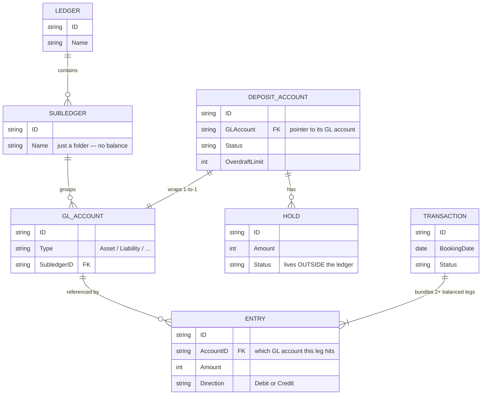
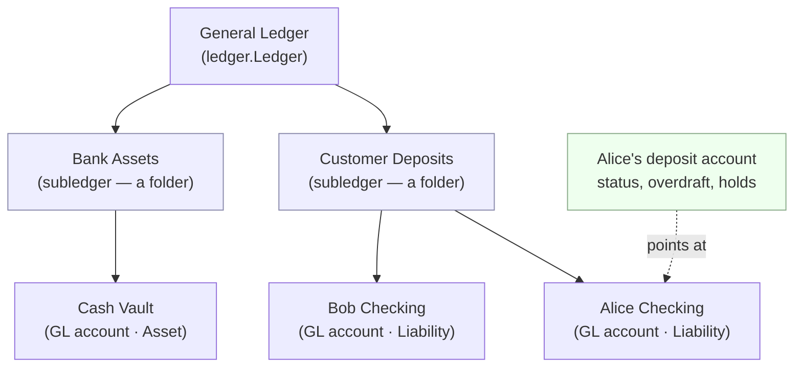
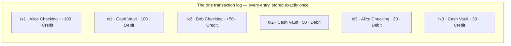
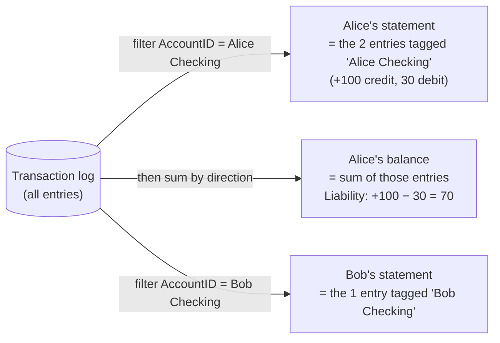
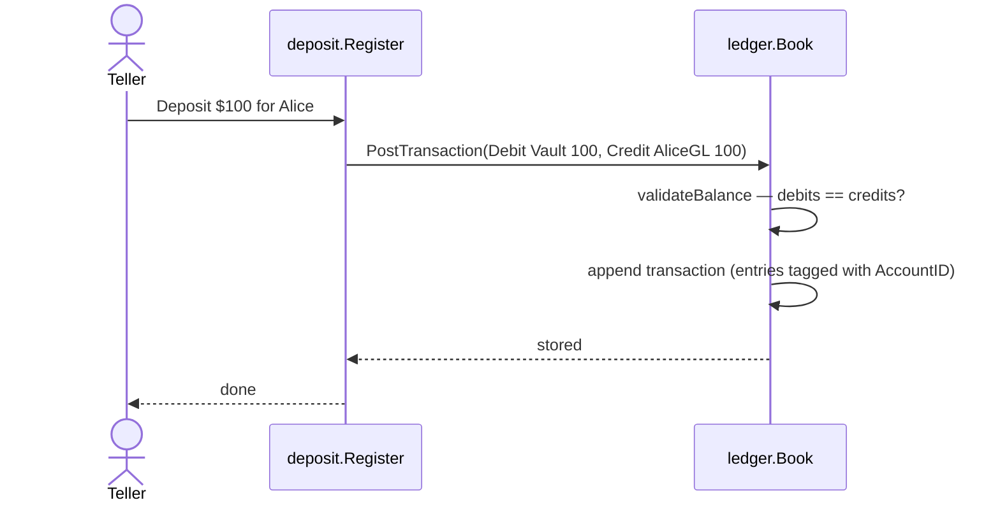
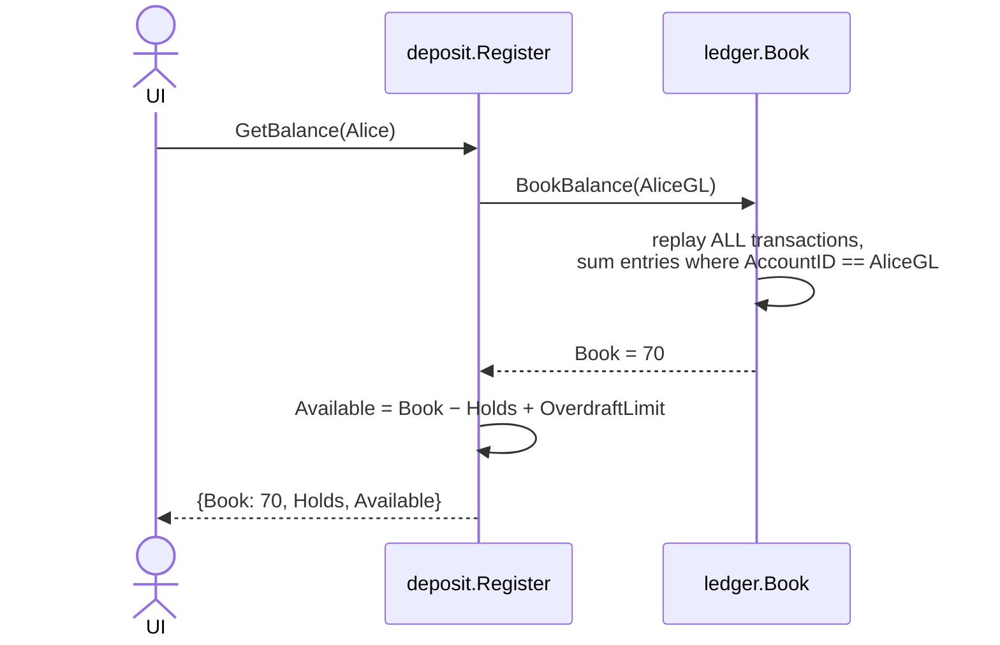
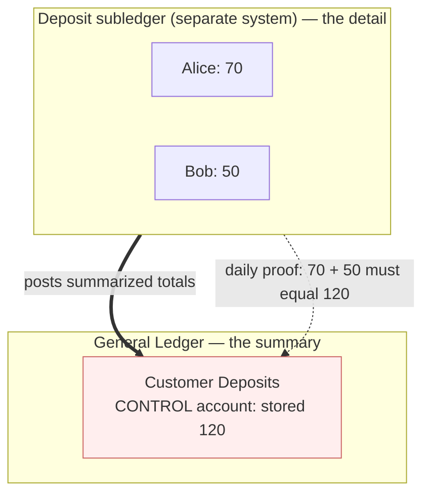
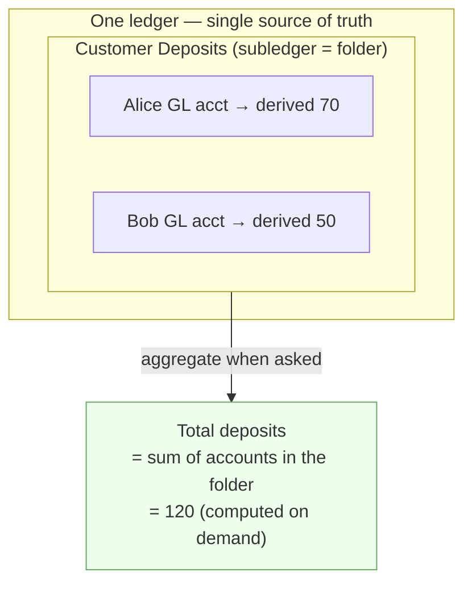
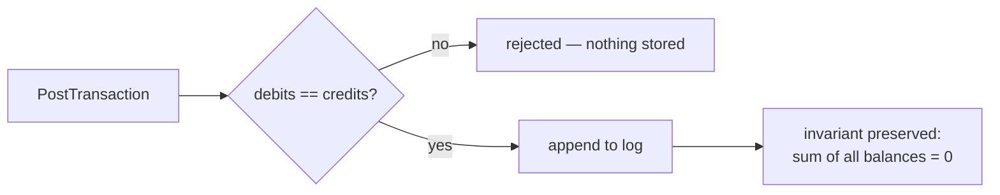

# Where do a deposit account's ledger entries live?

> **The one-sentence answer:** a deposit account's entries are **not stored
> separately**. There is a single shared transaction log; an account's
> "statement" is just the entries in that log *filtered* by account id, and its
> balance is those same entries *summed*. Nothing is copied, and no balance is
> ever stored.

This document builds that answer up from scratch, shows how *this* codebase
implements it, contrasts it with how legacy banks do it, and explains the
integrity guarantee that holds it all together.

---

## 1. The question, stated precisely

When you look at one customer's checking account you see a list of transactions
and a balance. The natural question is: **does that list physically exist as the
account's own private ledger, or is it produced on demand from a bigger shared
store?**

Two possible designs:

| Design | Where the entries live | The account's statement is… |
| --- | --- | --- |
| **Stored separately** | Each account owns a private list of its entries | …read directly from that private list |
| **Filtered** | One shared log holds everyone's entries, each tagged with an account id | …a query: "give me entries where `account = X`" |

This system uses the **filtered** design — and, as we'll see, takes it further
than most: it doesn't even store the *balance*, it recomputes it from the log
every time.

---

## 2. The vocabulary (and the one distinction that causes all the confusion)

The thing that trips people up is that there are **two different "accounts"**:

- **GL account** (`ledger.Account`) — a pure accounting account. This is where
  money and entries actually live. It has a *type* (Asset, Liability, …) and
  belongs to a subledger.
- **Deposit account** (`deposit.Account`) — the customer-facing object. It holds
  *operational* state (status, overdraft limit) and a **pointer** to one GL
  account. It stores **no money and no entries of its own.**

A customer's money is the balance of the **Liability** GL account that their
deposit account points at. (Liability, because the customer's deposit is money
the *bank owes them* — see `book/03-the-chart-of-accounts.md`.)

```go
// deposit/types.go:53
type Account struct {
    ID             AccountID
    GLAccount      ledger.AccountID // ← the customer's money lives HERE, in the GL
    Name           string
    Status         AccountStatus    // Active / Dormant / Frozen / Closed
    OverdraftLimit ledger.Amount
    CreatedAt      time.Time
}
```

So "deposit account vs subledger" is really: **a thin operational wrapper
pointing at one GL account, which is filed inside a subledger.**

---

## 3. How the pieces relate



Read the two key edges carefully:

- `TRANSACTION ||--|{ ENTRY` (solid line): entries are **owned by** a transaction
  — they're stored as a slice *inside* it (`ledger/types.go:154`). An entry has no
  independent existence.
- `GL_ACCOUNT ||--o{ ENTRY` (the "referenced by" edge): an account does **not**
  own a list of entries. Entries merely *carry* an `AccountID` tag
  (`ledger/types.go:129`). To find an account's entries you scan the log for that
  tag.

That second point **is** the answer to your question, in the data model.

---

## 4. The structural hierarchy



Note what the **subledger is not**: it has no balance field and no list of
entries (`ledger/types.go:109` — it's just `{ID, LedgerID, Name, CreatedAt}`). It
is purely a label that groups GL accounts. "All customer deposits" means "every GL
account whose `SubledgerID` is the Customer Deposits folder."

---

## 5. A worked example — follow the money

Three events. Watch where data lands.

1. **Alice deposits $100 cash.** Double-entry: the bank's cash goes up *and* the
   bank's debt to Alice goes up.
   - Debit `Cash Vault` (Asset) 100
   - Credit `Alice Checking` (Liability) 100
2. **Bob deposits $50 cash.**
   - Debit `Cash Vault` 50
   - Credit `Bob Checking` 50
3. **Alice withdraws $30 cash.**
   - Debit `Alice Checking` 30
   - Credit `Cash Vault` 30

After these, here is **the entire stored state** — one flat log of entries, each
tagged with the GL account it hits. There is no per-account storage anywhere:



Now Alice's **statement** and **balance** are both *derived* from that log — they
are not stored:



This is the whole idea in one picture: **one log, many filtered views.** Alice's
$100 credit and her $30 debit are interleaved in the same log as Bob's and the
vault's entries — they're never collected into an "Alice ledger." They're found by
their tag when someone asks.

> Why does Liability balance = credits − debits (not debits − credits)? Because a
> Liability's *normal balance* is Credit: credits grow what the bank owes, debits
> shrink it. The code encodes this in `AccountType.NormalBalance()`
> (`ledger/types.go:50`).

---

## 6. The code paths that produce those views

### Reading the statement (filter)

`ListTransactionsForAccount` literally scans every transaction and keeps the ones
that contain an entry tagged with the account — a `WHERE AccountID = X` over the
shared log (`ledger/list.go:92`):

```go
for _, tx := range s.transactions {
    for _, e := range tx.Entries {
        if e.AccountID == accountID { // ← the filter
            result = append(result, copyTransaction(tx))
            break
        }
    }
}
```

### Reading the balance (sum)

There is **no stored balance**. `computeBookBalance` replays the entire log every
time and adds/subtracts each matching entry by direction
(`ledger/book.go:589`):

```go
for _, tx := range s.transactions {
    for _, e := range tx.Entries {
        if e.AccountID != accountID {
            continue
        }
        if e.Direction == normal { // normal direction grows the balance
            balance += e.Amount
        } else {
            balance -= e.Amount
        }
    }
}
```

### The two layers talking to each other

A deposit (or any money movement) flows from the deposit layer down into the
single ledger:



And reading Alice's balance always recomputes from the log, then adds the
deposit-layer adjustments (holds, overdraft) that live *outside* the ledger:



(`deposit/register.go:438` for `GetBalance`.)

---

## 7. How real banks differ — two patterns

Your earlier question — "are they stored separately, or filtered from the backing
subledger?" — maps onto a real architectural choice banks have made historically.

### Pattern A — separate books (legacy / classic core banking)

The **General Ledger** and the **deposit subledger** are genuinely *separate
systems*. The subledger holds per-customer detail; the GL holds only a single
**control account** ("Customer Deposits") whose stored balance is supposed to
equal the sum of all the detail. The subledger posts *summarized* entries up to
the GL.



Because the control balance is **stored independently** of the detail, the two can
*drift* (bugs, partial failures, timing). So legacy banks run a **subledger-to-GL
reconciliation** every day to prove `Σ(detail) == control`. A mismatch is a
"reconciliation break" to be investigated. This is real operational toil — and it
exists precisely because the same number is written down in two places.

### Pattern B — one unified ledger (this codebase)

There is a **single** double-entry ledger. The deposit account is just a pointer
to a GL account; the subledger is a folder; and "total customer deposits" is
**computed by aggregation when asked**, never stored.



There is no second copy of the number, so **there is nothing to reconcile and
nothing that can drift.** This is the shape modern ledger systems converge on
(e.g. TigerBeetle, Modern Treasury). The price you pay is performance: every
balance read replays the whole log (`O(n)`), because you chose never to
materialize a stored balance.

| | Pattern A (legacy) | Pattern B (this repo) |
| --- | --- | --- |
| Per-customer entries | In the subledger system | In the one shared log, tagged by account |
| GL control account | A real account with a **stored** balance | Does not exist; total is derived |
| Subledger | A separate detail system | A folder/label |
| Balance | Often stored & maintained | Always recomputed from the log |
| Reconciliation | Required daily; can break | Structurally unnecessary |

---

## 8. The integrity guarantee that actually holds

If balances aren't stored, what keeps the books correct? **Balanced posting.**
Every transaction is rejected unless total debits equal total credits
(`validateBalance`, `ledger/book.go:404`). That single rule guarantees the signed
sum of *all* GL account balances is always exactly zero — the trial-balance
identity (of which the accounting equation, Assets = Liabilities + Equity, is a
corollary) holds after every post. That is the real invariant here, and
it's enforced at write time rather than checked after the fact.



The "Σ(deposits) == control" reconciliation from Pattern A holds here too — but
**vacuously**: there is no separately-stored control number for the detail to
disagree with.

---

## 9. The one thing that lives *outside* the ledger: holds

A **hold** (a pending card authorization) reduces what a customer can *spend*
without moving any money yet. It is not a real debit/credit, so it posts **no GL
entries** — it lives only in the deposit layer (`deposit/types.go:86`). That's why
available balance is computed in two parts:

```
Available = Book (from the ledger)  −  Holds (deposit layer)  +  OverdraftLimit
```

(`deposit/register.go:456`.)

Implication: the ledger is the single source of truth for *settled* money, but the
deposit layer carries state (holds) the ledger can't see or reconstruct. If this
system ever gets a database, holds are the one place where the two layers could
get out of sync — so they'd need their own consistency handling, even though the
ledger itself needs none.

---

## 10. Summary

- A deposit account stores **no entries and no balance** — it's a wrapper pointing
  at one Liability GL account.
- Entries are stored **once**, inside transactions, in a single shared log, each
  tagged with an `AccountID`.
- A statement is that log **filtered** by account; a balance is those entries
  **summed**. Both are derived, never stored.
- This is the **unified-ledger** pattern: no GL control account, subledger is just
  a folder, "total deposits" is an aggregation. Legacy banks instead keep a
  separate stored control balance and must reconcile it daily — this design makes
  that whole class of bug impossible.
- The enforced invariant is **balanced posting** (debits == credits); holds are
  the only money-affecting state kept outside the ledger.

### Where to look in the code

| Concept | File |
| --- | --- |
| Deposit account (wrapper) | `deposit/types.go:53` |
| GL account, entry, transaction, subledger | `ledger/types.go:109`–`164` |
| Normal-balance rule | `ledger/types.go:50` |
| Statement = filter | `ledger/list.go:92` |
| Balance = replay/sum | `ledger/book.go:589` |
| Balanced-posting check | `ledger/book.go:404` |
| Available balance (holds, overdraft) | `deposit/register.go:438` |
| Narrative background | `book/04-ledgers-subledgers-and-money.md`, `book/07-balances-and-holds.md` |
