# Who a real SEPA bank actually talks to

Real-world plumbing behind SEPA credit transfers and direct debits: the
institutions, the systems they operate, and which of them a given bank has an
actual connection to. This is background for the domain modelled in this
repository, not a description of it.

## The confusion, stated plainly

The names in this space belong to **three different kinds of thing**, and they
get listed side by side as if they were peers:

| Name | What kind of thing it is |
| --- | --- |
| EPC | An association. Writes rulebooks. Carries no traffic. |
| EBA CLEARING | A company. Owned by its member banks. |
| STEP2 | A *system* operated by EBA CLEARING. Bulk clearing. |
| RT1 | A *different system* operated by EBA CLEARING. Instant. |
| Eurosystem | ECB + the national central banks. |
| T2 | A *system* operated by the Eurosystem. Settlement. |
| TIPS | A *different system* operated by the Eurosystem. Instant. |
| SEPA-Clearer | A *system* operated by Deutsche Bundesbank. Bulk clearing. |
| Bundesbank | A national central bank. Wears three hats — see below. |

"Clearing house" is a **role**, not an institution. EBA CLEARING plays it with
STEP2 and RT1; Bundesbank plays it with SEPA-Clearer; Iberpay, STET,
equensWorldline and Nexi play it in their countries. The generic term for one
in the rulebooks is **CSM** — Clearing and Settlement Mechanism.

## The four layers

Every euro retail payment passes through all four. Nothing skips a layer. This
is a map of *what each system is for* — not a flow; the same bank sits at both
ends of a payment.

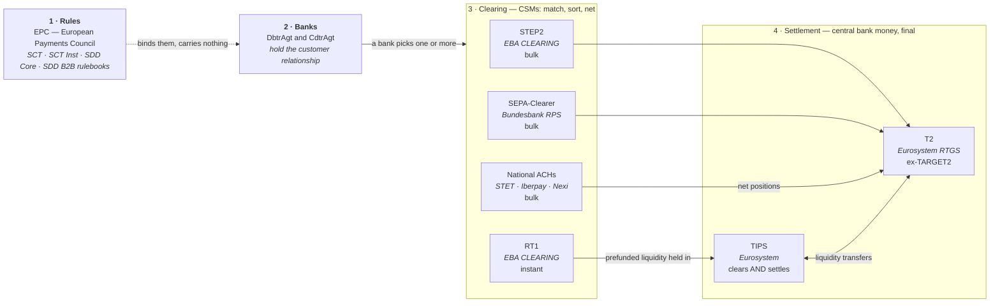

Two things to read off it:

- **Clearing and settlement are separate steps** for everything bulk. STEP2
  decides *who owes whom*; T2 is where the money actually moves, in central
  bank money, once per cycle, netted.
- **TIPS collapses the two.** There is no netting and no cycle — each payment
  settles individually in central bank money, in about a second. That is the
  whole reason instant is a different system rather than a faster STEP2.

## Bundesbank wears three hats

This is where most of the confusion comes from. A German bank talks to
Bundesbank in up to three unrelated capacities, and they have nothing to do
with each other.

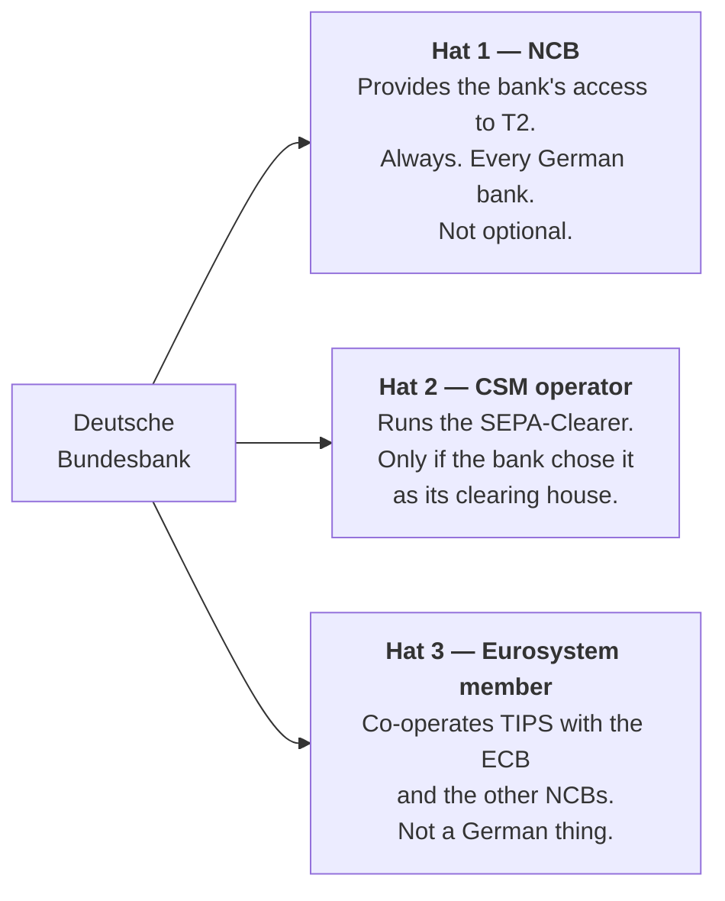

A bank that clears through STEP2 still deals with Bundesbank for hat 1. A bank
that clears through SEPA-Clearer deals with it for hats 1 *and* 2 — and those
are still two separate relationships, two separate connections, two separate
sets of files.

## What the SEPA-Clearer is

A central bank running a retail ACH. Most national central banks exited retail
clearing when SEPA arrived and left the field to EBA CLEARING; Bundesbank
stayed in. Consequences:

- **Open access.** Any credit institution with a Bundesbank account can join.
  No sponsor, no membership hurdle.
- **Cost-covering pricing by statute.** No margin. This is the main reason
  small and mid-size German banks use it.
- **Bulk only**, six settlement cycles per business day, settling in T2 — the
  next section counts them. It has no instant product; that is TIPS.
- **Reachability by interoperability.** SEPA-Clearer is linked to STEP2 and
  other European ACHs, so a bank clearing only through it still reaches every
  bank in SEPA. Without those links it would be a German island.

## Inside one SEPA-Clearer cycle

The rest of this document draws the CSM as one box. This section opens it, for
the one CSM whose rulebook is public in full detail. Times are from the
Bundesbank's *Procedural rules for SEPA credit transfers*, March 2024 v1.0, and
they drift — that document's own version history records a decade of cut-off
changes, so treat the shape as durable and the clock as current-as-of.

### Six submission windows, eight delivery windows

| # | Submission cut-off | Debit · submitter | Delivery + credit · receiver | Value |
| --- | --- | --- | --- | --- |
| 1 | 08:00 | ~08:10 | ~08:10 | D |
| 2 | 10:00 | ~10:10 | ~10:10 | D |
| 3 | 11:00 | ~11:10 | ~11:10 | D |
| 4 | 14:00 | ~14:10 | ~14:10 | D |
| 5 | 15:00 | ~15:10 | ~15:10 | D |
| 6 | 20:00 | ~20:10 | ~20:10 | **D+1** |
| 7 | — inbound only | — | ~16:10, from other CSMs | D |
| 8 | — inbound only | — | ~17:10, from STEP2 | D |

Settlement trails a cut-off by roughly ten minutes; the exact moment depends on
how many instructions are queued. Windows 7 and 8 take no submissions at all —
they exist only to deliver payments arriving from elsewhere, which is what the
*reachability by interoperability* bullet above costs in practice.

Files are accepted 00:00–24:00 Monday to Sunday, but anything arriving after
20:00, or on a weekend or TARGET holiday, is buffered until validation starts
around 06:00 on the next business day.

### Nothing reaches the creditor's bank before settlement

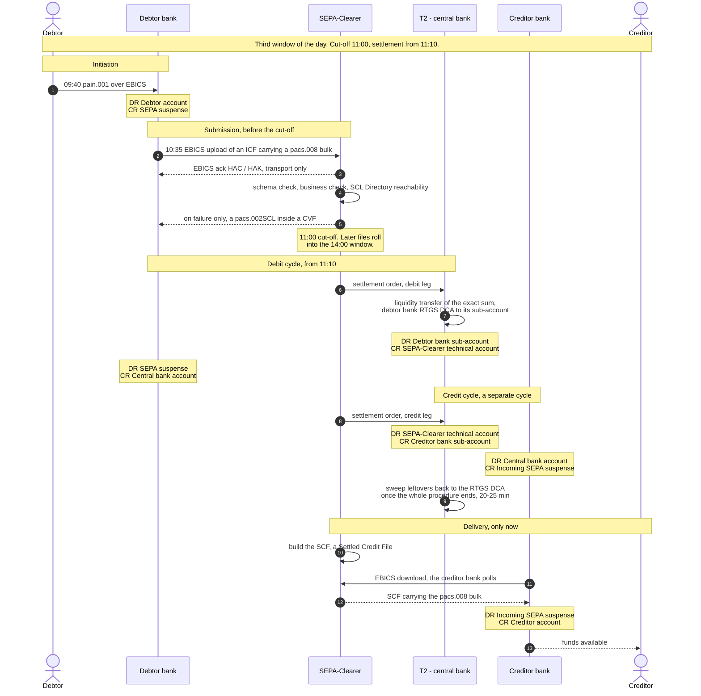

The invariant is in the file's own name: the creditor's bank collects an
**SCF — Settled Credit File**. Deliveries are made "once the submitted payment
messages have been processed and, where applicable, the relevant bookings have
been carried out". There is no advised-but-unsettled state on this rail, and the
receiver therefore never carries credit risk on the sender.

Two consequences that are easy to miss:

- **The creditor's bank cannot refuse a payment.** It has no pre-settlement
  sight of it, so account-closed, unknown-IBAN and compliance outcomes can only
  become a *Return* afterwards. See the R-transaction section below.
- **What the CSM checks is reachability, not existence.** The SCL Directory
  answers whether both PSPs are reachable — a BIC-level question. Whether the
  IBAN exists, is open, or matches a name is knowable only inside the creditor's
  bank, which has not been asked yet.

### Gross coverage, not netting

The SEPA-Clearer settles as a T2 **ancillary system using "procedure C"** —
settlement on sub-accounts of RTGS DCAs. This is *not* the multilateral netting
picture drawn under "Who pushes the button at the end of a cycle" below, and the
difference is worth holding separately:

- **The sum is known in advance, and it is gross.** Before each cycle the SCL
  transfers liquidity from the participant's RTGS DCA into its dedicated
  sub-account, equal to the amount it is about to debit. Nothing is netted
  against incoming payments. Counter-values settle **per logical file (bulk)**,
  not per net position.
- **Debiting and crediting are separate cycles.** They have to be: a debit can
  fail, so the set of payments that can be credited is not knowable until every
  debit has been attempted.
- **Between the two cycles the money is on the SCL's technical account** in T2 —
  the intermediary account an ancillary system uses to collect debits and pay out
  credits. It belongs to neither bank for those minutes.
- **No second attempt on a shortfall.** Insufficient funds means direct
  rejection by CVF. The payment is not queued, not retried; it simply never
  entered the credit cycle. A payment is settled or rejected, never pending.
- **The sub-account is not released per cycle.** Leftover liquidity returns to
  the RTGS DCA only once the *entire* procedure has run — SCT, SDD and card
  collections are processed in one combined settlement procedure, taking roughly
  20–25 minutes.

### The books, step by step

Four postings across three institutions, for one payment of 100:

| When | Institution | Debit | Credit |
| --- | --- | --- | --- |
| 09:40 | Debtor bank | Debtor account | SEPA suspense |
| ~11:10 | T2 | Debtor bank sub-account | SCL technical account |
| ~11:10 | Debtor bank | SEPA suspense | Central bank account |
| ~11:10 | T2 | SCL technical account | Creditor bank sub-account |
| ~11:10 | Creditor bank | Central bank account | Incoming SEPA suspense |
| ~11:2x | Creditor bank | Incoming SEPA suspense | Creditor account |

The suspense accounts are the interesting rows. The payer's money leaves their
balance at 09:40 and reaches the payee's at 11:2x — for those two hours it is on
neither customer's account, and for a few minutes of that it is on neither
bank's.

### Where a file can end up instead

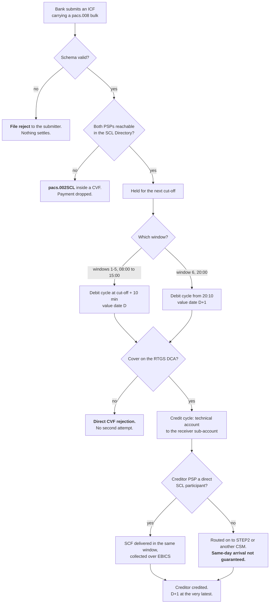

A bulk is rejected wholesale once more than 999 of its individual transactions
are erroneous. And the onward-routing branch is why the rules advise submitting
no later than window 4 for anything the payer did not initiate that day.

### What a payer actually experiences

Morning transfer, both banks direct SCL participants: **one to three hours**
door to door. Four things stretch it, and none of them are the clearing house:

- the submitting bank's own batching — the scheme clock starts when the bank
  accepts, not when the customer clicks;
- the receiving bank's posting run — interbank settled is not customer credited;
- onward routing to another CSM, where same-day is not promised;
- weekends and TARGET holidays, when the SCL does not run at all.

The legal ceiling is unchanged throughout: the payee's PSP must be credited by
the end of the next business day, D+1.

**And this timetable increasingly describes the wrong rail.** Since 9 October
2025 euro-area PSPs must offer instant credit transfers on the same channels as
ordinary ones at no higher charge, so a euro transfer initiated from a phone
most likely goes over TIPS or RT1 in about five seconds. What the batch windows
still show clearly is the shape a settlement-before-delivery rail has to take:
collect, then distribute, with an account in the middle holding the money for
the minutes in between.

## When two clearing houses are involved

The *reachability by interoperability* bullet is doing a lot of work. A bank
clearing only through the SEPA-Clearer can pay a bank that has never heard of
it, and the mechanism is worth spelling out because the obvious guess — that the
two clearing houses pay each other — is wrong.

### The clearing houses exchange files, not money

CSMs interoperate by sending each other the same things a participant sends:
files of payments, validation reports, settlement information and reconciliation
reports, over the same networks. The Bundesbank's rules put it plainly: "the
SEPA-Clearer exchanges payment files with the systems of other CSMs". It holds
bilateral cooperative agreements with several European clearing houses and a
connection to STEP2.

This is why interoperability costs nothing in format terms. Every CSM speaks
`pacs.008`, so a file crossing from one to another needs no translation — the
standardisation the EPC rulebooks impose on banks turns out to be what lets the
infrastructures talk to each other too.

### The money moves the only way it can — in central bank money, on a bank's account

A clearing house cannot pay another clearing house, because a clearing house
holds no money. What actually happens is **two settlements bridged by one
account**:

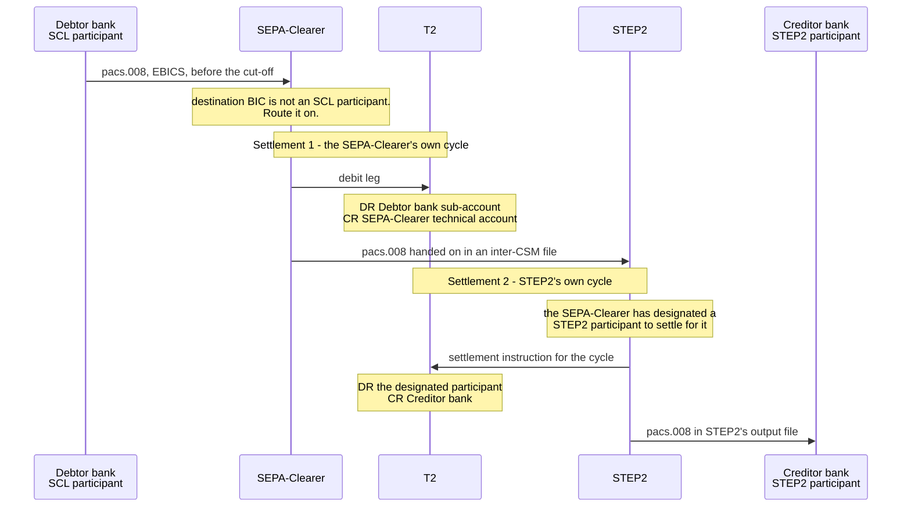

Three properties of that picture:

- **Each CSM only ever touches its own participants' central bank accounts.**
  Neither system instructs a movement in the other's world. The join is that
  *the sending CSM is represented inside the receiving CSM's settlement.*
- **The bridge is a financial institution, not the clearing house.** Any SEPA CSM
  may channel payments through STEP2 on behalf of its participants and
  **designate a participant for settlement in T2 RTGS**; the settlement
  obligation for those payments is assumed by that institution. That is what
  brings the payments under the Settlement Finality Directive — a clearing house
  cannot give finality to its own IOU, a central bank account movement can.
- **Money never leaves central bank money.** There is no correspondent account,
  no commercial-bank exposure between the two systems, and no moment where one
  clearing house owes the other.

The exact plumbing of a given link is set in the bilateral agreement between the
two operators, so the account shape varies. The invariant does not: whatever the
arrangement, the movement is in T2, on an account belonging to a bank.

### What it costs: a cycle, not a fee

Each hop adds a full clearing cycle, because the receiving CSM cannot settle a
file before its own next cut-off. That is the whole reason for delivery windows
7 and 8:

| Window | Time | Carries |
| --- | --- | --- |
| 7 | ~16:10 | payments arriving from other CSMs |
| 8 | ~17:10 | payments from STEP2, for BICs registered as STEP2-reachable via the Bundesbank |

They sit after the last outbound cycle because inbound inter-CSM traffic arrives
after the domestic day has run. The rulebook's own conclusion is the practical
one: where a payment is routed to another CSM, "it cannot generally be assumed
that these payments will reach the payee's payment service provider on the same
business day". The D+1 ceiling is what absorbs the extra hop.

The same arithmetic bites harder on R-transactions, which must retrace the route:
a post-settlement direct debit R-transaction routed via another CSM cannot go out
before the fourth submission window (SDD Core) or the fifth (SDD B2B).

### Two things this does not mean

- **Interoperability is not how most reach works.** It covers roughly 20% of the
  4,800-plus BICs in STEP2's SCT routing table. The large majority are reached
  because the bank, or its gateway, is a participant directly.
- **The submitting bank does not choose the route.** It submits to its own CSM
  and the CSM's routing directory decides — for the SEPA-Clearer, the SCL
  Directory, which is also what the reachability check at submission is run
  against. A bank publishes no opinion about which clearing houses exist.

### Instant is a different design again

Multi-CSM instant payments cannot work this way: there is no cycle to wait for
and no moment at which a file can be handed over. The EACHA instant framework
therefore builds inter-CSM settlement on **funding position rather than
sequence** — a prefunded model and a post-funded one, with the prefunded case
using the T2 real-time ancillary system interface and full cash cover. RT1 now
holds its liquidity in TIPS for the same reason: when settlement is per payment
and permanent, the only way two systems can interoperate is by both drawing on
liquidity that is already there.

## Direct and indirect participation

A bank does not have to be a member of the CSM it clears through. Most are
not — volumes below a few hundred million transactions a year do not justify
STEP2's fees and collateral.

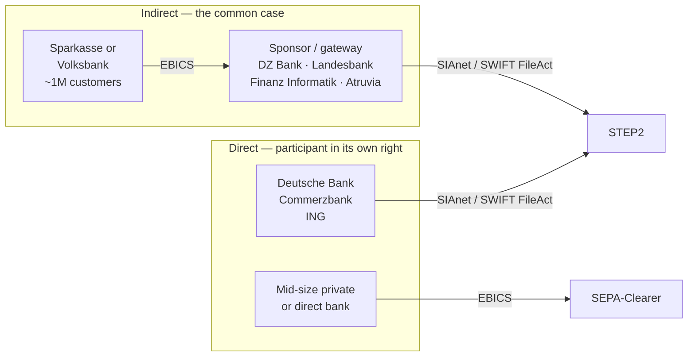

The indirect bank has **one** counterparty — its gateway. The gateway fronts
the CSM. Two hops in the network, one relationship to manage.

The SEPA-Clearer's open access is what makes the bottom row possible: a
mid-size bank can be a *direct* participant somewhere it can afford, instead of
hanging off DZ Bank or a Landesbank.

Who fronts whom, in Germany:

| Bank | IT processor | Clearing gateway |
| --- | --- | --- |
| Sparkasse | Finanz Informatik | Landesbank / DekaBank → STEP2, or SEPA-Clearer direct |
| Volksbank / Raiffeisenbank | Atruvia | DZ Bank → STEP2 |
| Private or direct bank | own or outsourced | SEPA-Clearer direct, or a correspondent / equensWorldline → STEP2 |

## A bulk credit transfer, end to end

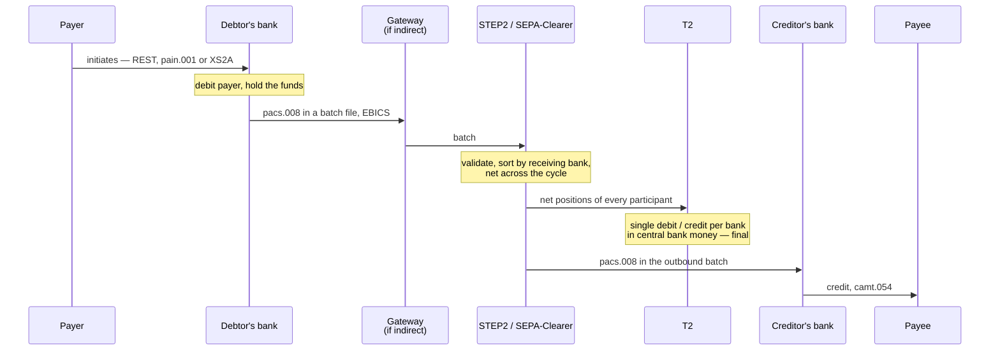

The payee's bank is obliged to credit by the end of the next business day
(D+1). The netting is the point: a hundred thousand payments between two banks
become one T2 movement.

One caveat on that diagram, and it is the reason the SEPA-Clearer gets a section
of its own above: **netting is STEP2's shape, not every bulk CSM's.** The
SEPA-Clearer settles gross, per logical file, against liquidity pulled in
advance. Both are deferred and cyclical; only one of them nets.

## The whole chain, and the two things that travel

Same journey as a flat sequence of hops:

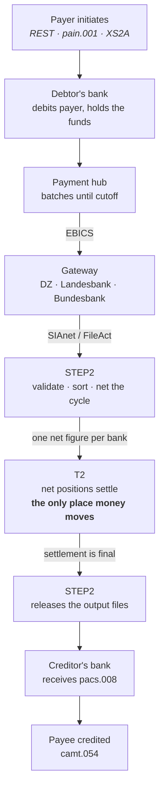

The step most people get wrong is `F`. **The payments do not go through T2.**
They never touch it. What settles there is one net figure per bank — an
aggregate that no longer knows which payments it came from. Two things travel,
on separate paths:

| | Carries | Travels via |
| --- | --- | --- |
| **Information** | `pacs.008` — who to credit, how much | STEP2, bank to bank |
| **Money** | one debit or credit per bank | T2, in central bank money |

And the ordering is load-bearing: **the cycle settles in T2 before STEP2
releases the output files.** The receiving bank gets its instructions only once
the funds behind them are final, so it never credits a customer against money
that has not settled. Reverse those two steps and you have invented settlement
risk.

Direct debits are the same picture with the arrow reversed — the creditor's
bank pushes `pacs.003` to pull. Same batching, same netting, same T2.

## Where the payment comes from

`pain.001` is a *file format for one channel*, not a required first step. Most
retail payments never involve one:

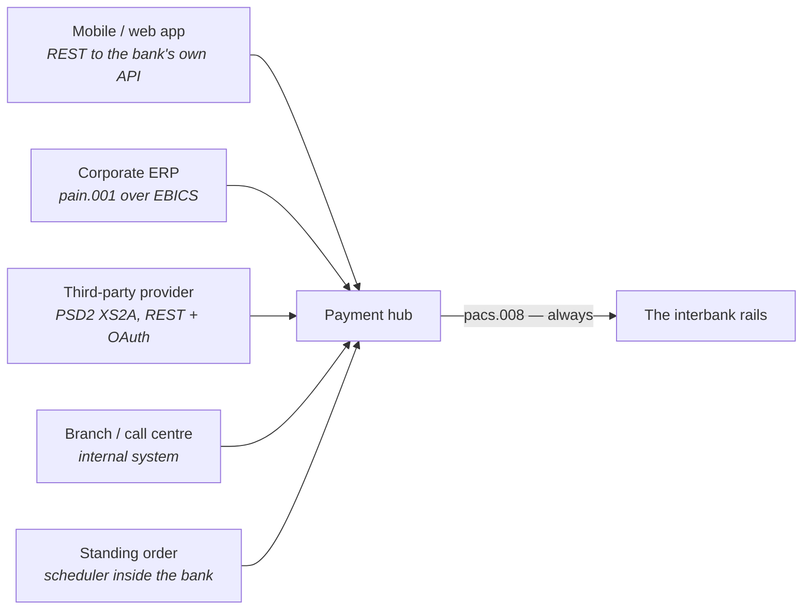

A retail app posts JSON to the bank's own internal API; the payment hub builds
the payment in the bank's model directly. `pain.001` belongs to the corporate
channel — payroll runs, supplier batches, an ERP shipping a file over EBICS.
PSD2 payment initiation is REST again, by a third party.

**The channel is the bank's own business; the rails are not.** Whatever the
front door, everything converges on the payment hub and leaves as `pacs.008`.
That is the leg the rulebooks govern, and it is the same for all five.

## An instant credit transfer

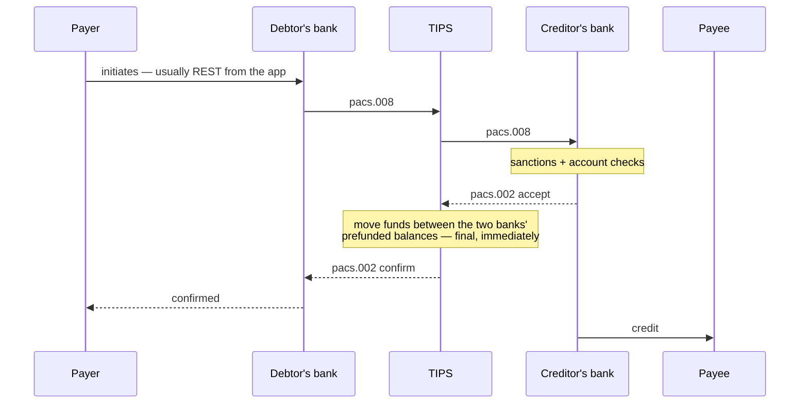

No batch, no cycle, no netting, no T2 step — TIPS holds prefunded balances and
moves between them. Whole round trip inside 10 seconds, 24/7/365.

Since **9 October 2025** (Instant Payments Regulation, EU 2024/886) euro-area
PSPs must both send and receive instant euro credit transfers. Reachability via
TIPS or RT1 is no longer optional. RT1, note, now holds its liquidity *in*
TIPS — the two are no longer independent.

## T2, and why netting exists at all

T2 is the Eurosystem's RTGS — **R**eal-**T**ime **G**ross **S**ettlement. *Gross*
means each payment settles on its own: immediately, individually, finally, with
no cycle to wait for and no way back.

It is not a large-value system by rule. There is no minimum amount; you could
send a euro through it. What keeps retail out is fees and good sense.

| | T2 · gross | STEP2 · deferred net |
| --- | --- | --- |
| Settles | per payment, instantly | per cycle, netted |
| Settlement risk | none — final on the spot | exposure builds until the cycle settles |
| Liquidity cost | high — the full amount, now | low — only the net |
| Volume | ~400k payments/day | tens of millions/day |
| Value | ~€2tn/day | small payments, huge count |

That table is the whole argument for having both. **RTGS buys away credit risk
by spending liquidity; netting does the reverse.** You cannot have both at once,
so Europe runs one of each and routes by what the payment needs.

T2's job is wider than large-value payments. It is the floor everything else
stands on:

- interbank large-value and urgent customer payments
- **ancillary system settlement** — STEP2's and SEPA-Clearer's net positions,
  CCP margin, CLS
- monetary policy operations with the central bank
- liquidity transfers out to the TIPS and T2S accounts

The second one has a wrinkle worth noticing: a *net* figure moved by a *gross*
mechanism. STEP2 does the netting; T2 then makes one indivisible, final
movement of the result. Netting is an arrangement between banks, and it is not
money until T2 says so.

Since the March 2023 consolidation, "T2" is two components with accounts
hanging off them:

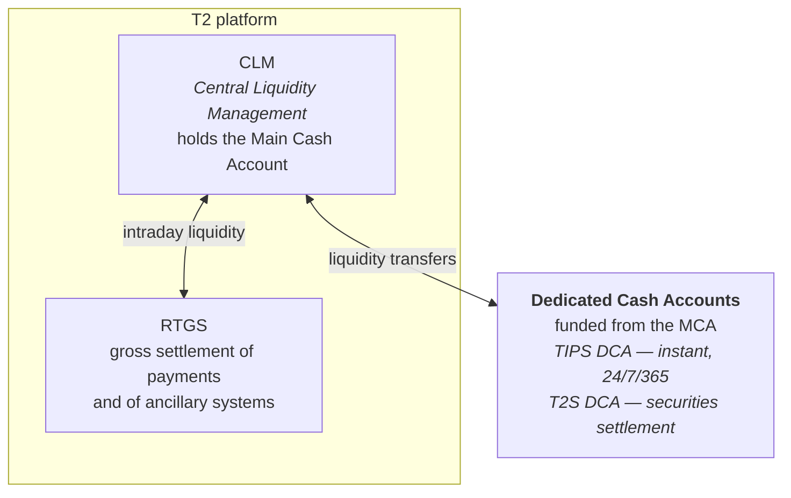

Liquidity moves between these during the day, and a bank has to fund each one
for what it expects to need there. **T2 closes** — business days only, with a
nightly maintenance window. TIPS never does. That difference is the whole
reason instant needed a separate system instead of a faster T2: you cannot
promise a payer ten seconds on a Sunday from a system that is shut.

## Who pushes the button at the end of a cycle

Not the banks, and not T2. **The CSM does**, acting in T2's formal role of
*ancillary system*.

What makes that possible is a mandate granted at onboarding: joining a CSM
includes authorising it to debit your RTGS account for whatever net position
the cycle turns out to produce. You agree in advance to be debited by an amount
nobody knows yet. Without that, a third party instructing a movement on your
central bank account would be unthinkable.

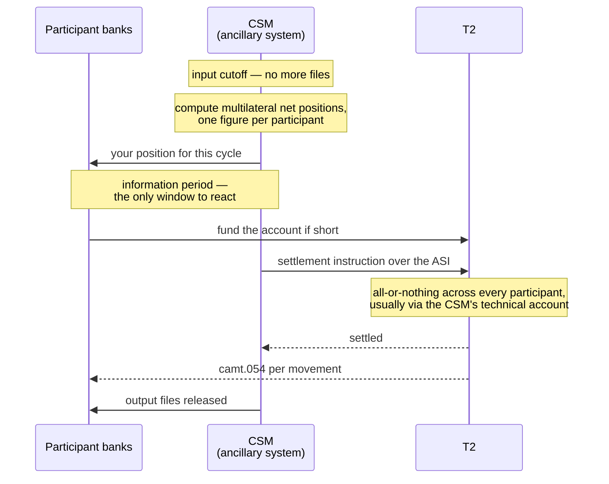

Three properties of that picture are load-bearing:

- **The information period exists so a bank can fund.** It is told its position
  *before* the debit, not after. A treasury desk that ignores this discovers
  the problem at cutoff, when nothing can be done.
- **All-or-nothing.** The cycle settles entirely or not at all. There is no
  half-settled cycle and no per-payment failure at this stage.
- **A technical account.** The CSM typically holds one in T2: debits collect
  in, credits pay out, and it nets to zero. That is the mechanism that makes
  the batch atomic.

If a participant cannot fund, the rulebook decides what happens — an extended
window, a guarantee fund, or removal of the failing participant and
recomputation of everyone's position. The detail varies by CSM; the
all-or-nothing property does not.

**That picture is the netting one.** A gross CSM has no information period to
offer, because there is no position to be told: the SEPA-Clearer transfers the
exact sum it is about to debit and rejects outright what it cannot cover. Read
the diagram above as STEP2's, and the section on the SEPA-Clearer as the other
answer to the same problem.

For the SEPA-Clearer, **Bundesbank appears on both sides of this diagram** — as
the ancillary system instructing settlement, and as the NCB providing the
account being instructed. Two of the three hats, in one cycle, and still two
separate systems.

One caveat: TARGET2 numbered its ancillary system settlement procedures 1–6 and
the 2023 consolidation restructured them. The current labels are in the T2
UDFS and are not reproduced here in full, because getting them subtly wrong is
worse than not stating them. One is worth naming, since its rulebook says so
outright: the SEPA-Clearer settles under **"procedure C"** — settlement on
sub-accounts of RTGS DCAs, with liquidity moved in before each cycle.

## How a bank sees its central bank balance

Not from Bundesbank, strictly — **from T2**. The NCB provides the account and
the relationship; the platform generates the reporting. The same split as the
three hats.

It arrives over **ESMIG** in A2A mode, through the bank's network service
provider, as ISO 20022 `camt` messages. Three mechanisms, and a real treasury
operation uses all three:

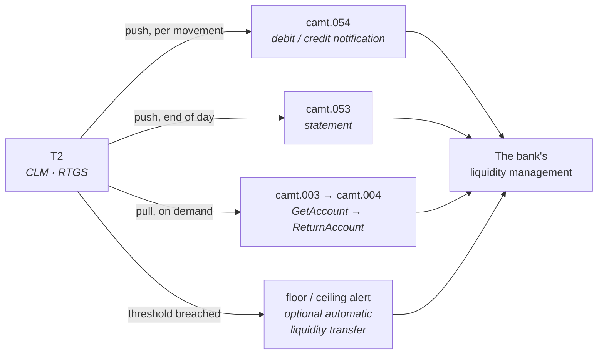

| Message | When | What it is |
| --- | --- | --- |
| `camt.054` | per movement, pushed | debit / credit notification — the real-time one |
| `camt.052` | intraday, scheduled or on demand | account report |
| `camt.053` | end of day, pushed | statement of the account |
| `camt.003` → `camt.004` | on demand | balance query and its answer |

**Floor and ceiling** are worth knowing about. CLM lets a participant set
thresholds on an account; breaching one raises a notification and can trigger a
rule-based liquidity transfer that tops the account up or sweeps it down
without anyone intervening. This is the mechanism that stops a bank finding out
at cutoff that it cannot fund a settlement.

Two things that catch people out:

- **Reporting is per account, not per institution.** The MCA in CLM, the RTGS
  DCA, the TIPS DCA, the T2S DCA — each is subscribed to and reported
  separately. A bank watching only its MCA can be blind to its TIPS balance
  draining overnight, which matters precisely because TIPS runs when nothing
  else does.
- **A received payment is itself a notification.** When another bank sends a
  `pacs.009`, that message *is* the news that the balance moved. The `camt.054`
  confirms it against the account, but the payment got there first.

There is also **U2A** — the ESMIG portal, a screen for humans. Useful to an
operator investigating something, never how the bank's systems learn.

## How it moves: files, messages, and EBICS

There is no message queue between a bank and its bulk clearer. The split runs
exactly along bulk versus instant:

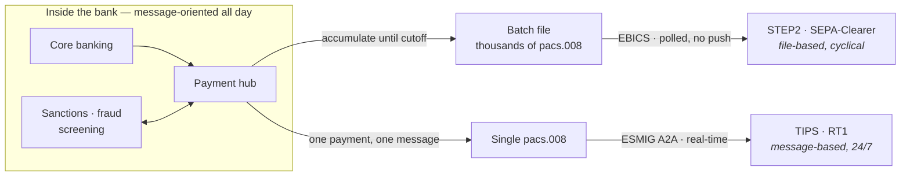

- **Bulk** is store-and-forward file transfer against a cutoff clock. EBICS has
  no push at all — the bank *polls* for its downloads.
- **Instant** is genuinely message-oriented, request and response, reached
  through **ESMIG** (Eurosystem Single Market Infrastructure Gateway) in A2A
  mode over a network service provider — SWIFT or Nexi/SIAnet. It has to be:
  the payer is standing there waiting.
- **T2 is message-based too.** Gross settlement is real-time by definition. The
  batch-ness belongs to the CSM, never to T2.

Two qualifications. The transport under bulk is queue-*like*: SWIFT FIN and
FileAct in store-and-forward mode hold messages until the receiver collects
them, with delivery guarantees and non-repudiation. And the message queue you
expect **does** exist — inside the bank. IBM MQ or Kafka carries individual
payments between core banking, the payment hub and screening all day. The
payment hub is the impedance matcher: messages on one side, a file at cutoff on
the other.

### EBICS

**E**lectronic **B**anking **I**nternet **C**ommunication **S**tandard. A
file-transfer protocol, not a payment format — the envelope, where pain/pacs/camt
are the letter inside.

German in origin: it replaced BCS-FTAM in 2008 under the DFÜ-Abkommen. France
adopted it in 2010 in place of ETEBAC, Switzerland from 2012, Austria too. It is
now governed by **EBICS SCRL**, owned jointly by the German, French, Swiss and
Austrian banking associations.

XML over HTTPS, batch-oriented. The interesting part is that **its security does
not rest on TLS**. Each subscriber holds three RSA key pairs:

| Key | Purpose |
| --- | --- |
| `A006` | electronic signature — authorises the order |
| `E002` | encrypts the payload |
| `X002` | authenticates the request |

The file is signed and encrypted at the application layer, so breaking the
transport does not let anyone forge an order.

- **Enrolment (INI/HIA)** is deliberately half-offline. The customer sends
  public keys electronically, then *mails a paper letter* carrying the key
  hashes, hand-signed. The bank compares. One step that is not online, on
  purpose.
- **Distributed signature (VEU)** puts four-eyes in the protocol rather than in
  an application: one subscriber uploads, another authorises. Signature classes
  are `E` (may sign alone), `A`/`B` (needs a co-signer) and `T` — transport
  only, which may ship a file but authorise nothing.
- **Order types** were three-letter codes (`CCT` credit transfer, `CDD` direct
  debit, `STA`/`C53` statements, `HAC` acknowledgements). EBICS **3.0** (2021)
  replaced them with **BTF**, a structured descriptor instead of an opaque
  triple. France mandated 3.0; Germany is migrating.

EBICS is not PSD2/XS2A. Those are REST and OAuth, for third parties reaching
retail accounts. EBICS is corporate-to-bank and bank-to-gateway, file-based, and
much older.

## Returns and the other R-transactions

The rule that removes most of the mystery: **an R-transaction goes back the way
the original came.** No separate channel, no separate counterparty. Arrived via
STEP2, returns via STEP2.

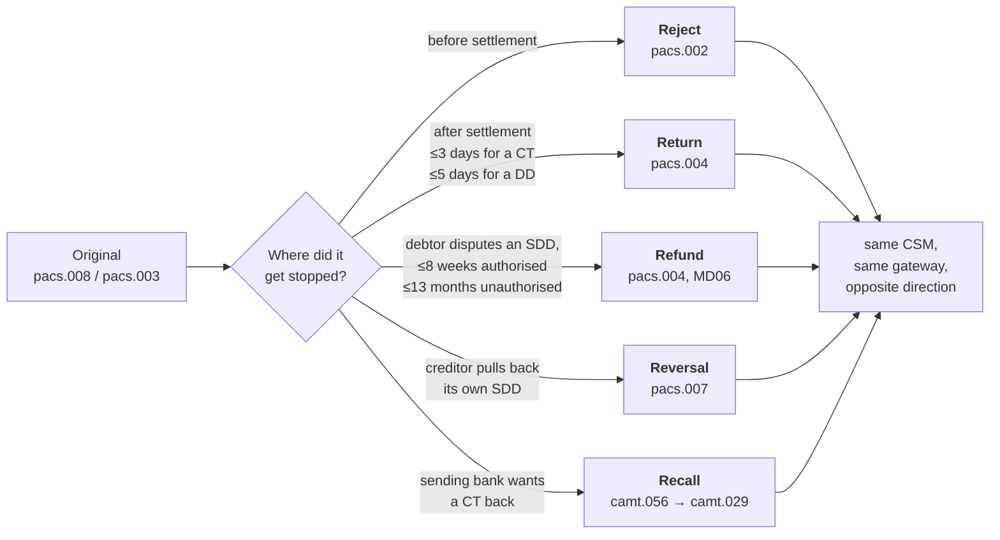

Common reason codes: `AC01` account identifier incorrect, `AC04` account
closed, `AC06` account blocked, `AM04` insufficient funds, `MD01` no mandate,
`MD06` refund requested by debtor, `MD07` debtor deceased.

Three things the diagram flattens:

- **A Reject is not the beneficiary bank's.** On a bulk rail it belongs to the
  originator's bank and to either CSM, because the beneficiary bank has no
  pre-settlement sight of the payment. Its only instrument is a Return. Instant
  inverts this: there the beneficiary bank must answer within ten seconds and
  settlement happens only on a positive `pacs.002`, so account-closed and
  compliance outcomes become rejects instead of returns.
- **A Return is a new payment.** It carries the original's message id, amount
  and settlement date, must be for the full amount, and settles in its own cycle
  going the other way. Nothing is unwound — a second settlement offsets the
  first. A returned payment cannot itself be returned.
- **The CSM does not police any of this.** The Bundesbank's rules state that for
  a recall "no check is made as to whether the recalled credit transfer was
  processed in the SEPA-Clearer" — it is forwarded without settlement and without
  matching. What guards against a mismatched R-message is the counterparty bank's
  reconciliation, not the clearing house.

A sanctions hit is the case with no R-transaction at all: the receiving bank
holds funds it may be legally barred from returning, so it freezes and reports.
The payer sees money that has left and is not coming back on any timetable.

## Verification of Payee, and the check that never existed before

Every return above is expensive: money leaves, comes back days later, and two
banks reconcile a payment neither wanted. Verification of Payee is the scheme's
attempt to stop the common cases before authorisation — and it is a genuinely
new capability, not a tightened old one.

**Nothing previously let a bank ask.** An IBAN's mod-97 check digits validate
its *format*, so a well-formed IBAN for an account that never existed passes
cleanly. The routing directory answers whether the destination *BIC* is
reachable, never anything about the account. The first party able to tell truth
from fiction was the creditor's bank, which on a bulk rail does not see the
payment until after settlement.

VoP is its own EPC scheme with its own rulebook, sitting in front of both SCT
and SCT Inst. Under Regulation (EU) 2024/886 euro-area PSPs have had to offer
it, free, since 9 October 2025.

### It asks about the name, not the account

The payer's PSP sends an `acmt.023` — is the holder of this IBAN called X? — and
the payee's PSP answers `acmt.024`. Five outcomes are defined:

| Response | Means |
| --- | --- |
| Match | the name and the account agree |
| Close Match | they nearly agree — the actual name is returned |
| No Match | **the account exists** and the holder is not called that |
| Identification code not supported/known | only for the account-plus-code variant |
| Verification check not possible | no matching result could be produced |

**An account that does not exist is the last row, not "No Match".** The rulebook
puts it in the bucket for reasons "other than those linked to a verification of
the combination", listing "Payment Account Number not maintained by the
Responding PSP" alongside a malformed account number and the responding PSP's
service being down. A reason code carries the detail, and those codes live in
the Inter-PSP API specifications rather than the rulebook.

That collapsing matters. A negative answer is ambiguous by construction: the
payer cannot tell "no such account" from "their VoP service is down". Whatever
the intent, the effect is that VoP is a poor account-existence oracle — you
cannot cheaply mine which IBANs are live.

### It warns, it does not block

For No Match, verification-not-possible, *or* no response at all, the payer's PSP
must instantly say that authorising "may lead to transferring Funds to a Payment
Account not held by the Payment Counterparty as indicated by the Requester" —
the same sentence in all three cases. The payer may then send it anyway. What
changes is liability, not routing: proceed past a warning and the refund claim
against the PSP is gone.

Three limits keep the returns coming:

- **Five seconds, then it counts as not-possible.** No answer inside the maximum
  execution time is treated as verification not possible, and a response
  arriving after the payer has been answered must be discarded.
- **It is a snapshot at initiation.** An account open at 09:40 can be closed
  before the 11:10 cycle settles.
- **Bulk can opt out.** A non-consumer payer may agree with its PSP to skip VoP
  when submitting payment orders as a package — which is precisely the corporate
  file traffic the SEPA-Clearer's windows carry.

### Why it is architecturally odd

Everything else a bank answers about a counterparty it answers from its own
rows — its registry, its routing directory, its register. VoP is a bank
querying *another bank's customer data* before any payment exists, with a
five-second budget, in front of a rail whose own answer takes hours.

It is not a read across institutions, though, and the distinction is the whole
design: it is a request over the wire that the other institution chooses how to
answer. The responding PSP decides what a close match is, what to disclose, and
whether it can answer at all.

Scheme status: rulebook EPC218-23, v1.0 issued 10 October 2024, v1.1 effective
20 September 2026. The taxonomy above is v1.0's.

## The message set

| Message | Direction | What it is |
| --- | --- | --- |
| `pain.001` | customer → bank | credit transfer initiation |
| `pain.008` | customer → bank | direct debit collection order |
| `pain.002` | bank → customer | status of the above |
| `pacs.008` | bank → bank | the credit transfer itself |
| `pacs.003` | bank → bank | the direct debit collection |
| `pacs.002` | bank → bank | status / reject |
| `pacs.004` | bank → bank | return or refund |
| `pacs.007` | bank → bank | reversal |
| `camt.056` | bank → bank | cancellation request (recall) |
| `camt.029` | bank → bank | resolution of the above |
| `camt.053` | bank → customer | statement |
| `camt.054` | bank → customer | debit / credit notification |
| `acmt.023` | bank → bank | Verification of Payee request |
| `acmt.024` | bank → bank | its answer — match, close match, no match, not possible |

`pain` = **pa**yment **in**itiation, customer-to-bank. `pacs` = **pa**yments
**c**learing and **s**ettlement, bank-to-bank. `camt` = **ca**sh
**m**anage**m**en**t**, reporting and exceptions. `acmt` = **ac**count
**m**anage**m**en**t**, which is where Verification of Payee lands — it asks
about an account, not about a payment.

## One bank's whole picture

A German bank with roughly a million customers, drawn as the set of connections
it actually operates:

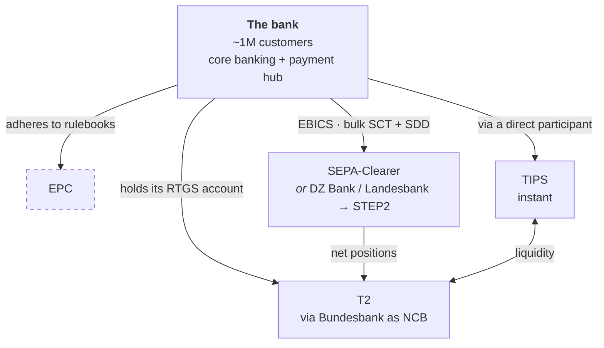

Four relationships. One is paperwork (EPC). One is where the files go (the
CSM). One is instant. One is the account where money is actually held and
everything ultimately settles.

Everything else in this document is detail about which box goes in slot two.

## Where the numbers come from

Cut-off times, settlement deadlines and return windows all drift. Every specific
figure above is traceable, so it can be re-checked rather than re-guessed:

| Claim | Source |
| --- | --- |
| Submission and delivery windows, procedure C, gross coverage, the SCF, CVF rejections, inter-CSM file exchange | Deutsche Bundesbank, *Procedural rules for SEPA credit transfers*, March 2024 v1.0 — sections IV.3, V.3 and VI |
| Return within three banking business days of the settlement date | EPC125-05, *SEPA Credit Transfer Scheme Rulebook* |
| Technical accounts as intermediary accounts for collecting debits and paying credits | ECB, *T2 Glossary* v3.0, and the *T2-T2S Consolidation Business Description* |
| CSMs designating a participant to settle for them in T2 RTGS; ~20% of STEP2 routing-table reach via interoperability | EBA CLEARING, STEP2-T reachability |
| Prefunded and post-funded models for inter-CSM instant settlement | EACHA, *Instant Payments Interoperability Framework* |
| Instant offered on the same channels at no higher charge from 9 October 2025 | Regulation (EU) 2024/886, and the Commission's clarification of its requirements |
| VoP response types, the non-existent-account case, the five-second budget and the wording of the warning | EPC218-23, *Verification Of Payee Scheme Rulebook*, 2024 v1.0 — sections 3.2.1 and 3.3 |

Two figures are deliberately given as shapes rather than facts, because they
depend on an agreement this document cannot see: the account plumbing of any
particular bilateral CSM link, and how long a receiving bank takes to post to
its customer after settlement.
